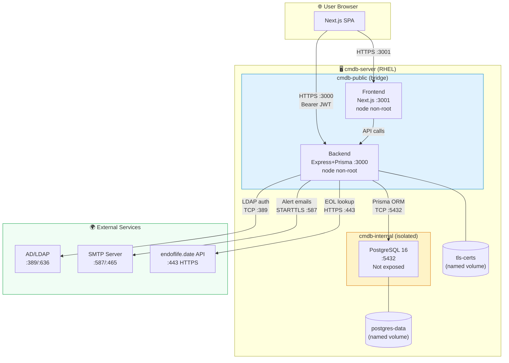

# 🏗️ CMDB Enterprise Platform — Technical Architecture

**Version:** 1.7.0
**Date:** 2026-04-14
**Status:** Production

---

## Table of Contents

1. [General Overview](#1-general-overview)
2. [Technology Stack](#2-technology-stack)
3. [Container Topology](#3-container-topology)
4. [Networks and Ports](#4-networks-and-ports)
5. [Traffic Flows](#5-traffic-flows)
6. [Architecture Diagram (Mermaid)](#6-architecture-diagram-mermaid)
7. [Data Model (Core Entities)](#7-data-model-core-entities)
8. [Functional Modules](#8-functional-modules)
9. [Security](#9-security)
10. [Design Decisions](#10-design-decisions)
11. [Capacity Planning and Hardware Sizing](#11-capacity-planning-and-hardware-sizing)

---

## 1. General Overview

CMDB Enterprise Platform is a full-stack web application for managing a technology asset inventory (Configuration Management Database). It allows organizations to register, classify, and monitor their IT assets (servers, networks, software, user devices), integrating security tools (Greenbone, CrowdStrike), contract management, and proactive email alerting.

The platform is deployed as a set of Docker containers orchestrated with Docker Compose, designed to run on Linux servers (Red Hat Enterprise Linux 8/9) with Podman support.

---

## 2. Technology Stack

### Frontend
| Component | Technology | Version |
|-----------|-----------|---------|
| Framework  | Next.js    | 16.x    |
| Language   | TypeScript | 5.x     |
| Styling    | Tailwind CSS | 4.x   |
| Icons      | Lucide React | 0.577 |
| CSV Parsing | PapaParse | 5.x    |
| Dependency Maps | ReactFlow | 11.x |
| Excel Export | SheetJS (xlsx) | 0.18.x |
| i18n       | Custom Context (no library) | — |
| Authentication | JWT localStorage + AuthContext | — |

### Backend
| Component | Technology | Version |
|-----------|-----------|---------|
| Runtime    | Node.js    | 20.x (Alpine) |
| Framework  | Express.js | 5.x     |
| ORM        | Prisma     | 5.x     |
| Language   | TypeScript | 5.x     |
| Authentication | JWT (jsonwebtoken) + bcrypt | 9.x / 6.x |
| MFA        | speakeasy (TOTP RFC 6238) | 2.x |
| QR Code    | qrcode     | 1.5.x   |
| LDAP       | ldap-authentication | 4.x |
| HTTP Security | Helmet | 8.x   |
| Email Alerts | nodemailer | 8.x  |
| Scheduler  | node-cron  | 4.x     |
| HTTPS      | Node.js https (built-in) | — |
| File upload | multer | 1.x |

### Database
| Component | Technology | Version |
|-----------|-----------|---------|
| Engine     | PostgreSQL | 16 (Alpine) |
| Admin UI   | Adminer    | latest (dev only) |

### Infrastructure
| Component | Technology |
|-----------|-----------|
| Containers | Docker Engine 24+ / Podman 4+ |
| Orchestration | Docker Compose v2 |
| Target OS  | RHEL 8/9, CentOS Stream 9 |
| SSL/TLS    | OpenSSL (self-signed certificates or corporate CA) |

---

## 3. Container Topology

```
┌─────────────────────────────────────────────────────────────────────┐
│                        HOST: cmdb-server                             │
│                                                                     │
│  ┌──────────────────────────────────────────────────────────────┐  │
│  │                     cmdb-public network                      │  │
│  │                                                              │  │
│  │   ┌─────────────────────┐    ┌────────────────────────────┐ │  │
│  │   │   cmdb-frontend      │    │      cmdb-backend          │ │  │
│  │   │   Next.js :3001      │───▶│   Express + Prisma :3000   │ │  │
│  │   │   (node non-root)    │    │   (node non-root)          │ │  │
│  │   └─────────────────────┘    └────────────┬───────────────┘ │  │
│  │          ▲                                │                  │  │
│  └──────────┼────────────────────────────────┼──────────────────┘  │
│             │                                │                     │
│         :3001                          ┌─────▼──────────────────┐  │
│         HOST                           │   cmdb-internal network │  │
│                                        │                        │  │
│                                  ┌─────▼──────────────────────┐ │  │
│                                  │   cmdb-postgres-prod        │ │  │
│                                  │   PostgreSQL 16 :5432       │ │  │
│                                  │   (NOT exposed to host)    │ │  │
│                                  └────────────────────────────┘ │  │
│                                        └────────────────────────┘  │
│                                                                     │
│   Ports exposed externally:  :3000 (API)   :3001 (UI)              │
└─────────────────────────────────────────────────────────────────────┘
```

---

## 4. Networks and Ports

### Docker Networks

| Network | Type | Description |
|---------|------|-------------|
| `cmdb-public` | Bridge | Frontend ↔ Backend ↔ Host |
| `cmdb-internal` | Bridge (internal: true) | Backend ↔ PostgreSQL only — **no external access** |

### Ports and Protocols

| Service | Internal Port | Host Port | Protocol | Description |
|---------|--------------|-----------|----------|-------------|
| Frontend (Next.js) | 3001 | 3001 | HTTP/HTTPS | Web user interface |
| Backend (Express) | 3000 | 3000 | HTTP / HTTPS (TLS) | REST API |
| PostgreSQL | 5432 | **NOT EXPOSED** | TCP | Accessible only from cmdb-internal |
| Adminer (dev) | 8080 | 8080 | HTTP | DB administration UI (development only) |

### External Integration Ports (outbound)

| Destination | Port | Protocol | Description |
|-------------|------|----------|-------------|
| Active Directory / LDAP | 389 | TCP/LDAP | LDAP authentication without TLS |
| Active Directory / LDAPS | 636 | TCP/LDAPS | LDAP authentication with TLS |
| SMTP (Gmail, O365) | 587 | TCP/STARTTLS | Email alert delivery |
| SMTP SSL | 465 | TCP/TLS | Email alert delivery (secure mode) |
| endoflife.date API | 443 | HTTPS | EOL/EOS product lookup |
| Park Place Technologies | 443 | HTTPS | Enterprise hardware EOSL (browser) |
| Cloud-Shelf | 443 | HTTPS | Hardware search (browser) |
| Greenbone (upload) | — | — | JSON report upload (no direct connection) |
| CrowdStrike (upload) | — | — | JSON report upload (no direct connection) |

---

## 5. Traffic Flows

### Local Authentication Flow
```
Browser → Frontend (3001) → API /api/auth/login (3000)
  Body: { email, password, mfaCode?, trustDevice?, deviceToken? }

  └── bcrypt.compare(password) → PostgreSQL (5432)
  └── user.active? → NO → 401 Account disabled
  └── [If MFA active (mfa_enabled=true)]
       ├── deviceToken in body? → look up in trusted_devices (expiresAt > now())
       │    └── FOUND → update lastSeenAt → jwt.sign() → 200 OK
       ├── mfaCode? → speakeasy.totp.verify()
       │    ├── INVALID → 401 INVALID_MFA_CODE
       │    └── VALID → (if trustDevice=true) → create TrustedDevice → return deviceToken
       │         └── jwt.sign() → 200 { token, user, deviceToken? }
       └── (no code or device) → 401 MFA_REQUIRED
  └── [If MFA not active]
       ├── role=ADMIN? → jwt.sign(mfaSetupRequired:true, 15min) → 200 { token, requireAction:'MFA_SETUP_REQUIRED' }
       └── role=VIEWER + mfa_prompted_at IS NULL?
            ├── YES → UPDATE mfa_prompted_at=now() → jwt.sign(8h) → 200 { token, requireAction:'MFA_SETUP_SUGGESTED' }
            └── NO → jwt.sign(8h) → 200 { token, user } (normal login)
```

### MFA Flow — First-login Setup (Admin)
```
Frontend receives requireAction:'MFA_SETUP_REQUIRED'
  └── Stores limited token (mfaSetupRequired=true) in localStorage
  └── Shows MFA wizard (no "Skip" button)
  └── POST /api/auth/mfa/setup → generates secret + QR (with limited token)
  └── User scans QR → enters verification code
  └── POST /api/auth/mfa/enable { code, secret, trustDevice? }
       └── UPDATE users SET mfa_enabled=true, mfa_secret=?
       └── jwt.sign() without mfaSetupRequired → Full JWT token (8h)
       └── (if trustDevice) → create TrustedDevice → return deviceToken
       └── Frontend: applySession(newToken) → redirect to /
```

### LDAP Authentication Flow (when USE_LDAP=true)
```
Browser → Frontend (3001) → API /api/auth/login (3000)
  │
  ├─ [Pre-check] Does email end in @cmdb.local / @cmdb.internal?
  │    └── YES → skip LDAP, go directly to local bcrypt path
  │
  └─ NO → LDAP attempt (5s timeout)
       ├─ [Strategy 1: LDAP_BIND_DN configured]
       │    └── Service account bind → search by mail/uid → user bind
       └─ [Strategy 2: no LDAP_BIND_DN]
            └── Direct bind with email as UPN (AD) or uid= (OpenLDAP)
       ├─ LDAP OK → does user exist in DB?
       │    ├── YES → load user row
       │    └── NO  → auto-provisioning (role=VIEWER, sso_external_id=email)
       └─ LDAP FAIL → fallback local bcrypt (fail-safe)
            └── does user exist with local password? → bcrypt.compare()

  └── [Common to both paths: same MFA/TrustedDevice flow described above]
```

### Protected API Flow
```
Browser → Frontend → API (with Bearer Token)
  └── authenticateToken() → jwt.verify()
  └── requireAdmin() (if applicable)
  └── Prisma ORM → PostgreSQL (5432, internal network)
  └── JSON response → Browser
```

### Alert Engine Flow (Daily Cron)
```
node-cron (08:30 AM Europe/Madrid)
  └── runAlertScan() → PostgreSQL (5432)
      ├── CIs with EoL/EoS < 30 days
      ├── Contracts nearing expiry
      └── Open CRITICAL/HIGH vulnerabilities
  └── buildAlertHtml() → HTML report
  └── nodemailer.sendMail() → SMTP (587/465)
      └── ALERT_RECIPIENT inbox
```

### Greenbone Integration Flow
```
Admin uploads JSON → POST /api/integrations/greenbone
  └── CVE normalization
  └── CI match by hostname
  └── UPDATE configuration_items.vulnerabilities (JSONB)
  └── Audit log entry
```

### HTTPS Flow (when HTTPS_ENABLED=true)
```
Browser → Frontend (3001) [HTTP]
Browser → API (3000) [HTTPS/TLS]
  └── TLS: certificate in cmdb-tls-certs volume
  └── Helmet HSTS header
  └── CORS strict: origin in CORS_ORIGINS
```

---

## 6. Architecture Diagram (Mermaid)



---

## 7. Data Model (Core Entities)

```
users                          configuration_items (CIs)
  ├── id (UUID)                  ├── id (UUID)
  ├── username                   ├── name
  ├── email                      ├── apiSlug (unique)
  ├── password (bcrypt)          ├── criticality (enum)
  ├── role (ADMIN/VIEWER)        ├── environment (enum)
  ├── active                     ├── ciTypeId → ci_types         ← relational
  ├── mfa_secret                 ├── status
  ├── mfa_enabled                ├── eolDate / eosDate
  ├── mfa_prompted_at (TIMESTAMPTZ) ← first MFA prompt          ├── lastCheckDate
  └── sso_external_id            ├── verificationSource
                                 ├── vulnerabilities (JSONB)
                                 ├── agentStatus (JSONB)
                                 ├── branchId → branches
                                 ├── ciModelId → device_models
                                 ├── businessOwnerId → users
                                 ├── technicalLeadId → users
                                 ├── businessImpact (TEXT: LOW|MEDIUM|HIGH|CRITICAL) ← NIS2
                                 ├── recoveryPriority (INT 1-5) ← ISO 22301
                                 ├── rto (INT minutes) ← ISO 22301
                                 ├── rpo (INT minutes) ← ISO 22301
                                 ├── spofRisk (BOOLEAN default false) ← ISO 22301
                                 ├── containsPii (BOOLEAN default false) ← GDPR
                                 └── dataClassification (TEXT: PUBLIC|INTERNAL|CONFIDENTIAL|RESTRICTED) ← GDPR

ci_type_categories            ci_types
  ├── code (PK)                 ├── id (UUID)
  ├── name                      ├── code (unique)
  └── sort_order                ├── name
                                ├── categoryCode → ci_type_categories
                                ├── sortOrder
                                └── isSystem (BOOLEAN)

trusted_devices               (MFA trusted devices)
  ├── id (UUID)
  ├── userId → users
  ├── token (unique, 32-byte hex)
  ├── userAgent
  ├── ipAddress
  ├── expiresAt (TIMESTAMPTZ)   ← configurable: TRUSTED_DEVICE_TTL_DAYS
  ├── createdAt
  └── lastSeenAt

vendors      contracts         hardware          software
  └── name     ├── contractNumber  ├── serialNumber    ├── version
               ├── startDate       ├── model           └── licenseType
               ├── endDate         └── manufacturer
               ├── vendorId
               └── parentContractId (addendums)

support_areas  branches     manufacturers  device_models  providers
  └── name       ├── name     └── name         ├── name       └── name
                 ├── code                       └── manufacturerId
                 └── supportAreaId

ci_relations
  ├── id (UUID)
  ├── sourceCiId → configuration_items
  ├── targetCiId → configuration_items
  ├── relationType (HOSTS | DEPENDS_ON | CONNECTED_TO | PROVIDES_SERVICE | BACKED_UP_BY)
  ├── createdAt
  └── createdBy

audit_logs
  ├── action
  ├── entity / entity_id
  ├── user_email
  └── created_at

document_types                documents
  ├── id (UUID)                 ├── id (UUID)
  ├── code (unique)             ├── name
  └── name                      ├── description
                                ├── typeId → document_types
                                ├── storedFilename (UUID-based)
                                ├── originalFilename
                                ├── mimeType
                                ├── sizeBytes
                                ├── uploadedBy → users
                                └── createdAt

document_versions             document_relations
  ├── id (UUID)                 ├── id (UUID)
  ├── documentId → documents    ├── sourceDocumentId → documents
  ├── versionNumber (INT)       ├── targetDocumentId → documents
  ├── storedFilename (UUID)     ├── relationType (AMENDMENT_OF | RELATED_TO | SUPERSEDES)
  ├── originalFilename          └── createdAt
  ├── sizeBytes
  ├── uploadedBy → users
  └── createdAt

document_cis                  document_contracts
  ├── documentId → documents    ├── documentId → documents
  └── ciId → configuration_items└── contractId → contracts

license_metric_categories     license_metrics
  ├── id (UUID)                  ├── id (UUID)
  ├── code (unique)              ├── code (unique)
  └── name                       ├── name
                                 └── categoryId → license_metric_categories

license_type_categories       license_types
  ├── id (UUID)                  ├── id (UUID)
  ├── code (unique)              ├── code (unique)
  └── name                       ├── name
                                 └── categoryId → license_type_categories

licenses
  ├── id (UUID)
  ├── name
  ├── licenseNumber
  ├── vendorId → vendors
  ├── startDate
  ├── endDate
  ├── licenseTypeId → license_types
  ├── licenseMetricId → license_metrics
  ├── metricValue (INT)
  ├── metricUnit (TEXT)
  ├── cost (DECIMAL)
  ├── currency (TEXT)
  ├── status (ACTIVE | EXPIRING | EXPIRED | DRAFT)
  ├── notes
  ├── parentLicenseId → licenses   ← hierarchy (sub-licences)
  └── createdAt

license_users                 _LicenseToCI (Prisma implicit M2M)
  ├── id (UUID)                  ├── A → licenses
  ├── licenseId → licenses       └── B → configuration_items
  ├── name
  ├── dni
  └── email

document_licenses             (M2M between Document and License)
  ├── documentId → documents
  └── licenseId → licenses
```

---

## 7b. File Storage (Document Repository)

Files uploaded through the Document Repository are handled with the following security guarantees:

| Aspect | Implementation |
|--------|---------------|
| **Upload library** | `multer` (multipart/form-data) |
| **Type validation** | Dual validation: allowed extension (allowlist) + file magic bytes (binary header). Rejects files whose content does not match the declared extension. |
| **On-disk filename** | Server-generated UUID v4; the original filename is never written to the filesystem. Prevents path traversal and collisions. |
| **Maximum size** | 50 MB per file (configurable via environment variable) |
| **Location** | Configurable host path (bind mount), defined by the `DOCUMENTS_STORAGE_PATH` environment variable. A named Docker volume `cmdb-documents` is used by default, but a bind mount to a dedicated path (local or NFS) is recommended in production. |
| **Download** | Served exclusively through the authenticated endpoint `GET /api/documents/:id/download`. The backend verifies the JWT before streaming the file. |
| **Allowed extensions** | PDF, DOCX, DOC, PPTX, XLSX, ODT, ODS, TXT, CSV, PNG, JPG |

### Configurable storage (bind mount)

From version 1.5.0 onwards, the document storage path is configured via the `DOCUMENTS_STORAGE_PATH` environment variable in the `.env` file:

```bash
# Local host path
DOCUMENTS_STORAGE_PATH=/var/lib/cmdb/documents

# NFS mount (example)
DOCUMENTS_STORAGE_PATH=/mnt/nfs/cmdb-docs
```

When `DOCUMENTS_STORAGE_PATH` is set, the `cmdb-backend` container mounts that host path at `/app/documents`, replacing the named Docker volume. This enables:
- Backups using standard filesystem tools
- Integration with shared NFS storage in high-availability environments
- Direct access for audits without entering the container

The directory must exist on the host before starting the services and must be accessible to the UID of the `node` process inside the container.

The storage directory (whether a bind mount or a named volume) must be included in the backup strategy alongside the PostgreSQL volume.

---

## 8. Functional Modules

| Module | Frontend Route | Backend Endpoints |
|--------|---------------|-------------------|
| Dashboard | `/` | `GET /api/cis`, `GET /api/contracts` |
| Inventory | `/inventory` | `GET/POST /api/cis`, `POST /api/cis/bulk` |
| Vulnerabilities | `/vulnerabilities` | `PATCH /api/vulnerabilities` |
| Contracts | `/contracts` | `GET/POST /api/contracts` |
| Master Data | `/admin/masters` | `GET/POST/DELETE /api/masters/*`, `GET /api/masters/ci-type-categories`, `PATCH/DELETE /api/masters/ci-types/:id` |
| Audit | `/audit` | `GET /api/audit-logs[?from=ISO&to=ISO]` |
| Integrations | `/integrations` | `POST /api/integrations/greenbone|crowdstrike` |
| Reports | `/reports` | (client-side PDF/CSV generation) |
| Settings | `/settings` | `GET/PATCH /api/users/*` |
| Profile | `/profile` | `GET/POST /api/users/me/mfa/*` |
| Map | `/map` | `GET /api/cis`, `GET /api/cis/:id/relations?depth=1-4` |
| Relations | `/inventory` (modal) | `POST /api/relations`, `DELETE /api/relations/:id` |
| Auth | `/login` | `POST /api/auth/login` |
| Document Repository | `/documents` | `GET /api/documents`, `POST /api/documents` (multipart/multer), `GET /api/documents/:id`, `PATCH /api/documents/:id`, `DELETE /api/documents/:id`, `POST /api/documents/:id/versions`, `GET /api/documents/:id/versions`, `GET /api/documents/:id/download`, `GET/POST/DELETE /api/documents/:id/relations`, `POST /api/documents/:id/cis`, `POST /api/documents/:id/contracts` |
| Inventory — Documents & Contracts | `/inventory` (CI detail modal) | `GET /api/cis/:id/contracts`, `POST /api/cis/:id/contracts`, `DELETE /api/cis/:id/contracts/:contractId`, `POST /api/cis/:id/documents`, `DELETE /api/cis/:id/documents/:docId` |
| Contracts — CIs & Documents | `/contracts` (expanded row) | `GET /api/contracts/:id/cis`, `POST /api/contracts/:id/cis`, `DELETE /api/contracts/:id/cis/:ciId` |
| License Repository | `/licenses` | `GET /api/licenses`, `POST /api/licenses`, `GET /api/licenses/:id`, `PATCH /api/licenses/:id`, `DELETE /api/licenses/:id`, `GET/POST/DELETE /api/licenses/:id/cis`, `GET/POST/DELETE /api/licenses/:id/documents`, `GET/POST/DELETE /api/licenses/:id/users` |
| Master Data — Licences | `/admin/masters` (tabs) | `GET/POST /api/masters/license-metric-categories`, `GET/POST/PATCH/DELETE /api/masters/license-metrics/:id`, `GET/POST /api/masters/license-type-categories`, `GET/POST/PATCH/DELETE /api/masters/license-types/:id` |

### Bidirectional associations: CI ↔ Document ↔ Contract

From version 1.5.0 onwards, associations between CIs, documents, and contracts can be managed from any of the three entity views:

| Action | Source view | Endpoint |
|--------|------------|----------|
| Associate CIs with a document | Document detail | `POST /api/documents/:id/cis` — body: `{ ciIds: string[] }` |
| Associate contracts with a document | Document detail | `POST /api/documents/:id/contracts` — body: `{ contractIds: string[] }` |
| Associate documents with a CI | CI Documents tab | `POST /api/cis/:id/documents` — body: `{ documentIds: string[] }` |
| Unlink a document from a CI | CI Documents tab | `DELETE /api/cis/:id/documents/:docId` |
| Associate contracts with a CI | CI Contracts tab | `POST /api/cis/:id/contracts` — body: `{ contractIds: string[] }` |
| Unlink a contract from a CI | CI Contracts tab | `DELETE /api/cis/:id/contracts/:contractId` |
| Associate CIs with a contract | Contract expanded row | `POST /api/contracts/:id/cis` — body: `{ ciIds: string[] }` |
| Unlink a CI from a contract | Contract expanded row | `DELETE /api/contracts/:id/cis/:ciId` |

All write operations require the ADMIN role and generate entries in `audit_logs`.

### License Repository — Associations

The licence module extends the association model with the following relationships:

| Action | Endpoint |
|--------|----------|
| Associate CIs with a licence | `POST /api/licenses/:id/cis` — body: `{ ciId: string }` |
| Unlink a CI from a licence | `DELETE /api/licenses/:id/cis/:ciId` |
| Associate documents with a licence | `POST /api/licenses/:id/documents` — body: `{ documentId: string }` |
| Unlink a document from a licence | `DELETE /api/licenses/:id/documents/:docId` |
| Add a licence user | `POST /api/licenses/:id/users` — body: `{ name, dni, email }` |
| Remove a licence user | `DELETE /api/licenses/:id/users/:userId` |

The reference catalogues (metrics and types) are managed through the `/api/masters/license-*` endpoints and are pre-loaded in the seed with 6 metric categories, 25 metrics, 3 type categories, and 14 standard types.

---

## 9. Security

| Control | Implementation |
|---------|---------------|
| Authentication | JWT HS256 (8h, algorithm explicit in both sign and verify) + bcrypt cost-12 |
| MFA | TOTP RFC 6238 (speakeasy). Admin: mandatory on first login (limited token `mfaSetupRequired`). VIEWER: suggested (once-only, tracked via `mfa_prompted_at`). |
| Trusted Devices | 32-byte hex token in `trusted_devices` DB + localStorage. Bound to client IP and User-Agent at creation; validation enforces strict equality (no NULL bypass). Configurable TTL (`TRUSTED_DEVICE_TTL_DAYS`). Daily cleanup cron (02:00). |
| JWT Expiry (frontend) | `AuthContext` decodes the `exp` claim (pure base64, no library) and discards expired tokens on mount, every 60 s, and on `visibilitychange`. `apiFetch` validates before every request. |
| Internal Errors | Express `catch` blocks always return `{ error: 'Internal server error' }` — raw SQL messages and stack traces are never sent to clients. |
| LDAP/AD | Optional via ldap-authentication; admin-bind+search (recommended) or direct-bind; 5s fail-safe timeout; shadow user with `sso_external_id` |
| RBAC | ADMIN / VIEWER with `requireAdmin` middleware |
| HTTP Headers | Helmet 8.x (X-Frame, X-Content-Type, HSTS, XSS) |
| CORS | Explicit allowlist (CORS_ORIGINS env var) |
| HTTPS | Node.js https module + certificates in Docker volume |
| Isolated DB | `cmdb-internal` network — port 5432 never exposed |
| Secrets | Environment variables — never in source code |
| Audit Log | Append-only `audit_logs` table. The `GET /api/audit-logs` endpoint enriches each entry with `entity_name` resolved via LEFT JOINs (`configuration_items`, `documents`, `users`, `ci_relations`) in a single `$queryRaw`. Supports date-range filtering via `?from` and `?to` query params (server-side validation + parameterised query via `Prisma.sql`). |
| Compliance | ISO 27001 A.9.2 / A.10.1 / A.12.4 (see SECURITY_AUDIT.md) |
| NIS2 / GDPR | Fields `businessImpact`, `spofRisk`, `containsPii`, `dataClassification`, `rto`, `rpo` in the CI model |

---

## 9b. Regulatory Compliance Model (NIS2 / ISO 22301 / GDPR)

Compliance fields are stored directly in the `configuration_items` table as TEXT/BOOLEAN/INT columns (without separate relational tables, to minimise joins).

### Regulation → Field Mapping

| Regulation | Article / Clause | CI Field | Description |
|------------|-----------------|----------|-------------|
| NIS2 | Art. 21 - Risk management | `businessImpact` | Impact classification (LOW/MEDIUM/HIGH/CRITICAL) |
| NIS2 | Art. 23 - Incident notification | `businessImpact = CRITICAL` | Identifies systems whose incidents must be reported within <24h |
| ISO 22301 | 8.4 - BCP / DRP | `rto`, `rpo` | Recovery objectives in minutes |
| ISO 22301 | 8.4 - SPOF Analysis | `spofRisk` | Marks systems without redundancy |
| ISO 22301 | 8.4 - Recovery Priority | `recoveryPriority` | Restoration order 1-5 |
| GDPR | Art. 30 - Record of processing activities | `containsPii` | Personal data processing flag |
| GDPR | Art. 5 - Processing principles | `dataClassification` | Classification: PUBLIC/INTERNAL/CONFIDENTIAL/RESTRICTED |

### Design decision: flat columns vs. separate compliance table

Flat columns in `configuration_items` were chosen because:
- The number of compliance fields is fixed and known (stable regulations)
- Avoids an additional JOIN in the most frequent query (GET /api/cis)
- Fields are optional (`NULL` = unclassified), with no storage penalty
- Facilitates filtering and sorting from the inventory view without subqueries

---

## 10. Design Decisions

| Decision | Alternatives Considered | Justification |
|----------|------------------------|---------------|
| Next.js App Router | Pages Router, Vite+React | Standalone Docker support, SSR, native layouts |
| Prisma ORM | TypeORM, Sequelize, raw SQL | Type-safety, automatic migrations, JSONB support |
| JWT in localStorage | httpOnly Cookies, Session | CORS cross-origin compatibility without a session server |
| JSONB for vulns/agents | Separate relational tables | Schema flexibility, heterogeneous data per source |
| node-cron | Bull, Agenda | No Redis dependency; simplicity for daily alerts |
| Graph traversal with recursive CTE (PostgreSQL) | N HTTP requests from frontend (client-side BFS) | Single query; the PostgreSQL engine handles traversal and cycle prevention with path arrays |
| SheetJS (xlsx) for export | jsPDF, backend CSV | 100% client-side Excel export, no additional server request, compatible with all modern browsers |
| Custom i18n context | next-intl, react-i18next | No App Router complications, minimal bundle, full control |
| Alpine base images | Ubuntu, Debian | Minimal image (~50MB), smaller attack surface |
| non-root USER node | root (default) | Hardening requirement: principle of least privilege |
| `@@index` on all FKs | No explicit indexes (Prisma default) | FK columns without indexes cause sequential scans on JOINs and filters. Indexes added on: `ci_types(categoryCode)`, `trusted_devices(userId)`, `locations(parentLocationId)`, `contracts(vendorId, parentContractId)`, `branches(supportAreaId)`, `device_models(manufacturerId)`, `licenses(status, endDate, licenseTypeId, licenseMetricId, vendorId)`, `document_licenses(documentId)`, and other relational tables. |
| Explicit `onDelete`/`onUpdate` on all relations | Leave unspecified (implicit behaviour) | Implicit referential actions are ambiguous across Prisma/PostgreSQL versions. Policy: `Cascade` for child/junction records, `SetNull` for optional FKs on CIs, `Restrict` for master-data references. |

---

## 11. Capacity Planning and Hardware Sizing

This section documents the hardware requirements for production deployment of CMDB Enterprise Platform on Red Hat Enterprise Linux (RHEL) environments with Rootless Podman.

### 11.1 Rootless Podman Specifics

> **⚠️ CRITICAL: Storage in /home with Rootless Podman**
>
> Unlike traditional Docker, **Rootless Podman stores all images, containers, and persistent volumes in the home directory of the service user**:
>
> ```
> /home/cmdb-admin/.local/share/containers/
>   ├── storage/           → Images and container layers (overlayfs)
>   │   ├── overlay/       → Image layers (Node.js, PostgreSQL, etc.)
>   │   └── overlay-images/
>   └── volumes/           → Persistent PostgreSQL data
>       ├── cmdb-postgres-data-prod/
>       └── cmdb-tls-certs/
> ```
>
> **Impact:** If `/home` is not on a dedicated LVM volume with sufficient space, the PostgreSQL database can fill the root partition (`/`) and cause:
> - Operating system crash
> - PostgreSQL data corruption
> - Inability to start new containers
> - Loss of logs and backups
>
> **Mandatory solution in production:**
> - Create an independent LVM volume for `/home` (or specifically `/home/cmdb-admin`)
> - Size it according to the scaling table (section 11.2)
> - Monitor disk usage proactively

### 11.2 Hardware Sizing Table

The following table provides sizing guidelines based on the projected volume of Configuration Items (CIs) in the inventory:

| CI Volume | vCPU | RAM | LVM Space in /home | DB Growth (Postgres) | Use Cases |
|-----------|------|-----|---------------------|----------------------|-----------|
| **Up to 1,000** | 2 | 4 GB | 15 GB | ~500 MB | SMBs, test environments, pilot deployments |
| **1,000 to 5,000** | 4 | 8 GB | 30 GB | ~2 GB | Mid-size companies, basic integrations (Greenbone, CrowdStrike) |
| **5,000 to 20,000+** | 8+ | 16 GB+ | 60 GB+ | ~10 GB+ | Enterprise, mass vulnerability scanning, high audit volume |

#### Sizing Notes:

**vCPU:**
- The Node.js backend is single-threaded per request (Event Loop)
- Podman runs multiple containers: PostgreSQL (CPU-intensive during complex queries), backend, frontend
- At least 1 dedicated vCPU per service is recommended (3 minimum)

**RAM:**
- PostgreSQL requires a buffer pool (~25% of total recommended RAM)
- Node.js backend: ~512 MB at idle, up to 1.5 GB under load with 1,000 active CIs
- Next.js standalone frontend: ~300 MB
- RAM must be reserved for the RHEL operating system (~1 GB)

**LVM Space in /home:**
- **Container images:** ~3-4 GB (Node.js 20 Alpine + PostgreSQL 16 Alpine + frontend)
- **PostgreSQL database:** Depends on CI volume (see "DB Growth")
- **Container logs:** ~500 MB - 1 GB per month (with logrotate configured)
- **Local backups:** If stored in `/home/cmdb-admin/backups`, calculate ~1 GB per daily backup × retention period (default 30 days)
- **Safety margin:** Always provision 30-50% more than the base calculation

**Database growth:**
- **Without vulnerabilities:** ~500 KB per CI (metadata + relations)
- **With JSONB vulnerabilities (Greenbone):** ~2-5 MB per CI (depending on number of CVEs)
- **With full auditing:** +20% additional per year (`audit_logs` table)

### 11.3 Calculation Example for 3,000 CIs

**Scenario:** Mid-size company with 3,000 CIs, Greenbone integration, daily backups with 30-day retention.

```
Space calculation for /home:
─────────────────────────────────────────────────
Container images:                  4 GB
PostgreSQL database:               1.5 GB  (3000 CIs × 500 KB)
JSONB vulnerabilities:             4.5 GB  (3000 CIs × 1.5 MB avg)
Container logs:                    1 GB    (3 months with logrotate)
Daily backups (30 days):           18 GB   (600 MB × 30 days)
─────────────────────────────────────────────────
Total:                             29 GB
Safety margin (40%):               +11.6 GB
─────────────────────────────────────────────────
Recommended LVM space:             40-50 GB
```

**Recommended hardware:**
- vCPU: 4
- RAM: 8 GB
- LVM in /home: 50 GB
- Filesystem: XFS (better performance for databases than ext4)

### 11.4 Disk Space Monitoring (Mandatory)

```bash
# Check /home usage
df -h /home

# Check Rootless Podman specific usage
du -sh /home/cmdb-admin/.local/share/containers/

# Check PostgreSQL database size
podman exec cmdb-postgres-prod psql -U cmdb_admin -d cmdb_db -c "\l+"

# Check Podman volume usage
podman volume ls
podman volume inspect cmdb-postgres-data-prod | grep Mountpoint
du -sh $(podman volume inspect cmdb-postgres-data-prod --format '{{.Mountpoint}}')
```

### 11.5 Hot LVM Expansion (if running out of space)

If the `/home` volume fills up in production, it can be expanded without stopping services:

```bash
# 1. Check available space in the Volume Group
sudo vgs
# VG   #PV #LV #SN Attr   VSize   VFree
# vg0    1   3   0 wz--n- 100.00g 20.00g

# 2. Extend the logical volume (+20 GB)
sudo lvextend -L +20G /dev/vg0/lv_home

# 3. Extend the filesystem (XFS can be done hot)
sudo xfs_growfs /home

# 4. Verify
df -h /home
```

### 11.6 Filesystem Recommendations

| Filesystem | Advantages | Disadvantages | Recommendation |
|------------|-----------|---------------|----------------|
| **XFS** | Excellent performance with large files (databases), hot growth | Cannot shrink size | ✅ **Recommended for production** |
| **ext4** | More mature, supports size reduction | Lower performance under intensive I/O | ⚠️ Acceptable but not optimal |
| **btrfs** | Snapshots, compression, CoW | Higher complexity, limited support on RHEL 8 | ❌ Not recommended for RHEL production |

**Official recommendation:** Use **XFS** for the `/home` volume in production with Rootless Podman.

### 11.7 Capacity Checklist Before Deployment

- [ ] `/home` is on an independent LVM volume (not on the root `/` partition)
- [ ] The volume is at least the size calculated from the table (section 11.2)
- [ ] The filesystem is XFS
- [ ] The Volume Group has free space for future expansions (minimum 20% free)
- [ ] Disk usage monitoring has been configured (alerts at 80%)
- [ ] The backup plan accounts for projected growth
- [ ] The LVM expansion procedure has been documented

---

*For the complete deployment documentation, refer to [`DEPLOY.md - Section 1.3`](../DEPLOY.md#13-verificar-dimensionamiento-de-almacenamiento-lvm).*
