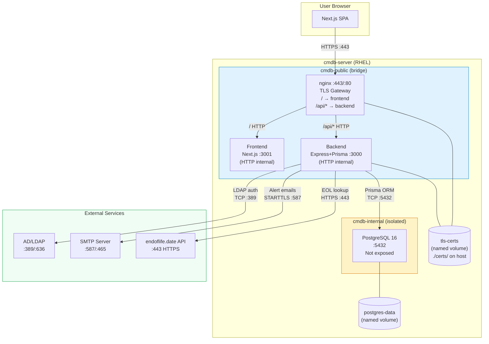
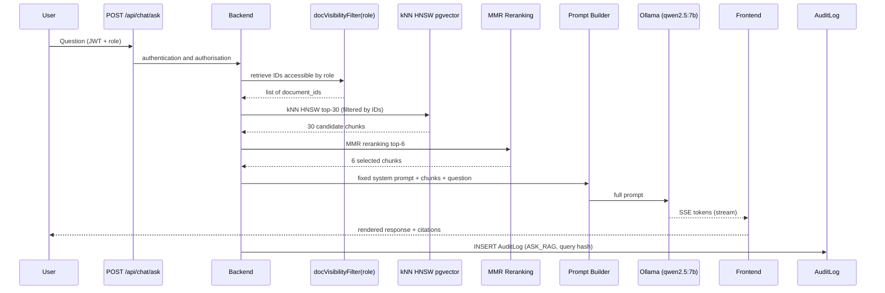

# 🏗️ CMDB Enterprise Platform — Technical Architecture

**Version:** 2.0.0
**Date:** 2026-06-20
**Status:** Production

---

## Table of Contents

1. [General Overview](#1-general-overview)
2. [Technology Stack](#2-technology-stack)
3. [Container Topology](#3-container-topology)
4. [Networks and Ports](#4-networks-and-ports)
5. [Traffic Flows](#5-traffic-flows)
6. [Architecture Diagram (Mermaid)](#6-architecture-diagram-mermaid)
7. [Data Model (Core Entities)](#7-data-model-core-entities)
8. [Functional Modules](#8-functional-modules)
9. [Security](#9-security)
10. [Design Decisions](#10-design-decisions)
11. [Capacity Planning and Hardware Sizing](#11-capacity-planning-and-hardware-sizing)
12. [RAG Subsystem — AI Assistant](#12-rag-subsystem--ai-assistant)

---

## 1. General Overview

CMDB Enterprise Platform is a full-stack web application for managing a technology asset inventory (Configuration Management Database). It allows organizations to register, classify, and monitor their IT assets (servers, networks, software, user devices), integrating security tools (Greenbone, CrowdStrike), contract management, and proactive email alerting.

The platform is deployed as a set of Docker containers orchestrated with Docker Compose, designed to run on Linux servers (Red Hat Enterprise Linux 8/9) with Podman support.

---

## 2. Technology Stack

### Frontend
| Component | Technology | Version |
|-----------|-----------|---------|
| Framework  | Next.js    | 16.x    |
| Language   | TypeScript | 5.x     |
| Styling    | Tailwind CSS | 4.x   |
| Icons      | Lucide React | 0.577 |
| CSV Parsing | PapaParse | 5.x    |
| Dependency Maps | ReactFlow | 11.x |
| Excel Export | ExcelJS | 4.4.x |
| i18n       | Custom Context (no library) | — |
| Authentication | JWT HttpOnly cookie + AuthContext | — |
| Theming    | ThemeContext + CSS custom properties | — |

**Key frontend contexts and components:**
- `contexts/AuthContext.tsx` — session state, JWT rehydration on mount, 60-second periodic expiry check.
- `contexts/LanguageContext.tsx` — 6-language support (ES/EN/DE/PT/FR/IT). All UI strings use `t("key")`.
- `contexts/ThemeContext.tsx` — Fetches `GET /api/settings/theme` on mount and injects `--sidebar-bg` and `--accent` CSS custom properties into `<head>` via `<style id="theme-vars">`. Exposes `companyName` and `logoUrl` to all components.
- `components/TopBar.tsx` — Mobile-only topbar (`md:hidden`) with a hamburger button. Renders company logo/name with the themed background.

### Backend
| Component | Technology | Version |
|-----------|-----------|---------|
| Runtime    | Node.js    | 20.x (Alpine) |
| Framework  | Express.js | 5.x     |
| ORM        | Prisma     | 5.x     |
| Language   | TypeScript | 5.x     |
| Authentication | JWT (jsonwebtoken) + bcrypt | 9.x / 6.x |
| MFA        | otplib (TOTP RFC 6238) | 12.x |
| QR Code    | qrcode     | 1.5.x   |
| LDAP       | ldap-authentication | 4.x |
| HTTP Security | Helmet | 8.x   |
| Email Alerts | nodemailer | 8.x  |
| Scheduler  | node-cron  | 4.x     |
| TLS Proxy  | nginx 1.30 | — |
| File upload | multer | 1.x |

### Database
| Component | Technology | Version |
|-----------|-----------|---------|
| Engine     | PostgreSQL | 16 (Alpine) |
| Admin UI   | Adminer    | latest (dev only) |

### Infrastructure
| Component | Technology |
|-----------|-----------|
| Containers | Docker Engine 24+ / Podman 4+ |
| Orchestration | Docker Compose v2 |
| Target OS  | RHEL 8/9, CentOS Stream 9 |
| SSL/TLS    | OpenSSL (self-signed certificates or corporate CA) |

---

## 3. Container Topology

**v3.0.0 — 9 containers** (updated from 3 in v2.x)

```
Browser ──HTTPS:443──▶ nginx (cmdb-public) ──── /        ──▶ cmdb-frontend  (Next.js :3001)
                                            ├── /api/*    ──▶ cmdb-backend   (Express :3000)
                                            └── /n8n/*    ──▶ n8n-main       (:5678, auth_request gate)

cmdb-backend (cmdb-internal) ──▶ cmdb-postgres-prod  (PostgreSQL 16 :5432)
                              ──▶ cmdb-ollama-prod    (Ollama :11434)
                              ──▶ cmdb-redis          (Redis 7 :6379, BullMQ queue)

n8n-main     (cmdb-public + cmdb-internal) ──▶ cmdb-redis (BullMQ enqueue)
                                            ──▶ cmdb-postgres-prod (schema: n8n_data)
n8n-worker-1 (cmdb-public + cmdb-internal) ──▶ cmdb-redis (BullMQ consume)
n8n-worker-2 (cmdb-public + cmdb-internal) ──▶ cmdb-redis (BullMQ consume)
```

| Container | Image | Network(s) | Host Port |
|-----------|-------|------------|-----------|
| `cmdb-nginx` | nginx:1.30-alpine | public | 443, 80 |
| `cmdb-frontend` | cmdb-frontend:latest | public | — |
| `cmdb-backend-prod` | cmdb-backend:latest | public + internal | — |
| `cmdb-postgres-prod` | pgvector/pgvector:pg16 | internal | — |
| `cmdb-ollama-prod` | ollama/ollama:latest | internal | — |
| `cmdb-redis` | redis:7-alpine | internal | — |
| `n8n-main` | n8nio/n8n:1 | public + internal | — |
| `n8n-worker-1` | n8nio/n8n:1 | public + internal | — |
| `n8n-worker-2` | n8nio/n8n:1 | public + internal | — |

**nginx routes (v3.0.0):**
- `/` → frontend :3001
- `/api/*` → backend :3000
- `/n8n/*` → n8n-main :5678 (protected by `auth_request /api/internal/n8n-gate` — ADMIN JWT required)
- `/api/internal/*` → `deny all; return 404;` (M2M only, blocked externally)

---

## 4. Networks and Ports

### Docker Networks

| Network | Type | Description |
|---------|------|-------------|
| `cmdb-public` | Bridge | nginx ↔ frontend ↔ backend ↔ n8n nodes ↔ host |
| `cmdb-internal` | Bridge (`internal: true`) | backend ↔ postgres ↔ ollama ↔ redis — **no external access** |

n8n workers are on **both** networks: `cmdb-public` for external calls (SMTP, Teams, LDAP, S3) and `cmdb-internal` to reach postgres/ollama/redis/backend.

### Ports and Protocols

| Service | Internal Port | Host Port | Protocol | Description |
|---------|--------------|-----------|----------|-------------|
| nginx (TLS gateway) | 443 / 80 | **443 / 80** | HTTPS / HTTP→HTTPS | Single entry point; TLS termination |
| Frontend (Next.js) | 3001 | **NOT EXPOSED** | HTTP (internal) | Served by nginx at `/` |
| Backend (Express) | 3000 | **NOT EXPOSED** | HTTP (internal) | Served by nginx at `/api/*` |
| PostgreSQL | 5432 | **NOT EXPOSED** | TCP | Accessible only from cmdb-internal |
| Adminer (dev) | 8080 | 8080 | HTTP | DB administration UI (development only) |

### External Integration Ports (outbound)

| Destination | Port | Protocol | Description |
|-------------|------|----------|-------------|
| Active Directory / LDAP | 389 | TCP/LDAP | LDAP authentication without TLS |
| Active Directory / LDAPS | 636 | TCP/LDAPS | LDAP authentication with TLS |
| SMTP (Gmail, O365) | 587 | TCP/STARTTLS | Email alert delivery |
| SMTP SSL | 465 | TCP/TLS | Email alert delivery (secure mode) |
| endoflife.date API | 443 | HTTPS | EOL/EOS product lookup |
| Park Place Technologies | 443 | HTTPS | Enterprise hardware EOSL (browser) |
| Cloud-Shelf | 443 | HTTPS | Hardware search (browser) |
| Greenbone (upload) | — | — | JSON report upload (no direct connection) |
| CrowdStrike (upload) | — | — | JSON report upload (no direct connection) |

---

## 5. Traffic Flows

### Local Authentication Flow
```
Browser → Frontend (3001) → API /api/auth/login (3000)
  Body: { email, password, mfaCode?, trustDevice?, deviceToken? }

  └── bcrypt.compare(password) → PostgreSQL (5432)
  └── user.active? → NO → 401 Account disabled
  └── [If MFA active (mfa_enabled=true)]
       ├── deviceToken in body? → look up in trusted_devices (expiresAt > now())
       │    └── FOUND → update lastSeenAt → jwt.sign() → 200 OK
       ├── mfaCode? → authenticator.check() (otplib)
       │    ├── INVALID → 401 INVALID_MFA_CODE
       │    └── VALID → (if trustDevice=true) → create TrustedDevice → return deviceToken
       │         └── jwt.sign() → 200 { token, user, deviceToken? }
       └── (no code or device) → 401 MFA_REQUIRED
  └── [If MFA not active]
       ├── role=ADMIN? → jwt.sign(mfaSetupRequired:true, 15min) → 200 { token, requireAction:'MFA_SETUP_REQUIRED' }
       └── role=VIEWER + mfa_prompted_at IS NULL?
            ├── YES → UPDATE mfa_prompted_at=now() → jwt.sign(8h) → 200 { token, requireAction:'MFA_SETUP_SUGGESTED' }
            └── NO → jwt.sign(8h) → 200 { token, user } (normal login)
```

### MFA Flow — First-login Setup (Admin)
```
Frontend receives requireAction:'MFA_SETUP_REQUIRED'
  └── Limited token (mfaSetupRequired=true) stored in HttpOnly cookie
  └── Shows MFA wizard (no "Skip" button)
  └── POST /api/auth/mfa/setup → generates secret + QR (with limited token)
  └── User scans QR → enters verification code
  └── POST /api/auth/mfa/enable { code, secret, trustDevice? }
       └── UPDATE users SET mfa_enabled=true, mfa_secret=?
       └── jwt.sign() without mfaSetupRequired → Full JWT token (8h)
       └── (if trustDevice) → create TrustedDevice → return deviceToken
       └── Frontend: applySession(newToken) → redirect to /
```

### LDAP Authentication Flow (when USE_LDAP=true)
```
Browser → Frontend (3001) → API /api/auth/login (3000)
  │
  ├─ [Pre-check] Does email end in @cmdb.local / @cmdb.internal?
  │    └── YES → skip LDAP, go directly to local bcrypt path
  │
  └─ NO → LDAP attempt (5s timeout)
       ├─ [Strategy 1: LDAP_BIND_DN configured]
       │    └── Service account bind → search by mail/uid → user bind
       └─ [Strategy 2: no LDAP_BIND_DN]
            └── Direct bind with email as UPN (AD) or uid= (OpenLDAP)
       ├─ LDAP OK → does user exist in DB?
       │    ├── YES → load user row
       │    └── NO  → auto-provisioning (role=VIEWER, sso_external_id=email)
       └─ LDAP FAIL → fallback local bcrypt (fail-safe)
            └── does user exist with local password? → bcrypt.compare()

  └── [Common to both paths: same MFA/TrustedDevice flow described above]
```

### Protected API Flow
```
Browser → Frontend → API (with Bearer Token)
  └── authenticateToken() → jwt.verify()
  └── requireAdmin() (if applicable)
  └── Prisma ORM → PostgreSQL (5432, internal network)
  └── JSON response → Browser
```

### Alert Engine Flow (Daily Cron)
```
node-cron (08:30 AM Europe/Madrid)
  └── runAlertScan() → PostgreSQL (5432)
      ├── CIs with EoL/EoS < 30 days
      ├── Contracts nearing expiry
      └── Open CRITICAL/HIGH vulnerabilities
  └── buildAlertHtml() → HTML report
  └── nodemailer.sendMail() → SMTP (587/465)
      └── ALERT_RECIPIENT inbox
```

### Greenbone Integration Flow
```
Admin uploads JSON → POST /api/integrations/greenbone
  └── CVE normalization
  └── CI match by hostname
  └── UPDATE configuration_items.vulnerabilities (JSONB)
  └── Audit log entry
```

### HTTPS Flow (nginx as unified TLS gateway)
```
Browser → nginx:443 [HTTPS/TLS — certificate in ./certs/]
  ├── /         → frontend:3001 [HTTP internal]
  └── /api/*    → backend:3000  [HTTP internal]
                    └── Helmet HSTS header
                    └── CORS: only FRONTEND_URL (same-origin via nginx)
  nginx:80 → 301 redirect → https://
```
With nginx as the single gateway, frontend and API share the same origin
(`https://host/` and `https://host/api/*`) — browser CORS is not needed.

---

## 6. Architecture Diagram (Mermaid)



---

## 7. Data Model (Core Entities)

```
users                          configuration_items (CIs)
  ├── id (UUID)                  ├── id (UUID)
  ├── username                   ├── name
  ├── email                      ├── apiSlug (unique)
  ├── password (bcrypt)          ├── criticality (enum)
  ├── role (ADMIN/VIEWER)        ├── environment (enum)
  ├── active                     ├── ciTypeId → ci_types         ← relational
  ├── mfa_secret                 ├── status
  ├── mfa_enabled                ├── eolDate / eosDate
  ├── mfa_prompted_at (TIMESTAMPTZ) ← first MFA prompt          ├── lastCheckDate
  └── sso_external_id            ├── verificationSource
                                 ├── vulnerabilities (JSONB)
                                 ├── agentStatus (JSONB)
                                 ├── branchId → branches
                                 ├── ciModelId → device_models
                                 ├── businessOwnerId → users
                                 ├── technicalLeadId → users
                                 ├── businessImpact (TEXT: LOW|MEDIUM|HIGH|CRITICAL) ← NIS2
                                 ├── recoveryPriority (INT 1-5) ← ISO 22301
                                 ├── rto (INT minutes) ← ISO 22301
                                 ├── rpo (INT minutes) ← ISO 22301
                                 ├── spofRisk (BOOLEAN default false) ← ISO 22301
                                 ├── containsPii (BOOLEAN default false) ← GDPR
                                 └── dataClassification (TEXT: PUBLIC|INTERNAL|CONFIDENTIAL|RESTRICTED) ← GDPR

ci_type_categories            ci_types
  ├── code (PK)                 ├── id (UUID)
  ├── name                      ├── code (unique)
  └── sort_order                ├── name
                                ├── categoryCode → ci_type_categories
                                ├── sortOrder
                                └── isSystem (BOOLEAN)

trusted_devices               (MFA trusted devices)
  ├── id (UUID)
  ├── userId → users
  ├── token (unique, 32-byte hex)
  ├── userAgent
  ├── ipAddress
  ├── expiresAt (TIMESTAMPTZ)   ← configurable: TRUSTED_DEVICE_TTL_DAYS
  ├── createdAt
  └── lastSeenAt

vendors      contracts         hardware          software
  └── name     ├── contractNumber  ├── serialNumber    ├── version
               ├── startDate       ├── model           └── licenseType
               ├── endDate         └── manufacturer
               ├── vendorId
               └── parentContractId (addendums)

support_areas  branches     manufacturers  device_models  providers
  └── name       ├── name     └── name         ├── name       └── name
                 ├── code                       └── manufacturerId
                 └── supportAreaId

ci_relations
  ├── id (UUID)
  ├── sourceCiId → configuration_items
  ├── targetCiId → configuration_items
  ├── relationType (HOSTS | DEPENDS_ON | CONNECTED_TO | PROVIDES_SERVICE | BACKED_UP_BY)
  ├── createdAt
  └── createdBy

audit_logs
  ├── action
  ├── entity / entity_id
  ├── user_email
  └── created_at

app_settings                   (key-value store for runtime configuration)
  ├── key (TEXT, PK)             Keys: sidebar_bg, accent_color, company_name, logo_data, logo_mime
  ├── value (TEXT)               Logo stored as base64
  └── updated_at (TIMESTAMPTZ)

document_types                documents
  ├── id (UUID)                 ├── id (UUID)
  ├── code (unique)             ├── name
  └── name                      ├── description
                                ├── typeId → document_types
                                ├── storedFilename (UUID-based)
                                ├── originalFilename
                                ├── mimeType
                                ├── sizeBytes
                                ├── uploadedBy → users
                                └── createdAt

document_versions             document_relations
  ├── id (UUID)                 ├── id (UUID)
  ├── documentId → documents    ├── sourceDocumentId → documents
  ├── versionNumber (INT)       ├── targetDocumentId → documents
  ├── storedFilename (UUID)     ├── relationType (AMENDMENT_OF | RELATED_TO | SUPERSEDES)
  ├── originalFilename          └── createdAt
  ├── sizeBytes
  ├── uploadedBy → users
  └── createdAt

document_cis                  document_contracts
  ├── documentId → documents    ├── documentId → documents
  └── ciId → configuration_items└── contractId → contracts

license_metric_categories     license_metrics
  ├── id (UUID)                  ├── id (UUID)
  ├── code (unique)              ├── code (unique)
  └── name                       ├── name
                                 └── categoryId → license_metric_categories

license_type_categories       license_types
  ├── id (UUID)                  ├── id (UUID)
  ├── code (unique)              ├── code (unique)
  └── name                       ├── name
                                 └── categoryId → license_type_categories

licenses
  ├── id (UUID)
  ├── name
  ├── licenseNumber
  ├── vendorId → vendors
  ├── startDate
  ├── endDate
  ├── licenseTypeId → license_types
  ├── licenseMetricId → license_metrics
  ├── metricValue (INT)
  ├── metricUnit (TEXT)
  ├── cost (DECIMAL)
  ├── currency (TEXT)
  ├── status (ACTIVE | EXPIRING | EXPIRED | DRAFT)
  ├── notes
  ├── parentLicenseId → licenses   ← hierarchy (sub-licences)
  └── createdAt

license_users                 _LicenseToCI (Prisma implicit M2M)
  ├── id (UUID)                  ├── A → licenses
  ├── licenseId → licenses       └── B → configuration_items
  ├── name
  ├── dni
  └── email

document_licenses             (M2M between Document and License)
  ├── documentId → documents
  └── licenseId → licenses
```

---

## 7b. File Storage (Document Repository)

Files uploaded through the Document Repository are handled with the following security guarantees:

| Aspect | Implementation |
|--------|---------------|
| **Upload library** | `multer` (multipart/form-data) |
| **Type validation** | Dual validation: allowed extension (allowlist) + file magic bytes (binary header). Rejects files whose content does not match the declared extension. |
| **On-disk filename** | Server-generated UUID v4; the original filename is never written to the filesystem. Prevents path traversal and collisions. |
| **Maximum size** | 50 MB per file (configurable via environment variable) |
| **Location** | Configurable host path (bind mount), defined by the `DOCUMENTS_STORAGE_PATH` environment variable. A named Docker volume `cmdb-documents` is used by default, but a bind mount to a dedicated path (local or NFS) is recommended in production. |
| **Download** | Served exclusively through the authenticated endpoint `GET /api/documents/:id/download`. The backend verifies the JWT before streaming the file. |
| **Allowed extensions** | PDF, DOCX, DOC, PPTX, XLSX, ODT, ODS, TXT, CSV, PNG, JPG |

### Configurable storage (bind mount)

From version 1.5.0 onwards, the document storage path is configured via the `DOCUMENTS_STORAGE_PATH` environment variable in the `.env` file:

```bash
# Local host path
DOCUMENTS_STORAGE_PATH=/var/lib/cmdb/documents

# NFS mount (example)
DOCUMENTS_STORAGE_PATH=/mnt/nfs/cmdb-docs
```

When `DOCUMENTS_STORAGE_PATH` is set, the `cmdb-backend` container mounts that host path at `/app/documents`, replacing the named Docker volume. This enables:
- Backups using standard filesystem tools
- Integration with shared NFS storage in high-availability environments
- Direct access for audits without entering the container

The directory must exist on the host before starting the services and must be accessible to the UID of the `node` process inside the container.

The storage directory (whether a bind mount or a named volume) must be included in the backup strategy alongside the PostgreSQL volume.

---

## 8. Functional Modules

| Module | Frontend Route | Backend Endpoints |
|--------|---------------|-------------------|
| Dashboard | `/` | `GET /api/cis`, `GET /api/contracts` |
| Inventory | `/inventory` | `GET/POST /api/cis`, `POST /api/cis/bulk` |
| Vulnerabilities | `/vulnerabilities` | `PATCH /api/vulnerabilities` |
| Contracts | `/contracts` | `GET/POST /api/contracts` |
| Master Data | `/admin/masters` | `GET/POST/DELETE /api/masters/*`, `GET /api/masters/ci-type-categories`, `PATCH/DELETE /api/masters/ci-types/:id` |
| Audit | `/audit` | `GET /api/audit-logs[?from=ISO&to=ISO]` |
| Integrations | `/integrations` | `POST /api/integrations/greenbone|crowdstrike` |
| Reports | `/reports` | (client-side PDF/CSV generation) |
| Settings | `/settings` | `GET/PATCH /api/users/*`, `GET /api/settings/theme`, `PUT /api/settings/theme`, `POST /api/settings/logo`, `DELETE /api/settings/logo`, `POST /api/admin/n8n/resync` |
| Profile | `/profile` | `GET/POST /api/users/me/mfa/*` |
| Map | `/map` | `GET /api/cis`, `GET /api/cis/:id/relations?depth=1-4` |
| Relations | `/inventory` (modal) | `POST /api/relations`, `DELETE /api/relations/:id` |
| Auth | `/login` | `POST /api/auth/login` |
| Document Repository | `/documents` | `GET /api/documents`, `POST /api/documents` (multipart/multer), `GET /api/documents/:id`, `PATCH /api/documents/:id`, `DELETE /api/documents/:id`, `POST /api/documents/:id/versions`, `GET /api/documents/:id/versions`, `GET /api/documents/:id/download`, `GET/POST/DELETE /api/documents/:id/relations`, `POST /api/documents/:id/cis`, `POST /api/documents/:id/contracts` |
| Inventory — Documents & Contracts | `/inventory` (CI detail modal) | `GET /api/cis/:id/contracts`, `POST /api/cis/:id/contracts`, `DELETE /api/cis/:id/contracts/:contractId`, `POST /api/cis/:id/documents`, `DELETE /api/cis/:id/documents/:docId` |
| Contracts — CIs & Documents | `/contracts` (expanded row) | `GET /api/contracts/:id/cis`, `POST /api/contracts/:id/cis`, `DELETE /api/contracts/:id/cis/:ciId` |
| License Repository | `/licenses` | `GET /api/licenses`, `POST /api/licenses`, `GET /api/licenses/:id`, `PATCH /api/licenses/:id`, `DELETE /api/licenses/:id`, `GET/POST/DELETE /api/licenses/:id/cis`, `GET/POST/DELETE /api/licenses/:id/documents`, `GET/POST/DELETE /api/licenses/:id/users` |
| Master Data — Licences | `/admin/masters` (tabs) | `GET/POST /api/masters/license-metric-categories`, `GET/POST/PATCH/DELETE /api/masters/license-metrics/:id`, `GET/POST /api/masters/license-type-categories`, `GET/POST/PATCH/DELETE /api/masters/license-types/:id` |

### Visual Configuration Endpoints (Branding)

- `GET /api/settings/theme` — Public (no authentication). Returns `{ sidebarBg, accentColor, companyName, hasLogo }`. Used by ThemeContext on mount and by the login page.
- `GET /api/settings/logo` — Public. Serves the company logo as a binary image with the correct `Content-Type`. Returns 404 if no logo is configured.
- `PUT /api/settings/theme` — ADMIN only. Updates `sidebar_bg`, `accent_color`, and/or `company_name` in `app_settings`. Writes an AuditLog record.
- `POST /api/settings/logo` — ADMIN only. Uploads a logo (PNG/JPEG/WebP, max 2 MB) with magic bytes validation. Stored as base64 in `app_settings`. Writes an AuditLog record.
- `DELETE /api/settings/logo` — ADMIN only. Removes the logo. Writes an AuditLog record.

### Bidirectional associations: CI ↔ Document ↔ Contract

From version 1.5.0 onwards, associations between CIs, documents, and contracts can be managed from any of the three entity views:

| Action | Source view | Endpoint |
|--------|------------|----------|
| Associate CIs with a document | Document detail | `POST /api/documents/:id/cis` — body: `{ ciIds: string[] }` |
| Associate contracts with a document | Document detail | `POST /api/documents/:id/contracts` — body: `{ contractIds: string[] }` |
| Associate documents with a CI | CI Documents tab | `POST /api/cis/:id/documents` — body: `{ documentIds: string[] }` |
| Unlink a document from a CI | CI Documents tab | `DELETE /api/cis/:id/documents/:docId` |
| Associate contracts with a CI | CI Contracts tab | `POST /api/cis/:id/contracts` — body: `{ contractIds: string[] }` |
| Unlink a contract from a CI | CI Contracts tab | `DELETE /api/cis/:id/contracts/:contractId` |
| Associate CIs with a contract | Contract expanded row | `POST /api/contracts/:id/cis` — body: `{ ciIds: string[] }` |
| Unlink a CI from a contract | Contract expanded row | `DELETE /api/contracts/:id/cis/:ciId` |

All write operations require the ADMIN role and generate entries in `audit_logs`.

### License Repository — Associations

The licence module extends the association model with the following relationships:

| Action | Endpoint |
|--------|----------|
| Associate CIs with a licence | `POST /api/licenses/:id/cis` — body: `{ ciId: string }` |
| Unlink a CI from a licence | `DELETE /api/licenses/:id/cis/:ciId` |
| Associate documents with a licence | `POST /api/licenses/:id/documents` — body: `{ documentId: string }` |
| Unlink a document from a licence | `DELETE /api/licenses/:id/documents/:docId` |
| Add a licence user | `POST /api/licenses/:id/users` — body: `{ name, dni, email }` |
| Remove a licence user | `DELETE /api/licenses/:id/users/:userId` |

The reference catalogues (metrics and types) are managed through the `/api/masters/license-*` endpoints and are pre-loaded in the seed with 6 metric categories, 25 metrics, 3 type categories, and 14 standard types.

---

## 9. Security

| Control | Implementation |
|---------|---------------|
| Authentication | JWT HS256 (8h, algorithm explicit in both sign and verify) + bcrypt cost-12 |
| MFA | TOTP RFC 6238 (otplib). Admin: mandatory on first login (limited token `mfaSetupRequired`). VIEWER: suggested (once-only, tracked via `mfa_prompted_at`). |
| Trusted Devices | 32-byte hex token in `trusted_devices` DB. Bound to client IP and User-Agent at creation; validation enforces strict equality (no NULL bypass). Configurable TTL (`TRUSTED_DEVICE_TTL_DAYS`). Daily cleanup cron (02:00). |
| JWT Expiry (frontend) | `AuthContext` decodes the `exp` claim from `cmdb_user` localStorage and discards expired sessions on mount, every 60 s, and on `visibilitychange`. `apiFetch` validates before every request. JWT itself stored in HttpOnly cookie purged by `POST /api/auth/logout`. |
| Internal Errors | Express `catch` blocks always return `{ error: 'Internal server error' }` — raw SQL messages and stack traces are never sent to clients. |
| LDAP/AD | Optional via ldap-authentication; admin-bind+search (recommended) or direct-bind; 5s fail-safe timeout; shadow user with `sso_external_id` |
| RBAC | ADMIN / VIEWER with `requireAdmin` middleware |
| HTTP Headers | Helmet 8.x + nginx: CSP, X-Frame-Options DENY, HSTS includeSubDomains+preload, Referrer-Policy, Permissions-Policy |
| CORS | Explicit allowlist (CORS_ORIGINS env var) |
| HTTPS | Node.js https module + certificates in Docker volume |
| Isolated DB | `cmdb-internal` network — port 5432 never exposed |
| Secrets | Environment variables — never in source code |
| Audit Log | Append-only `audit_logs` table. The `GET /api/audit-logs` endpoint enriches each entry with `entity_name` resolved via LEFT JOINs (`configuration_items`, `documents`, `users`, `ci_relations`) in a single `$queryRaw`. Supports date-range filtering via `?from` and `?to` query params (server-side validation + parameterised query via `Prisma.sql`). |
| Compliance | ISO 27001 A.9.2 / A.10.1 / A.12.4 (see SECURITY_AUDIT.md) |
| NIS2 / GDPR | Fields `businessImpact`, `spofRisk`, `containsPii`, `dataClassification`, `rto`, `rpo` in the CI model |

---

## 9b. Regulatory Compliance Model (NIS2 / ISO 22301 / GDPR)

Compliance fields are stored directly in the `configuration_items` table as TEXT/BOOLEAN/INT columns (without separate relational tables, to minimise joins).

### Regulation → Field Mapping

| Regulation | Article / Clause | CI Field | Description |
|------------|-----------------|----------|-------------|
| NIS2 | Art. 21 - Risk management | `businessImpact` | Impact classification (LOW/MEDIUM/HIGH/CRITICAL) |
| NIS2 | Art. 23 - Incident notification | `businessImpact = CRITICAL` | Identifies systems whose incidents must be reported within <24h |
| ISO 22301 | 8.4 - BCP / DRP | `rto`, `rpo` | Recovery objectives in minutes |
| ISO 22301 | 8.4 - SPOF Analysis | `spofRisk` | Marks systems without redundancy |
| ISO 22301 | 8.4 - Recovery Priority | `recoveryPriority` | Restoration order 1-5 |
| GDPR | Art. 30 - Record of processing activities | `containsPii` | Personal data processing flag |
| GDPR | Art. 5 - Processing principles | `dataClassification` | Classification: PUBLIC/INTERNAL/CONFIDENTIAL/RESTRICTED |

### Design decision: flat columns vs. separate compliance table

Flat columns in `configuration_items` were chosen because:
- The number of compliance fields is fixed and known (stable regulations)
- Avoids an additional JOIN in the most frequent query (GET /api/cis)
- Fields are optional (`NULL` = unclassified), with no storage penalty
- Facilitates filtering and sorting from the inventory view without subqueries

---

## 10. Design Decisions

| Decision | Alternatives Considered | Justification |
|----------|------------------------|---------------|
| Next.js App Router | Pages Router, Vite+React | Standalone Docker support, SSR, native layouts |
| Prisma ORM | TypeORM, Sequelize, raw SQL | Type-safety, automatic migrations, JSONB support |
| JWT in HttpOnly cookie | localStorage, Session | XSS-safe; cookie sent automatically; logout via POST endpoint |
| JSONB for vulns/agents | Separate relational tables | Schema flexibility, heterogeneous data per source |
| node-cron | Bull, Agenda | No Redis dependency; simplicity for daily alerts |
| Graph traversal with recursive CTE (PostgreSQL) | N HTTP requests from frontend (client-side BFS) | Single query; the PostgreSQL engine handles traversal and cycle prevention with path arrays |
| ExcelJS for export | jsPDF, backend CSV | 100% client-side Excel export, no additional server request, no active CVEs (xlsx had unfixable Prototype Pollution) |
| Custom i18n context | next-intl, react-i18next | No App Router complications, minimal bundle, full control |
| Alpine base images | Ubuntu, Debian | Minimal image (~50MB), smaller attack surface |
| non-root USER node | root (default) | Hardening requirement: principle of least privilege |
| `@@index` on all FKs | No explicit indexes (Prisma default) | FK columns without indexes cause sequential scans on JOINs and filters. Indexes added on: `ci_types(categoryCode)`, `trusted_devices(userId)`, `locations(parentLocationId)`, `contracts(vendorId, parentContractId)`, `branches(supportAreaId)`, `device_models(manufacturerId)`, `licenses(status, endDate, licenseTypeId, licenseMetricId, vendorId)`, `document_licenses(documentId)`, and other relational tables. |
| Explicit `onDelete`/`onUpdate` on all relations | Leave unspecified (implicit behaviour) | Implicit referential actions are ambiguous across Prisma/PostgreSQL versions. Policy: `Cascade` for child/junction records, `SetNull` for optional FKs on CIs, `Restrict` for master-data references. |

---

## 11. Capacity Planning and Hardware Sizing

This section documents the hardware requirements for production deployment of CMDB Enterprise Platform on Red Hat Enterprise Linux (RHEL) environments with Rootless Podman.

### 11.1 Rootless Podman Specifics

> **⚠️ CRITICAL: Storage in /home with Rootless Podman**
>
> Unlike traditional Docker, **Rootless Podman stores all images, containers, and persistent volumes in the home directory of the service user**:
>
> ```
> /home/cmdb-admin/.local/share/containers/
>   ├── storage/           → Images and container layers (overlayfs)
>   │   ├── overlay/       → Image layers (Node.js, PostgreSQL, etc.)
>   │   └── overlay-images/
>   └── volumes/           → Persistent PostgreSQL data
>       ├── cmdb-postgres-data-prod/
>       └── cmdb-tls-certs/
> ```
>
> **Impact:** If `/home` is not on a dedicated LVM volume with sufficient space, the PostgreSQL database can fill the root partition (`/`) and cause:
> - Operating system crash
> - PostgreSQL data corruption
> - Inability to start new containers
> - Loss of logs and backups
>
> **Mandatory solution in production:**
> - Create an independent LVM volume for `/home` (or specifically `/home/cmdb-admin`)
> - Size it according to the scaling table (section 11.2)
> - Monitor disk usage proactively

### 11.2 Hardware Sizing Table

The following table provides sizing guidelines based on the projected volume of Configuration Items (CIs) in the inventory:

| CI Volume | vCPU | RAM | LVM Space in /home | DB Growth (Postgres) | Use Cases |
|-----------|------|-----|---------------------|----------------------|-----------|
| **Up to 1,000** | 2 | 4 GB | 15 GB | ~500 MB | SMBs, test environments, pilot deployments |
| **1,000 to 5,000** | 4 | 8 GB | 30 GB | ~2 GB | Mid-size companies, basic integrations (Greenbone, CrowdStrike) |
| **5,000 to 20,000+** | 8+ | 16 GB+ | 60 GB+ | ~10 GB+ | Enterprise, mass vulnerability scanning, high audit volume |

#### Sizing Notes:

**vCPU:**
- The Node.js backend is single-threaded per request (Event Loop)
- Podman runs multiple containers: PostgreSQL (CPU-intensive during complex queries), backend, frontend
- At least 1 dedicated vCPU per service is recommended (3 minimum)

**RAM:**
- PostgreSQL requires a buffer pool (~25% of total recommended RAM)
- Node.js backend: ~512 MB at idle, up to 1.5 GB under load with 1,000 active CIs
- Next.js standalone frontend: ~300 MB
- RAM must be reserved for the RHEL operating system (~1 GB)

**LVM Space in /home:**
- **Container images:** ~3-4 GB (Node.js 22 Alpine + PostgreSQL 16 Alpine + frontend)
- **PostgreSQL database:** Depends on CI volume (see "DB Growth")
- **Container logs:** ~500 MB - 1 GB per month (with logrotate configured)
- **Local backups:** If stored in `/home/cmdb-admin/backups`, calculate ~1 GB per daily backup × retention period (default 30 days)
- **Safety margin:** Always provision 30-50% more than the base calculation

**Database growth:**
- **Without vulnerabilities:** ~500 KB per CI (metadata + relations)
- **With JSONB vulnerabilities (Greenbone):** ~2-5 MB per CI (depending on number of CVEs)
- **With full auditing:** +20% additional per year (`audit_logs` table)

### 11.3 Calculation Example for 3,000 CIs

**Scenario:** Mid-size company with 3,000 CIs, Greenbone integration, daily backups with 30-day retention.

```
Space calculation for /home:
─────────────────────────────────────────────────
Container images:                  4 GB
PostgreSQL database:               1.5 GB  (3000 CIs × 500 KB)
JSONB vulnerabilities:             4.5 GB  (3000 CIs × 1.5 MB avg)
Container logs:                    1 GB    (3 months with logrotate)
Daily backups (30 days):           18 GB   (600 MB × 30 days)
─────────────────────────────────────────────────
Total:                             29 GB
Safety margin (40%):               +11.6 GB
─────────────────────────────────────────────────
Recommended LVM space:             40-50 GB
```

**Recommended hardware:**
- vCPU: 4
- RAM: 8 GB
- LVM in /home: 50 GB
- Filesystem: XFS (better performance for databases than ext4)

### 11.4 Disk Space Monitoring (Mandatory)

```bash
# Check /home usage
df -h /home

# Check Rootless Podman specific usage
du -sh /home/cmdb-admin/.local/share/containers/

# Check PostgreSQL database size
podman exec cmdb-postgres-prod psql -U cmdb_admin -d cmdb_db -c "\l+"

# Check Podman volume usage
podman volume ls
podman volume inspect cmdb-postgres-data-prod | grep Mountpoint
du -sh $(podman volume inspect cmdb-postgres-data-prod --format '{{.Mountpoint}}')
```

### 11.5 Hot LVM Expansion (if running out of space)

If the `/home` volume fills up in production, it can be expanded without stopping services:

```bash
# 1. Check available space in the Volume Group
sudo vgs
# VG   #PV #LV #SN Attr   VSize   VFree
# vg0    1   3   0 wz--n- 100.00g 20.00g

# 2. Extend the logical volume (+20 GB)
sudo lvextend -L +20G /dev/vg0/lv_home

# 3. Extend the filesystem (XFS can be done hot)
sudo xfs_growfs /home

# 4. Verify
df -h /home
```

### 11.6 Filesystem Recommendations

| Filesystem | Advantages | Disadvantages | Recommendation |
|------------|-----------|---------------|----------------|
| **XFS** | Excellent performance with large files (databases), hot growth | Cannot shrink size | ✅ **Recommended for production** |
| **ext4** | More mature, supports size reduction | Lower performance under intensive I/O | ⚠️ Acceptable but not optimal |
| **btrfs** | Snapshots, compression, CoW | Higher complexity, limited support on RHEL 8 | ❌ Not recommended for RHEL production |

**Official recommendation:** Use **XFS** for the `/home` volume in production with Rootless Podman.

### 11.7 Capacity Checklist Before Deployment

- [ ] `/home` is on an independent LVM volume (not on the root `/` partition)
- [ ] The volume is at least the size calculated from the table (section 11.2)
- [ ] The filesystem is XFS
- [ ] The Volume Group has free space for future expansions (minimum 20% free)
- [ ] Disk usage monitoring has been configured (alerts at 80%)
- [ ] The backup plan accounts for projected growth
- [ ] The LVM expansion procedure has been documented

---

*For the complete deployment documentation, refer to [`DEPLOY.md - Section 1.3`](../DEPLOY.md#13-verificar-dimensionamiento-de-almacenamiento-lvm).*

---

## 12. RAG Subsystem — AI Assistant

### 12.1 Overview

The CMDB intelligent assistant uses RAG (Retrieval-Augmented Generation) to answer questions in natural language by citing documents stored in the platform. The user asks a question; the system retrieves the most relevant text fragments from the documents the user is authorised to access based on their role, includes them as context in the prompt, and obtains a response from the language model. All AI processing is local: no data is sent to external cloud AI services.

### 12.2 Added Components

| Component | Technology | Version | Role |
|-----------|-----------|---------|------|
| Local LLM | Ollama | latest | Embeddings (bge-m3) and chat (qwen2.5:7b-instruct) |
| Vector DB | pgvector | 0.7+ | Vector store within the existing PostgreSQL instance |
| Doc parsing | pdf-parse, mammoth, exceljs, officeparser | various | Text extraction from PDF/DOCX/XLSX/PPTX/ODT |
| OCR (fallback) | tesseract-ocr, poppler-utils, node-tesseract-ocr | 5.5.1 / 2.2.1 | OCR for scanned PDFs with no embedded text (automatic docParser fallback) |
| Chat API | Express SSE | — | Streaming responses via text/event-stream |

### 12.3 Data Flow (Ingestion)

```mermaid
sequenceDiagram
    participant U as User
    participant API as POST /api/documents
    participant BE as Backend
    participant IDX as rag_document_index
    participant CRON as Cron 30s
    participant P as docParser
    participant C as Chunker
    participant RS as ragService.embed()
    participant OL as Ollama (bge-m3)
    participant DB as rag_chunks

    U->>API: Uploads document
    API->>BE: multipart/form-data
    BE->>IDX: INSERT status=PENDING
    CRON->>IDX: Query PENDING documents
    IDX-->>CRON: Pending document
    CRON->>P: extract text (by MIME type; OCR if scanned PDF)
    P->>C: plain text
    C->>RS: semantic chunks 800 tok
    RS->>OL: chunk text
    OL-->>RS: vector float[1024]
    RS->>DB: INSERT rag_chunks (embedding + metadata)
    DB-->>IDX: status=READY
```

> **OCR fallback for scanned PDFs:** if `pdf-parse` extracts zero characters, `docParser` automatically activates the OCR fallback: each page is rasterised with `pdftoppm` (300 DPI by default, configurable with `OCR_DPI`) and Tesseract 5 is run with the languages set in `OCR_LANGUAGES` (default `spa+eng`). Temporary PNG files are deleted in the `finally` block. The resulting OCR text follows the same chunking and embedding pipeline as native text.

### 12.4 Data Flow (Query)



### 12.5 Container Topology (updated)

The `cmdb-ollama` service is added to the internal `cmdb-net` network. This container is never exposed to the host. The backend accesses Ollama exclusively at `http://ollama:11434`. Nginx remains the sole entry point for external traffic; Ollama is completely opaque from outside the host.

```
Browser ──HTTPS:443──▶ nginx ──/──▶ frontend (Next.js :3001)
                              └──/api/──▶ backend (Express :3000)
                                              ├──▶ postgres+pgvector (:5432)
                                              └──▶ ollama (:11434)  [internal network]
```

### 12.6 RAG Data Model (tables)

| Table | Description |
|-------|-------------|
| `rag_document_index` | Indexing status per document/version: `PENDING`, `INDEXING`, `READY`, `ERROR`. One row per document+version combination. |
| `rag_chunks` | Text fragments with an `embedding vector(1024)` column, `section`, `page`, `metadata` (jsonb). From v2 the table also carries `entity_type` (`document` \| `ci` \| `contract` \| `license` \| `vulnerability`) and `entity_id` (uuid); for document chunks `document_id` stays populated, for entity chunks it is `NULL`. HNSW index on `embedding` using `vector_cosine_ops` plus a composite B-tree index on `(entity_type, entity_id)` for entity lookups and DELETEs from hooks. |
| `rag_entity_index` *(v2)* | Indexing status per non-document entity. Unique key `(entity_type, entity_id)`. Kept separate from `rag_document_index` because entities are mutable and not version-rooted in the pipeline. CHECK constraint on `entity_type` ∈ `('ci','contract','license','vulnerability')`. |
| `rag_chat_sessions` | Chat sessions per user: id, user_id, title, creation and last-activity timestamps. |
| `rag_chat_messages` | Messages per session: user question, model response, `citations` (jsonb with `entityType`, `entityId`, title, section and snippet for each fragment used). |

**Key indexes:**

```sql
-- Approximate nearest-neighbour search (cosine similarity)
CREATE INDEX rag_chunks_embedding_hnsw
    ON rag_chunks
    USING hnsw (embedding vector_cosine_ops)
    WITH (m = 16, ef_construction = 64);

-- Entity lookup (v2): re-index, DELETEs from hooks, listing by type
CREATE INDEX idx_rag_chunks_entity
    ON rag_chunks (entity_type, entity_id);
```

For vulnerabilities — which are JSON entries inside `configuration_items.vulnerabilities` rather than their own table — `entity_id` is derived as `uuid_v5(namespace, ciId || ':' || cve)` with an immutable namespace constant defined in `backend/src/services/entitySerializer.ts`. This guarantees UPSERT idempotence and stable citation traceability over time.

### 12.7 Access Control (Document ACL)

The fields `read_admin`, `read_auditor`, and `read_viewer` (Boolean, default `true`) on the `documents` table determine whether a fragment originating from that document is retrievable for each role. The filter is applied **before** the kNN step via a SQL subquery that restricts the eligible `document_id` set, ensuring that no chunk from a restricted document is ever included in the model's context. Post-retrieval filtering is not used, to prevent information leakage.

```sql
-- Visibility subquery applied BEFORE kNN
SELECT id FROM documents
WHERE
  (role = 'ADMIN'   AND read_admin   = true) OR
  (role = 'AUDITOR' AND read_auditor = true) OR
  (role = 'VIEWER'  AND read_viewer  = true)
```

### 12.8 Bulk Document Import (staging + AI analysis)

Bulk import (ADMIN only) reuses the Ollama model to classify documents before they are created. Its lifecycle is backed by two staging tables, kept separate from the real document repository:

| Table | Description |
|-------|-------------|
| `bulk_import_batch` | One row per upload: `created_by`, `status` (`UPLOADED` → `ANALYZING` → `READY` → `PARTIALLY_COMMITTED`/`COMMITTED`/`DISCARDED`), `file_count`, `total_bytes`. |
| `bulk_import_item` | One row per file: `staged_file_name` (UUID in the staging area), file metadata, `status` (`PENDING_ANALYSIS` → `ANALYZING` → `ANALYZED`/`ERROR` → `COMMITTED`/`DISCARDED`), `analysis` (jsonb with the AI suggestion + the user's decision), `committed_document_id`. FK to `bulk_import_batch` with `ON DELETE CASCADE`. |

**Flow:**

1. **Upload** (`POST /api/documents/bulk/batches`): per-file magic-byte validation + batch limits (`BULK_MAX_FILES`, `BULK_MAX_TOTAL_MB`); files are written to `BULK_STAGING_DIR` with UUID names; the batch and items are created (`PENDING_ANALYSIS`).
2. **Analysis** (`processBulkImportQueue`, on the RAG cron every 30 s, budget `BULK_ANALYZE_BUDGET`/cycle): `parseDocument` extracts text — **with an OCR fallback (Tesseract via `parsePdfWithOcr`) for scanned PDFs with no digital text**, same as normal RAG indexing —, `analyzeDocumentForImport` asks Ollama (`format: json`, anti-injection framing) for `{type, dates, vendor, number, target, ciHints}`; the output is Zod-validated and sanitized; `matchCIsForImport` finds CIs by serial/name (escaped LIKE). Result stored in `analysis`, status `ANALYZED`.
3. **Materialization** (`POST .../items/:id/commit` or `.../batches/:id/commit`): in a transaction the real `Document` is created (the file is copied from staging to the store and only removed from staging if the transaction succeeds), plus optionally a `Contract`/addendum or `License` with its document↔entity and document↔CI associations. Each created entity is audited and queued for RAG indexing.
4. **Cleanup:** an hourly cron discards batches older than `BULK_BATCH_TTL_HOURS` and deletes their staged files (bounded resource — ISO 22301 / NIS2).

The worker shares the single CPU-bound Ollama with RAG indexing, so it runs **after** `processRagQueue` on each tick and with a small per-cycle budget, to avoid starving normal indexing.

### 12.9 Security and Compliance

| Area | Measure |
|------|---------|
| SSRF | Ollama is only accessible within the internal Docker network; the backend never accepts client-supplied URLs for outbound calls. |
| Prompt injection | The system prompt is fixed and cannot be overridden by the user. A denylist of control patterns (e.g. role-escape sequences) is applied before the prompt is sent to the model. |
| GDPR | The `AuditLog` records a SHA-256 hash of the query, never the literal text. Chat sessions can be purged by the user themselves. No PII is stored in `rag_chunks`. |
| ISO 27001 A.8.15 | An `AuditLog` record is inserted for every `ASK_RAG` and `INDEX_DOC` operation. |
| ISO 22301 | Ollama is stateless between calls. An Ollama service failure degrades the assistant to "AI unavailable" without affecting the rest of the application (controlled degradation). |

### 12.10 Capacity Planning (CPU-only host with AMX)

The `qwen2.5:7b-instruct` model running on CPU with Intel AMX extensions (Sapphire Rapids or later) delivers the following approximate performance profile:

| Concurrent Users | Ollama RAM in Use | Speed (tok/s per call) | Mean Response Time |
|-----------------|-------------------|------------------------|---------------------|
| 1 | 6 GB | 12–18 tok/s | 10–18 s |
| 5 (FIFO queue) | 6 GB | 12–18 tok/s per call | 50–90 s |
| 10 (FIFO queue) | 6 GB | 12–18 tok/s per call | > 90 s (visible degradation) |

The practical limit without a GPU is 2–3 simultaneous requests with acceptable latency. Beyond 5 concurrent users a FIFO queue forms; total elapsed time scales linearly.

> **Scaling note:** Switching to the `qwen2.5:3b-instruct` model approximately doubles effective concurrency and halves mean latency, at the cost of lower accuracy on complex technical questions.

> **Architecture note:** The migration to `backend/src/modules/` was completed in v2.9.0 — see § v2.9.0 Backend Modularization below. `index.ts` now acts as a pure orchestrator (~4 900 lines, down from ~8 200).

### 12.10 v2 — Structured entity indexing

Starting with v2.3 the RAG subsystem indexes four structured entity types in addition to the document corpus: **CIs**, **contracts** (root only — addenda are serialised inside the root's text), **licenses** (same root/addenda pattern) and **vulnerabilities** (identified by a synthetic UUID v5 derived from `(ciId, cve)`). The `rag_chunks` table is extended with `entity_type` and `entity_id` columns, and a separate state table `rag_entity_index` is added — kept apart from `rag_document_index` because entities are mutable and not versioned through the pipeline.

Access control in the search path uses a single `WHERE` clause with a conditional `LEFT JOIN`: document chunks still flow through the existing per-role ACL; entity chunks are visible to every authenticated user. Worker priorities (vulnerability > contract/license > CI, 3 slots per tick) and the complete ACL SQL are documented in `docs/RAG_ENTITIES_INDEXING_PLAN.md` §7 and §10. The DPIA updated with the eight additional STRIDE risks lives in `docs/security/rag-dpia.md` (AMENDMENT v1.1).

---

## v2.9.0 — Backend Modularization (Strangler Fig)

Extracts **~108 routes** (~3 300 lines) from `index.ts` into `backend/src/modules/` via the Strangler Fig pattern. `index.ts` drops from ~8 200 to ~4 900 lines and becomes a pure orchestrator.

### Extracted modules (T0–T7, PRs #154–#161)

| Task | Module | Routes | PR |
|------|--------|--------|----|
| T0 | `shared/` (middleware + utils) | — (infrastructure) | #154 |
| T1 | `settings` | 5 | #155 |
| T2 | `vendors` | 4 | #156 |
| T3 | `integrations` | 2 | #157 |
| T4 | `licenses` | 14 | #158 |
| T5 | `contracts` | 9 | #159 |
| T6 | `masters` | 43 | #160 |
| T7 | `documents` | 31 | #161 |

### Module pattern conventions

```typescript
// Each module exports a DI factory:
export function createXxxRouter(
  prisma: PrismaClient,
  queueForIndexing?: (type: string, id: string) => void | Promise<void>,
): Router

// Mounted in index.ts:
app.use('/api/xxx', createXxxRouter(prisma, (t, id) => queueEntityForIndexing(t as RagEntityType, id)));
```

- **`shared/middleware/`**: `createAuthenticateToken(prisma)`, `requireAdmin`, `requireAudit`, `requireUuidParam` — imported by all modules.
- **`shared/utils/`**: `insertAuditLog`, `escapeLike`, `parsePagination`, `docVisibilitySqlCol` — stateless utilities.
- **No `index.ts` barrel**: modules are imported directly from `./modules/<name>/router`.
- **Per-module tests**: jest + supertest, ~40–46 tests per module (401 gate, 403 RBAC, happy-path, audit-log assertions).
- **Out of scope for v2.9.0 (future phase)**: `cis` + `relations`, critical core (`auth`/SSO/MFA, `users`, `audit-logs`, `chat`/RAG, `admin`, `cron`).

### Full backend/src/ tree after v2.9.0

```
backend/src/
  index.ts                     — Express orchestrator: router mounts, cron, startup. ~4 900 lines.
  shared/
    middleware/
      authenticate.ts          — createAuthenticateToken(prisma)
      requireAdmin.ts / requireAudit.ts / requireUuidParam.ts
    utils/
      auditLog.ts / likeEscape.ts / pagination.ts / docVisibility.ts
    types.ts / schemas/common.ts
  modules/
    dcim/                      — Physical DCIM (buildings/floors/rooms/aisles/footprints/racks/heatmap)
    plugins/                   — Plugin Engine: registry, hooks, marketplace, cron
    alerts/                    — Email alerts (EOL/EOS/contracts/vulns, scheduler, history)
    decommission/              — Decommission plans (recursive CTE, SVG Gantt, CRUD docs/contracts)
    catalog/                   — OS and BaseSoftware
    settings/                  — App config (theme, logo, SMTP, RAG, LDAP, SSO)  [v2.9.0]
    vendors/                   — Vendors CRUD  [v2.9.0]
    integrations/              — Greenbone + CrowdStrike (SSRF-allowlisted)  [v2.9.0]
    licenses/                  — Licenses CRUD + M2M CIs/documents/users  [v2.9.0]
    contracts/                 — Contracts CRUD + addenda + M2M CIs/documents  [v2.9.0]
    masters/                   — Master data (~43 routes): manufacturers, CI types, models, branches, …  [v2.9.0]
    documents/                 — Document repository + AI bulk import (~31 routes)  [v2.9.0]
    ai/                        — AI/RAG assistant (queue, indexing, chat)  [v2.9.2]
      queue.ts / router.ts
    timeline/                  — Unified Gantt/Timeline view (CIs, contracts, licences, decom)  [v3.1.0]
      router.ts / schemas.ts / queries.ts / types.ts
    internal/                  — M2M endpoints for n8n (alerts, maintenance, rag, bulk, users, backup, notify)  [v3.0.0]
      router.ts (+ per-domain sub-routers)
    n8n-provisioning/          — Idempotent provisioning of n8n credentials + workflows  [v3.2.0]
      provisioner.ts / onBoot.ts / router.ts / workflows.ts / apiClient.ts / config.ts
  services/
    ldap.ts / microsoftSso.ts / emailService.ts / eolService.ts / ragService.ts / …
```

---

## 13. v2.7.0 — New capabilities and architectural changes

### 13.1 `catalog/` module (T4 — OperatingSystem, T5 — BaseSoftware)

New module `backend/src/modules/catalog/` following the DCIM pattern:

```
backend/src/modules/catalog/
  router.ts    — 14 CRUD endpoints: /api/catalog/operating-systems, /api/catalog/base-software,
                  /api/catalog/cis/:ciId/base-software
  schemas.ts   — Zod schemas for OS and BaseSoftware (code auto-generated from name)
  queries.ts   — Prisma queries, idempotent ON CONFLICT
  audit.ts     — auditCatalog() helper (insert-only, ISO 27001 A.8.15)
```

Mounted in `index.ts`:
```typescript
app.use('/api/catalog', authenticateToken, createCatalogRouter(prisma));
```

### 13.2 Data model — v2.7.0

**New tables:**
- `operating_systems` (id, code UNIQUE, name, version, vendor, eol_date, notes)
- `base_software` (id, code UNIQUE, name, version, type, vendor, eol_date, notes)
- `_ci_base_software` (M:M join between `configuration_items` and `base_software`)

**New columns on `configuration_items`:**
- `host_name`, `mgmt_ip`, `admin_ip`, `dns`, `cluster_name`, `firmware_version` (text, nullable)
- `v_cpus` (int, nullable — mutually exclusive with `cpu_model`)
- `cpu_model` (text, nullable — mutually exclusive with `v_cpus`)
- `ram_gb`, `disk_gb` (int, nullable)
- `operating_system_id` (FK → `operating_systems`, nullable)

**`RelationType` enum extension** (+12 values):
`CONTAINS`, `COMPOSED_OF`, `ATTACHED_TO` (structural), `CONNECTS_TO`, `UPLINKS_TO` (network), `POWERS`, `PROTECTS` (power), `REPLICATES_TO`, `RUNS_ON`, `QUERIES`, `LICENSES`, `MANAGES` (logical).

**New column on `audit_logs`:**
- `details` (jsonb, nullable) — stores `{ description, changes? }`. Insert-only.

### 13.3 Relation type module (T8)

`backend/src/relationTypes.ts` — authoritative source:
- `VALID_RELATION_TYPES`: allowlist of all 18 types.
- `RELATION_TYPE_MATRIX`: constraints by CI type at each end.
- `validateRelationCiTypes()`: validation applied before any INSERT on `/api/relations`.

`frontend/lib/relationTypes.ts` — frontend mirror with UI additions:
- `CATEGORY_COLORS`: `{ structural: #6366f1, network: #0d9488, power: #f59e0b, logical: #f97316 }`
- `relationAllowed()`: option filtering in `AddRelationModal`.

**v3.4.4 — `INSTALLED_IN` (Blade Enclosure / Converged containment):**
- Semantics: `source → INSTALLED_IN → target` = "source is physically installed inside target". Category `structural`.
- Matrix: source ∈ `PHYSICAL_SERVER | STORAGE | NETWORK`; target ∈ `BLADE_SYSTEM___BLADE_ENCLOSURE | CONVERGED_INFRASTRUCTURE`.
- **Single container per source**, enforced in two layers: application check (`validateInstalledIn()` in `index.ts` → 409 naming the current chassis) + partial unique index `ci_relations_installed_in_source_unique` in the DB (`WHERE relation_type = 'INSTALLED_IN'`, migration `20260708090100`).
- Target chassis with `status = RETIRADO` → 422 on creation. Retiring the chassis afterwards does **not** propagate status; the contained CI's detail shows a warning badge (`GET /api/cis/:id/relations` now exposes `source_status`/`target_status`).
- `CI_INCLUDE` includes `relationsFrom` filtered to `INSTALLED_IN`; `flattenCI` exposes `installedInRelationId/installedInId/installedInName/installedInStatus` on `/api/cis` (inventory view column+filter, and the `installedIn` column+filter of the `inventory` report).
- Enum migration: `ALTER TYPE ... ADD VALUE IF NOT EXISTS` (`20260708090000`), kept separate from the index because PostgreSQL cannot use a new enum value in the transaction that creates it.

### 13.4 Cascade in bulk import (T7)

`POST /api/cis/bulk/commit` optionally accepts `osName`, `osVersion`, `baseSoftwareList`. Runs in a Prisma `$transaction`:

1. `INSERT INTO operating_systems ... ON CONFLICT (code) DO NOTHING` — idempotent.
2. `INSERT INTO base_software ... ON CONFLICT (code) DO NOTHING` — idempotent.
3. `INSERT INTO configuration_items ...` using resolved OS id.
4. `INSERT INTO _ci_base_software ...` M:M associations.

A failure in steps 1/2 does not cancel the CI; errors are recorded as warnings on the batch.

### 13.5 AuditLog improvements (T10)

- `GET /api/audit-logs` uses a CTE to compute `entity_name` (calculated alias in SELECT):

```sql
WITH al_named AS (
  SELECT ..., CASE al.entity WHEN 'CI' THEN ci.name ... END AS entity_name
  FROM audit_logs al LEFT JOIN ...
  WHERE created_at BETWEEN $from AND $to
)
SELECT * FROM al_named
WHERE entity_name ILIKE '%' || $search || '%' ESCAPE '\'
ORDER BY created_at DESC LIMIT 500
```

- `escapeLike(s)`: escapes `%`, `_`, `\` before interpolation (OWASP A03).
- `buildAuditDetails(description, changes?)`: helper to build `details` JSONB without PII.

### 13.6 Architectural decisions (2026-06-12)

| Decision | Rationale |
|----------|-----------|
| Unified `catalog/` module for OS + BSW | Same DCIM pattern; avoids growing `index.ts`; both masters share auto-code logic |
| `cpuModel` ↔ `vCpus` mutually exclusive | Enforces physical/virtual invariant at DB and Zod level (plan D3) |
| CTE for `entity_name` in audit-logs | `entity_name` is a computed alias; not referenceable in WHERE without CTE |
| `RELATION_TYPE_MATRIX` in shared module | Single source of truth; frontend imports as mirror (backlog: auto-generation) |
| `details` jsonb on `audit_logs` (not a new table) | Keeps table flat; `jsonb` supports GIN indexes for future searches |

---

## 14. Plugin Engine (v2.8.0)

Extension engine that lets **ADMIN** users install third-party plugins without touching the core. Full technical reference in [`docs/PLUGIN_ENGINE.md`](PLUGIN_ENGINE.md); development guide in [`docs/PLUGIN_DEVELOPMENT_GUIDE.md`](PLUGIN_DEVELOPMENT_GUIDE.md); admission checklist in [`docs/PLUGIN_SECURITY_CHECKLIST.md`](PLUGIN_SECURITY_CHECKLIST.md).

### 14.1 `backend/src/modules/plugins/` module

Follows the repo module pattern (same as `dcim/` and `catalog/`); does **not** grow `index.ts`:

| File | Responsibility |
|------|----------------|
| `engine.ts` | `SandboxExecutor` (`vm.Script`), `HookRegistry`, `CronRegistry`, `RouteRegistry`, `PluginValidator`, `MigrationRunner`, `PluginLifecycleManager`, `emitHook()` |
| `router.ts` | 12 REST endpoints under `/api/plugins` (`requireAdmin` + rate-limit) |
| `schemas.ts` | `PluginManifestSchema` (Zod), permissions, slots, statuses |
| `middleware.ts` | `pluginRateLimiter`, `requirePluginExists`, upload validation |
| `queries.ts` | `getActivePlugins`, `setPluginStatus`, `createBackupRecord` |
| `audit.ts` | `pluginAudit()` → inserts into `audit_logs` (`entity='PLUGIN'`) |
| `index.ts` | `initializePluginEngine(app, prisma)` — mount + re-activation at boot |

### 14.2 Core integration

- **Hooks:** `index.ts` emits `emitHook('pre*'/'post*')` at 13 points (CI CRUD, contract/document/license creation, login). Pre-hooks can cancel the operation (`{ cancel, reason }` → 409); post-hooks are fire-and-forget. `emitHook` early-returns when no plugins are active (zero cost).
- **Boot:** `initializePluginEngine` is called at the end of `index.ts`; it mounts the router and re-activates `ACTIVE` plugins (hooks + cron). A failing plugin is marked `ERROR` without blocking startup (ISO 22301 RTO).
- **Frontend:** `PluginProvider` (in `app/layout.tsx`) loads active plugins; `PluginSlot` renders one `PluginIframe` per slot. Plugin UI is served inside an `<iframe sandbox="allow-scripts allow-same-origin">` with a `postMessage` bridge (`cmdb:init`/`cmdb:resize`/`cmdb:navigate`).

### 14.3 Trust model and data

| Decision | Choice |
|----------|--------|
| **D1 — Sandbox** | `vm.Script` pure-trust (not a security boundary). The real boundary is the **admission gate**: Ed25519 signature + SHA-256 checksum + checklist + 4-eyes in prod. Frozen vm context (no `fs`/`process`/`require`/`eval`/`globalThis`), 5 s timeout, `fetch` restricted to the manifest allowlist |
| **D2 — Data** | DDL migrations prefixed `plg_<id>_`, run by the PostgreSQL role `cmdb_plugin` (no privileges on core tables). DDL allowlist; down-migrations + JSON backup before uninstall |
| **D3 — UI** | Isolated iframe + `postMessage` host↔iframe bridge |
| **D4 — Scope** | Complete: marketplace, Ed25519 signing, migration runner (rollback as a `501` placeholder) |

### 14.4 Data model

6 Prisma models (`plugin_registry`, `plugin_hooks`, `plugin_cron_jobs`, `plugin_routes`, `plugin_data_backups`, `plugin_data_store`) — field detail in [`PLUGIN_ENGINE.md §4`](PLUGIN_ENGINE.md#4-modelos-de-datos). On-disk storage under the `cmdb-plugins` volume (`staging/`, `installed/`, `backups/`).

### 14.5 Implementation decisions (2026-06-13)

| Decision | Rationale |
|----------|-----------|
| Sandbox via `vm`, not `worker_threads`/separate process | Simplicity; the strong control is the human + cryptographic admission gate, documented explicitly |
| Migrations via `execFile('psql')` with the `cmdb_plugin` role | `execFile` avoids shell injection; the restricted role is the DB barrier |
| JSON backup pre-uninstall | Reversibility and forensic preservation (NIS2) before dropping `plg_*` tables |
| 4-eyes in production only | Balances operational friction (dev/test) with control in the critical environment |

---

## 15. v2.8.2 — Asset lifecycle dates (DateType + mirror triggers)

### 15.1 Mirror pattern (DateType as source of truth)

v2.8.2 introduces an extensible date system that coexists with the legacy `eol_date`/`eos_date` columns:

```
DateType (source of truth)
  ├── CIDate               ← CI's own lifecycle dates
  ├── OperatingSystemDate  ← OS lifecycle dates
  ├── BaseSoftwareDate     ← base software lifecycle dates
  └── DeviceModelDate      ← hardware model lifecycle dates

Mirror columns (cache, maintained by triggers, NOT removed):
  configuration_items.eol_date / eos_date
  device_models.eol_date / eos_date
```

PostgreSQL triggers (`trg_sync_ci_eol_eos`, `trg_sync_dm_eol_eos` and `_del` variants) update mirror columns when rows with canonical codes are inserted, updated, or deleted.

| DateType code | Mirror column updated |
|---|---|
| `end-of-life` | `configuration_items.eol_date` |
| `end-of-support` | `configuration_items.eos_date` |
| `hw-end-of-life` | `device_models.eol_date` |
| `hw-end-of-support` | `device_models.eos_date` |

### 15.2 New endpoints in `/api/catalog`

- `GET/POST/PATCH/DELETE /date-types[/:id]` — DateType CRUD (ADMIN only)
- `GET/POST/PATCH/DELETE /{entity}/{id}/dates[/:dateId]` — per-entity date associations
- `GET /cis/:ciId/lifecycle-dates` — aggregator (CI + OS + DeviceModel + BSW) with `source` field

---

## 16. Email Alerts Module (v2.8.4)

### 16.1 Module structure

```
backend/src/modules/alerts/
├── schemas.ts        — Zod types: AlertConfigUpdateSchema, AlertRuleUpdateSchema, AlertItem / ScanResult interfaces
├── queries.ts        — Prisma CRUD: getConfig, getRules, upsertConfig, upsertRule, getHistory, createRun
├── engine.ts         — scanAlerts(): scans 7 categories and computes SHA-256 fingerprint
├── email-builder.ts  — buildAlertHtml(result, locale): inline HTML with embedded i18n ×6
├── smtp-transport.ts — sendEmail(): reads SMTP credentials from ENV at call time
├── audit.ts          — insertAlertAudit(): INSERT into audit_logs (no details column)
├── pipeline.ts       — runAlertsPipeline(): orchestrates dedup → scan → email → createRun → audit
├── scheduler.ts      — startAlertScheduler(): per-minute cron tick + timezone logic
└── router.ts         — createAlertsRouter(prisma): 7 endpoints mounted at /api/alerts
```

The module follows the same pattern as `backend/src/modules/dcim/` (reference implementation): self-contained router, no circular dependency with `index.ts`, mounted via `app.use('/api/alerts', authenticateToken, createAlertsRouter(prisma))`.

### 16.2 Alert pipeline flow

```
startAlertScheduler()  ──tick every minute──▶  alreadyRanToday()?
                                                    │ NO
                                                    ▼
POST /api/alerts/run-now ──────────────────▶  runAlertsPipeline(prisma, trigger, force?)
                                                    │
                                              scanAlerts()  ←── 7 SQL queries ($queryRaw)
                                                    │            with LEFT JOIN device_models
                                                    │            for EOL model fallback
                                              SHA-256 fingerprint
                                                    │
                                              suppress_unchanged? ──YES──▶ skip (dedup)
                                                    │ NO
                                              buildAlertHtml(result, locale)
                                                    │
                                              sendEmail() ──▶ SMTP (nodemailer)
                                                    │
                                              createRun() ──▶ INSERT alert_runs
                                                    │
                                              insertAlertAudit() ──▶ INSERT audit_logs
```

### 16.3 Data model — v2.8.4

```
alert_config (singleton: id = 'default')
├── enabled            BOOLEAN
├── send_time_hour     INT
├── send_time_minute   INT
├── timezone           VARCHAR(64)   -- IANA (e.g. 'America/New_York')
├── locale             VARCHAR(10)   -- ES/EN/DE/PT/FR/IT
├── recipients         TEXT[]
├── send_all_clear     BOOLEAN
└── suppress_unchanged BOOLEAN

alert_rules (7 rows, one per category)
├── id         UUID PK
├── category   VARCHAR(50) UNIQUE  -- eol|eos|warranty|maintenance|contract|vulnerability|license
├── enabled    BOOLEAN
├── warn_days  INT
└── recipients TEXT[]

alert_runs (history, insert-only)
├── id           UUID PK
├── trigger      VARCHAR(20)   -- 'scheduled'|'manual'|'test'
├── started_at   TIMESTAMP (DESC index)
├── finished_at  TIMESTAMP
├── status       VARCHAR(20)   -- 'ok'|'error'|'skipped'
├── total_alerts INT
├── breakdown    JSONB         -- { eol: N, eos: N, ... }
├── recipients   TEXT[]
├── message_id   VARCHAR(255)
└── error_msg    TEXT
```

### 16.4 EOL fallback from device model

The EOL/EOS scanner uses a `LEFT JOIN` on `hardware_cis` → `device_models` to inherit dates when a CI has no date of its own:

```sql
SELECT ci.id, ci.name,
       COALESCE(ci.eol_date, dm.eol_date) AS effective_eol,
       CASE WHEN ci.eol_date IS NOT NULL THEN 'ci' ELSE 'model' END AS eol_source
FROM configuration_items ci
LEFT JOIN hardware_cis  hci ON hci.ci_id = ci.id
LEFT JOIN device_models dm  ON dm.id = hci.device_model_id
WHERE (ci.eol_date <= :warnDate)
   OR (ci.eol_date IS NULL AND dm.eol_date <= :warnDate)
```

The `eol_source` field propagates to the frontend via `flattenCI()` in `index.ts` (`eolSource: 'ci' | 'model'`). The inventory badge shows a grey **(model)** chip when the source is `'model'`.

### 16.5 Implementation decisions (2026-06-15)

| Decision | Discarded alternative | Reason |
|----------|-----------------------|--------|
| 1-minute tick with DB check | Recalculate cron expression | Allows changing hour/timezone live from UI without restart |
| `Intl.DateTimeFormat` for timezone | `moment-timezone` library | No external dependency; available in Node 18+ |
| Translations embedded in email-builder.ts | JSON files on disk | No disk I/O at send time; bundle independent of frontend |
| SHA-256 dedup fingerprint | Unordered ID hash | Stable sort (`.sort()`) guarantees idempotence across reorderings |
| `emailService.ts` kept as empty shim | Deleting the file | Prevents breaking imports on branches pending merge |

## 17. Staff Schedule Module (v3.5.0)

**Core module** (not Plugin Engine) for weekly, per-department shift/attendance planning. Full technical documentation in `docs/STAFF_SCHEDULE.md` (Spanish); DPIA in `docs/DPIA_STAFF_SCHEDULE.md` (Spanish).

### 17.1 Module structure

```
backend/src/modules/staff-schedule/
  schemas.ts           — TEXT+Zod allowlists (SCHEDULE_STATUS, ALERT_TYPE, ALERT_SEVERITY, SCHEDULE_STATE) + body validation
  middleware.ts         — requireScheduleAccess (blocks VIEWER), requireAdmin, requireDeptEditAccess(prisma), requireUuidParam
  authz.ts              — canUserEditDepartment() shared between middleware and service
  queries.ts            — loadScheduleWithEntries, countTeleworkThisMonth, loadDepartmentUsers
  audit.ts               — auditStaffSchedule() (AuditLog insert)
  validationEngine.ts   — computeNetHours, detectSummer, validate (V1-V7, pure/synchronous)
  service.ts            — CRUD, publish/unpublish/clone, maskEntryForViewer (Art.9), buildScheduleView
  router.ts             — createStaffScheduleRouter(prisma), mounted in index.ts as /api/staff-schedule
  export.ts             — exportScheduleCsv/Xlsx (always operates on an already-masked ScheduleView)
```

Mount point (`index.ts`, next to DCIM): `app.use('/api/staff-schedule', authenticateToken, requireScheduleAccess, createStaffScheduleRouter(prisma))`.

### 17.2 Data model

`Department`, `DepartmentManager` (row-level authorization), `DepartmentScheduleConfig`, `SummerSchedule` (global period only — hours live on `DepartmentScheduleConfig`), `StaffSchedule`, `ScheduleEntry` (PII + Art.9 subset), `ScheduleAlert`. `User.departmentId` nullable, FK `ON DELETE SET NULL`. Manual migration `20260709120000_staff_schedule` (`CREATE TABLE IF NOT EXISTS` ×6 + `ALTER TABLE users ADD COLUMN`).

Status/severity/type fields are **TEXT + Zod allowlist**, not PostgreSQL enums (avoids the enum-migration friction hit in v3.4.4).

### 17.3 GDPR Art. 9 — health-data masking

`BAJA_MEDICA`/`BAJA_PATERNIDAD` are special-category data. `maskEntryForViewer()` replaces the real status with a generic `AUSENTE` (+ `healthMasked:true`) for any viewer who is neither `ADMIN` nor the entry's own owner, applied server-side before any serialization (view, export, monthly summary). `maskAlertForViewer()` hides the `userId` of `BAJA_CONFLICT` alerts; `getMonthlySummary()` omits the `healthLeaveDays` field entirely for unauthorized viewers (rather than sending `0`). See §7 of `docs/STAFF_SCHEDULE.md` and `docs/DPIA_STAFF_SCHEDULE.md` for compliance detail.

### 17.4 Row-level authorization

`DepartmentManager` lets a non-ADMIN user edit/validate/publish/clone schedules for the departments they manage, without needing a global `ADMIN` role. `canUserEditDepartment()` (`authz.ts`) is the single source of truth, used by both the middleware (`requireDeptEditAccess`) and the `canEdit` field computed for the frontend.

### 17.5 Implementation decisions

| Decision | Discarded alternative | Reason |
|----------|------------------------|--------|
| Core module (DCIM pattern) | Plugin Engine | 6 tables + a FK coupled to core `User` + a validation engine don't fit the engine's sandbox |
| Row-level authorization (`DepartmentManager`) | ADMIN-only editing | Avoids granting a global ADMIN role to team leads for the sole purpose of editing their own department's schedules |
| Server-side health masking | Collapse BAJA_MEDICA/PATERNIDAD into generic AUSENTE | HR still needs the real breakdown; masking on read protects without losing the data for those who need it |
| `GUARDIA_COVERAGE`/`BAJA_CONFLICT` at week granularity | "Same day" (original spec) | `ScheduleEntry` has a single `status` per `(schedule,user,date)` — the literal rule would be dead code |
| `ON DELETE CASCADE` FKs to `User` | `Restrict` (Prisma default) | The existing GDPR erasure endpoint (`DELETE /api/admin/users/:id`) hard-deletes; without cascade it would fail |
| `SummerSchedule` holds only the global period | Summer hours also on `SummerSchedule` (original spec, duplicated) | Single source of truth; hours already live on `DepartmentScheduleConfig` |
