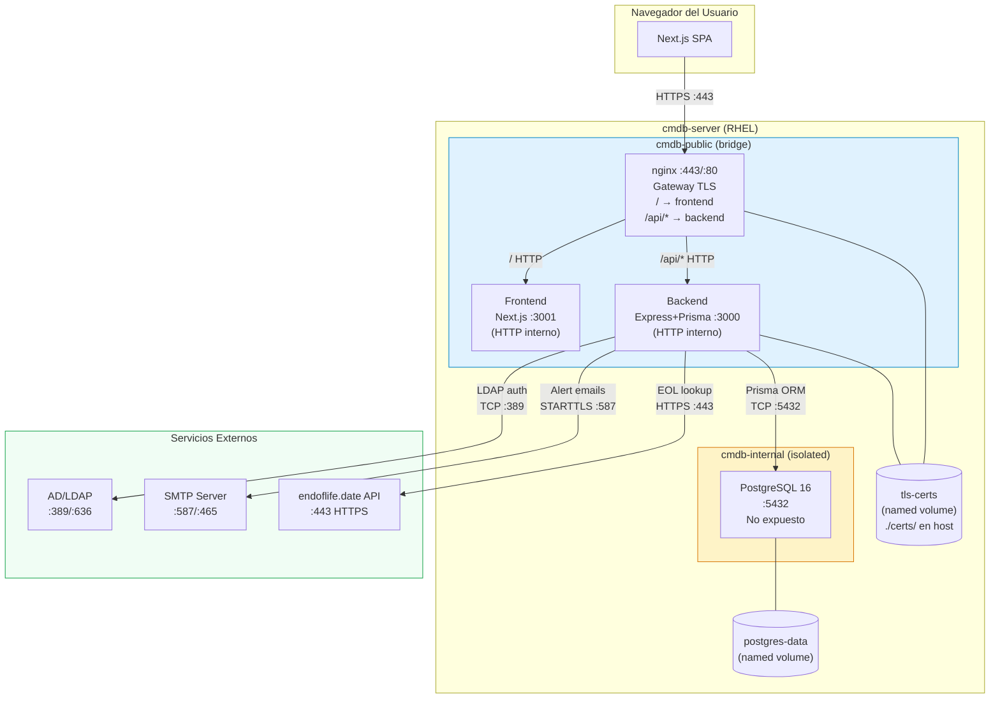
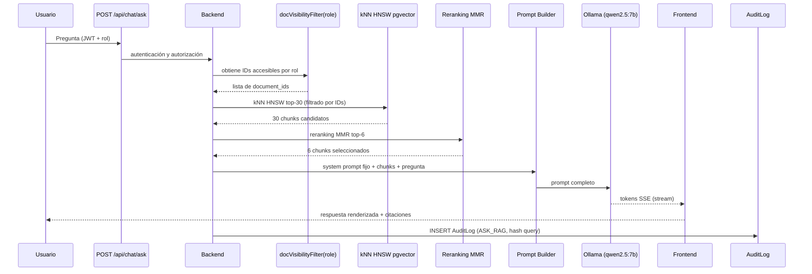

# 🏗️ CMDB Enterprise Platform — Arquitectura Técnica

**Versión:** 2.0.0
**Fecha:** 2026-06-20
**Estado:** Producción

---

## Índice

1. [Visión General](#1-visión-general)
2. [Stack Tecnológico](#2-stack-tecnológico)
3. [Topología de Contenedores](#3-topología-de-contenedores)
4. [Redes y Puertos](#4-redes-y-puertos)
5. [Flujos de Tráfico](#5-flujos-de-tráfico)
6. [Diagrama de Arquitectura (Mermaid)](#6-diagrama-de-arquitectura-mermaid)
7. [Modelo de Datos (Entidades Principales)](#7-modelo-de-datos-entidades-principales)
8. [Módulos Funcionales](#8-módulos-funcionales)
9. [Seguridad](#9-seguridad)
10. [Decisiones de Diseño](#10-decisiones-de-diseño)
11. [Capacity Planning y Dimensionamiento de Hardware](#11-capacity-planning-y-dimensionamiento-de-hardware)
12. [Subsistema RAG — Asistente IA](#12-subsistema-rag--asistente-ia)

---

## 1. Visión General

CMDB Enterprise Platform es una aplicación web full-stack de gestión de inventario tecnológico (Configuration Management Database). Permite a las organizaciones registrar, clasificar y monitorizar sus activos de TI (servidores, redes, software, dispositivos de usuario), integrando herramientas de seguridad (Greenbone, CrowdStrike), gestión de contratos y alertas proactivas por email.

La plataforma se despliega como un conjunto de contenedores Docker orquestados con Docker Compose, diseñada para ejecutarse en servidores Linux (Red Hat Enterprise Linux 8/9) con soporte para Podman.

---

## 2. Stack Tecnológico

### Frontend
| Componente | Tecnología | Versión |
|------------|-----------|---------|
| Framework  | Next.js    | 16.x    |
| Lenguaje   | TypeScript | 5.x     |
| Estilos    | Tailwind CSS | 4.x   |
| Iconos     | Lucide React | 0.577 |
| Parsing CSV | PapaParse | 5.x    |
| Mapas de dependencias | ReactFlow | 11.x |
| Export Excel | ExcelJS | 4.4.x |
| i18n       | Custom Context (sin librería) | — |
| Autenticación | JWT HttpOnly cookie + AuthContext | — |
| Theming    | ThemeContext + CSS custom properties | — |

**Contextos y componentes clave del frontend:**
- `contexts/AuthContext.tsx` — estado de sesión, rehidratación del JWT en el montaje, comprobación periódica de caducidad cada 60 s.
- `contexts/LanguageContext.tsx` — soporte de 6 idiomas (ES/EN/DE/PT/FR/IT). Todas las cadenas UI usan `t("clave")`.
- `contexts/ThemeContext.tsx` — Obtiene `GET /api/settings/theme` en el montaje e inyecta las propiedades CSS `--sidebar-bg` y `--accent` en `<head>` mediante un `<style id="theme-vars">`. Expone `companyName` y `logoUrl` a todos los componentes.
- `components/TopBar.tsx` — Barra superior solo móvil (`md:hidden`) con botón hamburguesa. Renderiza logo/nombre de empresa con el fondo temático.

### Backend
| Componente | Tecnología | Versión |
|------------|-----------|---------|
| Runtime    | Node.js    | 20.x (Alpine) |
| Framework  | Express.js | 5.x     |
| ORM        | Prisma     | 5.x     |
| Lenguaje   | TypeScript | 5.x     |
| Autenticación | JWT (jsonwebtoken) + bcrypt | 9.x / 6.x |
| MFA        | otplib (TOTP RFC 6238) | 12.x |
| QR Code    | qrcode     | 1.5.x   |
| LDAP       | ldap-authentication | 4.x |
| Seguridad HTTP | Helmet | 8.x   |
| Alertas Email | nodemailer | 8.x  |
| Scheduler  | node-cron  | 4.x     |
| Proxy TLS  | nginx 1.30 | — |
| Upload de ficheros | multer | 1.x |

### Base de Datos
| Componente | Tecnología | Versión |
|------------|-----------|---------|
| Motor      | PostgreSQL | 16 (Alpine) |
| UI Admin   | Adminer    | latest (dev only) |

### Infraestructura
| Componente | Tecnología |
|------------|-----------|
| Contenedores | Docker Engine 24+ / Podman 4+ |
| Orquestación | Docker Compose v2 |
| SO Objetivo  | RHEL 8/9, CentOS Stream 9 |
| SSL/TLS      | OpenSSL (certificados autofirmados o CA corporativa) |

---

## 3. Topología de Contenedores

```
┌─────────────────────────────────────────────────────────────────────┐
│                        HOST: cmdb-server                             │
│                                                                     │
│  ┌──────────────────────────────────────────────────────────────┐  │
│  │                     cmdb-public network                      │  │
│  │                                                              │  │
│  │   ┌────────────────────────────────────────────────────┐    │  │
│  │   │  cmdb-nginx    (nginx 1.30-alpine)                  │    │  │
│  │   │  Puertos host: :443 (HTTPS)  :80 (→ redirect 301)  │    │  │
│  │   │  /         → frontend:3001                          │    │  │
│  │   │  /api/*    → backend:3000                           │    │  │
│  │   │  certs: tls-certs (ro)                             │    │  │
│  │   └──────────────┬──────────────┬─────────────────────┘    │  │
│  │                  │              │                            │  │
│  │                  ▼              ▼                            │  │
│  │   ┌─────────────────┐  ┌───────────────────────────────┐   │  │
│  │   │  cmdb-frontend   │  │       cmdb-backend            │   │  │
│  │   │  Next.js :3001   │  │  Express + Prisma :3000       │   │  │
│  │   │  (HTTP interno)  │  │  (HTTP interno)               │   │  │
│  │   └─────────────────┘  └────────────┬──────────────────┘   │  │
│  │          (NO expuesto al host)       │  certs: tls-certs(rw)│  │
│  └──────────────────────────────────────┼──────────────────────┘  │
│                                         │                          │
│                                   ┌─────▼──────────────────┐      │
│                                   │   cmdb-internal network │      │
│                                   │                         │      │
│                                   │   cmdb-postgres-prod        │      │
│                                   │   PostgreSQL 16 :5432       │      │
│                                   │   (NO expuesto al host)     │      │
│                                   └─────────────────────────────┘      │
│                                                                         │
│   Puertos expuestos al host:  :443 (HTTPS)   :80 (HTTP → redirect)     │
│   Frontend y backend: SOLO red interna Docker, sin binding al host      │
└─────────────────────────────────────────────────────────────────────────┘
```

---

## 4. Redes y Puertos

### Redes Docker

| Red | Tipo | Descripción |
|-----|------|-------------|
| `cmdb-public` | Bridge | Frontend ↔ Backend ↔ Host |
| `cmdb-internal` | Bridge (internal: true) | Backend ↔ PostgreSQL solo — **sin acceso externo** |

### Puertos y Protocolos

| Servicio | Puerto Interno | Puerto Host | Protocolo | Descripción |
|---------|---------------|-------------|-----------|-------------|
| nginx (gateway TLS) | 443 / 80 | **443 / 80** | HTTPS / HTTP→HTTPS | Único punto de entrada; termina TLS |
| Frontend (Next.js) | 3001 | **NO EXPUESTO** | HTTP (interno) | Servido por nginx en `/` |
| Backend (Express) | 3000 | **NO EXPUESTO** | HTTP (interno) | Servido por nginx en `/api/*` |
| PostgreSQL | 5432 | **NO EXPUESTO** | TCP | Solo accesible desde cmdb-internal |
| Adminer (dev) | 8080 | 8080 | HTTP | UI de administración DB (development only) |

### Puertos de Integraciones Externas (salientes)

| Destino | Puerto | Protocolo | Descripción |
|---------|--------|-----------|-------------|
| Active Directory / LDAP | 389 | TCP/LDAP | Autenticación LDAP sin TLS |
| Active Directory / LDAPS | 636 | TCP/LDAPS | Autenticación LDAP con TLS |
| SMTP (Gmail, O365) | 587 | TCP/STARTTLS | Envío de alertas email |
| SMTP SSL | 465 | TCP/TLS | Envío de alertas email (modo seguro) |
| endoflife.date API | 443 | HTTPS | Consulta EOL/EOS de productos |
| Park Place Technologies | 443 | HTTPS | EOSL hardware enterprise (browser) |
| Cloud-Shelf | 443 | HTTPS | Búsqueda hardware (browser) |
| Greenbone (upload) | — | — | JSON report upload (sin conexión directa) |
| CrowdStrike (upload) | — | — | JSON report upload (sin conexión directa) |

---

## 5. Flujos de Tráfico

### Flujo de Autenticación Local
```
Browser → Frontend (3001) → API /api/auth/login (3000)
  Body: { email, password, mfaCode?, trustDevice?, deviceToken? }

  └── bcrypt.compare(password) → PostgreSQL (5432)
  └── ¿user.active? → NO → 401 Account disabled
  └── [Si MFA activo (mfa_enabled=true)]
       ├── ¿deviceToken en body? → buscar en trusted_devices (expiresAt > now())
       │    └── ENCONTRADO → update lastSeenAt → jwt.sign() → 200 OK
       ├── ¿mfaCode? → authenticator.check() (otplib)
       │    ├── INVÁLIDO → 401 INVALID_MFA_CODE
       │    └── VÁLIDO → (si trustDevice=true) → crear TrustedDevice → devolver deviceToken
       │         └── jwt.sign() → 200 { token, user, deviceToken? }
       └── (sin código ni dispositivo) → 401 MFA_REQUIRED
  └── [Si MFA no activo]
       ├── ¿role=ADMIN? → jwt.sign(mfaSetupRequired:true, 15min) → 200 { token, requireAction:'MFA_SETUP_REQUIRED' }
       └── ¿role=VIEWER + mfa_prompted_at IS NULL?
            ├── SÍ → UPDATE mfa_prompted_at=now() → jwt.sign(8h) → 200 { token, requireAction:'MFA_SETUP_SUGGESTED' }
            └── NO → jwt.sign(8h) → 200 { token, user } (login normal)
```

### Flujo MFA — Configuración en primer login (Admin)
```
Frontend recibe requireAction:'MFA_SETUP_REQUIRED'
  └── Token limitado (mfaSetupRequired=true) almacenado en cookie HttpOnly
  └── Muestra asistente MFA (no tiene botón "Omitir")
  └── POST /api/auth/mfa/setup → genera secret + QR (con token limitado)
  └── Usuario escanea QR → introduce código de verificación
  └── POST /api/auth/mfa/enable { code, secret, trustDevice? }
       └── UPDATE users SET mfa_enabled=true, mfa_secret=?
       └── jwt.sign() sin mfaSetupRequired → Token JWT completo (8h)
       └── (si trustDevice) → crear TrustedDevice → devolver deviceToken
       └── Frontend: applySession(nuevoToken) → redirige a /
```

### Flujo de Autenticación LDAP (cuando USE_LDAP=true)
```
Browser → Frontend (3001) → API /api/auth/login (3000)
  │
  ├─ [Pre-check] ¿email termina en @cmdb.local / @cmdb.internal?
  │    └── SÍ → salta LDAP, va directo al path local bcrypt
  │
  └─ NO → intento LDAP (timeout 5s)
       ├─ [Estrategia 1: LDAP_BIND_DN configurado]
       │    └── Service account bind → search por mail/uid → user bind
       └─ [Estrategia 2: sin LDAP_BIND_DN]
            └── Direct bind con email como UPN (AD) o uid= (OpenLDAP)
       ├─ LDAP OK → ¿usuario existe en BD?
       │    ├── SÍ  → carga user row
       │    └── NO  → auto-provisioning (role=VIEWER, sso_external_id=email)
       └─ LDAP FAIL → fallback bcrypt local (fail-safe)
            └── ¿usuario existe con contraseña local? → bcrypt.compare()

  └── [Común a ambos paths: mismo flujo MFA/TrustedDevice descrito arriba]
```

### Flujo de API Protegida
```
Browser → Frontend → API (con Bearer Token)
  └── authenticateToken() → jwt.verify()
  └── requireAdmin() (si aplica)
  └── Prisma ORM → PostgreSQL (5432, red interna)
  └── JSON response → Browser
```

### Flujo de Motor de Alertas (Cron Diario)
```
node-cron (08:30 AM Europe/Madrid)
  └── runAlertScan() → PostgreSQL (5432)
      ├── CIs con EoL/EoS < 30 días
      ├── Contratos próximos a vencer
      └── Vulnerabilidades CRITICAL/HIGH abiertas
  └── buildAlertHtml() → HTML report
  └── nodemailer.sendMail() → SMTP (587/465)
      └── ALERT_RECIPIENT inbox
```

### Flujo de Integración Greenbone
```
Admin sube JSON → POST /api/integrations/greenbone
  └── Normalización de CVEs
  └── Match CI por hostname
  └── UPDATE configuration_items.vulnerabilities (JSONB)
  └── Audit log entry
```

### Flujo HTTPS (nginx como gateway TLS unificado)
```
Browser → nginx:443 [HTTPS/TLS — certificado en ./certs/]
  ├── /         → frontend:3001 [HTTP interno]
  └── /api/*    → backend:3000  [HTTP interno]
                    └── Helmet HSTS header
                    └── CORS: solo FRONTEND_URL (mismo origen via nginx)
  nginx:80 → 301 redirect → https://
```
Al usar nginx como gateway único, frontend y backend comparten el mismo origen
(`https://host/` y `https://host/api/*`) — CORS no es necesario en la práctica.

---

## 6. Diagrama de Arquitectura (Mermaid)



---

## 7. Modelo de Datos (Entidades Principales)

```
users                          configuration_items (CIs)
  ├── id (UUID)                  ├── id (UUID)
  ├── username                   ├── name
  ├── email                      ├── apiSlug (unique)
  ├── password (bcrypt)          ├── criticality (enum)
  ├── role (ADMIN/VIEWER)        ├── environment (enum)
  ├── active                     ├── ciTypeId → ci_types         ← relacional
  ├── mfa_secret                 ├── status
  ├── mfa_enabled                ├── eolDate / eosDate
  ├── mfa_prompted_at (TIMESTAMPTZ) ← primera sugerencia MFA   ├── lastCheckDate
  └── sso_external_id            ├── verificationSource
                                 ├── vulnerabilities (JSONB)
                                 ├── agentStatus (JSONB)
                                 ├── branchId → branches
                                 ├── ciModelId → device_models
                                 ├── businessOwnerId → users
                                 ├── technicalLeadId → users
                                 ├── businessImpact (TEXT: LOW|MEDIUM|HIGH|CRITICAL) ← NIS2
                                 ├── recoveryPriority (INT 1-5) ← ISO 22301
                                 ├── rto (INT minutes) ← ISO 22301
                                 ├── rpo (INT minutes) ← ISO 22301
                                 ├── spofRisk (BOOLEAN default false) ← ISO 22301
                                 ├── containsPii (BOOLEAN default false) ← GDPR
                                 └── dataClassification (TEXT: PUBLIC|INTERNAL|CONFIDENTIAL|RESTRICTED) ← GDPR

ci_type_categories            ci_types
  ├── code (PK)                 ├── id (UUID)
  ├── name                      ├── code (unique)
  └── sort_order                ├── name
                                ├── categoryCode → ci_type_categories
                                ├── sortOrder
                                └── isSystem (BOOLEAN)

trusted_devices               (dispositivos de confianza MFA)
  ├── id (UUID)
  ├── userId → users
  ├── token (unique, 32-byte hex)
  ├── userAgent
  ├── ipAddress
  ├── expiresAt (TIMESTAMPTZ)   ← configurable: TRUSTED_DEVICE_TTL_DAYS
  ├── createdAt
  └── lastSeenAt

vendors      contracts         hardware          software
  └── name     ├── contractNumber  ├── serialNumber    ├── version
               ├── startDate       ├── model           └── licenseType
               ├── endDate         └── manufacturer
               ├── vendorId
               └── parentContractId (addendums)

support_areas  branches     manufacturers  device_models  providers
  └── name       ├── name     └── name         ├── name       └── name
                 ├── code                       └── manufacturerId
                 └── supportAreaId

ci_relations
  ├── id (UUID)
  ├── sourceCiId → configuration_items
  ├── targetCiId → configuration_items
  ├── relationType (HOSTS | DEPENDS_ON | CONNECTED_TO | PROVIDES_SERVICE | BACKED_UP_BY)
  ├── createdAt
  └── createdBy

audit_logs
  ├── action
  ├── entity / entity_id
  ├── user_email
  └── created_at

app_settings                   (almacén clave-valor para configuración en runtime)
  ├── key (TEXT, PK)             Claves: sidebar_bg, accent_color, company_name, logo_data, logo_mime
  ├── value (TEXT)               Logo almacenado como base64
  └── updated_at (TIMESTAMPTZ)

document_types                documents
  ├── id (UUID)                 ├── id (UUID)
  ├── code (unique)             ├── name
  └── name                      ├── description
                                ├── typeId → document_types
                                ├── storedFilename (UUID-based)
                                ├── originalFilename
                                ├── mimeType
                                ├── sizeBytes
                                ├── uploadedBy → users
                                └── createdAt

document_versions             document_relations
  ├── id (UUID)                 ├── id (UUID)
  ├── documentId → documents    ├── sourceDocumentId → documents
  ├── versionNumber (INT)       ├── targetDocumentId → documents
  ├── storedFilename (UUID)     ├── relationType (AMENDMENT_OF | RELATED_TO | SUPERSEDES)
  ├── originalFilename          └── createdAt
  ├── sizeBytes
  ├── uploadedBy → users
  └── createdAt

document_cis                  document_contracts
  ├── documentId → documents    ├── documentId → documents
  └── ciId → configuration_items└── contractId → contracts

license_metric_categories     license_metrics
  ├── id (UUID)                  ├── id (UUID)
  ├── code (unique)              ├── code (unique)
  └── name                       ├── name
                                 └── categoryId → license_metric_categories

license_type_categories       license_types
  ├── id (UUID)                  ├── id (UUID)
  ├── code (unique)              ├── code (unique)
  └── name                       ├── name
                                 └── categoryId → license_type_categories

licenses
  ├── id (UUID)
  ├── name
  ├── licenseNumber
  ├── vendorId → vendors
  ├── startDate
  ├── endDate
  ├── licenseTypeId → license_types
  ├── licenseMetricId → license_metrics
  ├── metricValue (INT)
  ├── metricUnit (TEXT)
  ├── cost (DECIMAL)
  ├── currency (TEXT)
  ├── status (ACTIVE | EXPIRING | EXPIRED | DRAFT)
  ├── notes
  ├── parentLicenseId → licenses   ← jerarquía (sublicencias)
  └── createdAt

license_users                 _LicenseToCI (M2M implícita Prisma)
  ├── id (UUID)                  ├── A → licenses
  ├── licenseId → licenses       └── B → configuration_items
  ├── name
  ├── dni
  └── email

document_licenses             (M2M entre Document y License)
  ├── documentId → documents
  └── licenseId → licenses
```

---

## 7b. Almacenamiento de Ficheros (Repositorio Documental)

Los archivos subidos a través del Repositorio Documental se gestionan con las siguientes garantías de seguridad:

| Aspecto | Implementación |
|---------|---------------|
| **Librería de upload** | `multer` (multipart/form-data) |
| **Validación de tipo** | Doble validación: extensión permitida (allowlist) + magic bytes del fichero (cabecera binaria). Rechaza archivos cuyo contenido no coincida con la extensión declarada. |
| **Nombre en disco** | UUID v4 generado en el servidor; el nombre original nunca se escribe en el sistema de ficheros. Previene path traversal y colisiones. |
| **Tamaño máximo** | 50 MB por fichero (configurable vía variable de entorno) |
| **Ubicación** | Ruta configurable en el host (bind mount), definida por la variable de entorno `DOCUMENTS_STORAGE_PATH`. Por defecto se utiliza un volumen Docker nombrado `cmdb-documents`, pero en producción se recomienda un bind mount hacia una ruta dedicada (local o NFS). |
| **Descarga** | Servida exclusivamente a través del endpoint autenticado `GET /api/documents/:id/download`. El backend comprueba el JWT antes de enviar el stream del fichero. |
| **Extensiones admitidas** | PDF, DOCX, DOC, PPTX, XLSX, ODT, ODS, TXT, CSV, PNG, JPG |

### Almacenamiento configurable (bind mount)

A partir de la versión 1.5.0, la ruta de almacenamiento de documentos se configura mediante la variable de entorno `DOCUMENTS_STORAGE_PATH` en el archivo `.env`:

```bash
# Ruta local en el host
DOCUMENTS_STORAGE_PATH=/var/lib/cmdb/documents

# Montaje NFS (ejemplo)
DOCUMENTS_STORAGE_PATH=/mnt/nfs/cmdb-docs
```

Cuando `DOCUMENTS_STORAGE_PATH` está definida, el contenedor `cmdb-backend` monta esa ruta del host en `/app/documents`, reemplazando el volumen Docker nombrado. Esto facilita:
- Backups mediante herramientas estándar del sistema de ficheros
- Integración con almacenamiento compartido NFS en entornos de alta disponibilidad
- Acceso directo para auditorías sin acceder al interior del contenedor

El directorio debe existir en el host antes de arrancar los servicios y debe ser accesible para el UID del proceso `node` dentro del contenedor.

El directorio (ya sea bind mount o volumen nombrado) debe incluirse en la estrategia de backup junto con el volumen de PostgreSQL.

---

## 8. Módulos Funcionales

| Módulo | Ruta Frontend | Endpoints Backend |
|--------|--------------|-------------------|
| Dashboard | `/` | `GET /api/cis`, `GET /api/contracts` |
| Inventario | `/inventory` | `GET/POST /api/cis`, `POST /api/cis/bulk` |
| Vulnerabilidades | `/vulnerabilities` | `PATCH /api/vulnerabilities` |
| Contratos | `/contracts` | `GET/POST /api/contracts` |
| Datos Maestros | `/admin/masters` | `GET/POST/DELETE /api/masters/*`, `GET /api/masters/ci-type-categories`, `PATCH/DELETE /api/masters/ci-types/:id` |
| Auditoría | `/audit` | `GET /api/audit-logs[?from=ISO&to=ISO]` |
| Integraciones | `/integrations` | `POST /api/integrations/greenbone|crowdstrike` |
| Reportes | `/reports` | (client-side PDF/CSV generation) |
| Configuración | `/settings` | `GET/PATCH /api/users/*`, `GET /api/settings/theme`, `PUT /api/settings/theme`, `POST /api/settings/logo`, `DELETE /api/settings/logo` |
| Perfil | `/profile` | `GET/POST /api/users/me/mfa/*` |
| Mapa | `/map` | `GET /api/cis`, `GET /api/cis/:id/relations?depth=1-4` |
| Relaciones | `/inventory` (modal) | `POST /api/relations`, `DELETE /api/relations/:id` |
| Auth | `/login` | `POST /api/auth/login` |
| Repositorio Documental | `/documents` | `GET /api/documents`, `POST /api/documents` (multipart/multer), `GET /api/documents/:id`, `PATCH /api/documents/:id`, `DELETE /api/documents/:id`, `POST /api/documents/:id/versions`, `GET /api/documents/:id/versions`, `GET /api/documents/:id/download`, `GET/POST/DELETE /api/documents/:id/relations`, `POST /api/documents/:id/cis`, `POST /api/documents/:id/contracts` |
| Inventario — Documentos y Contratos | `/inventory` (modal detalle CI) | `GET /api/cis/:id/contracts`, `POST /api/cis/:id/contracts`, `DELETE /api/cis/:id/contracts/:contractId`, `POST /api/cis/:id/documents`, `DELETE /api/cis/:id/documents/:docId` |
| Contratos — CIs y Documentos | `/contracts` (fila expandida) | `GET /api/contracts/:id/cis`, `POST /api/contracts/:id/cis`, `DELETE /api/contracts/:id/cis/:ciId` |
| Repositorio de Licencias | `/licenses` | `GET /api/licenses`, `POST /api/licenses`, `GET /api/licenses/:id`, `PATCH /api/licenses/:id`, `DELETE /api/licenses/:id`, `GET/POST/DELETE /api/licenses/:id/cis`, `GET/POST/DELETE /api/licenses/:id/documents`, `GET/POST/DELETE /api/licenses/:id/users` |
| Datos Maestros — Licencias | `/admin/masters` (pestañas) | `GET/POST /api/masters/license-metric-categories`, `GET/POST/PATCH/DELETE /api/masters/license-metrics/:id`, `GET/POST /api/masters/license-type-categories`, `GET/POST/PATCH/DELETE /api/masters/license-types/:id` |

### Endpoints de Configuración Visual (Branding)

- `GET /api/settings/theme` — Público (sin autenticación). Devuelve `{ sidebarBg, accentColor, companyName, hasLogo }`. Usado por ThemeContext en el montaje y por la página de login.
- `GET /api/settings/logo` — Público. Sirve el logo de la empresa como imagen binaria con `Content-Type` correcto. Devuelve 404 si no hay logo.
- `PUT /api/settings/theme` — Solo ADMIN. Actualiza `sidebar_bg`, `accent_color` y/o `company_name` en `app_settings`. Registra en AuditLog.
- `POST /api/settings/logo` — Solo ADMIN. Carga logo (PNG/JPEG/WebP, máx. 2 MB) con validación de magic bytes. Almacena en base64 en `app_settings`. Registra en AuditLog.
- `DELETE /api/settings/logo` — Solo ADMIN. Elimina el logo. Registra en AuditLog.

### Asociaciones bidireccionales CI ↔ Documento ↔ Contrato

A partir de la versión 1.5.0, las asociaciones entre CIs, documentos y contratos pueden gestionarse desde cualquiera de las tres vistas de entidad:

| Acción | Vista de origen | Endpoint |
|--------|----------------|----------|
| Asociar CIs a un documento | Detalle del documento | `POST /api/documents/:id/cis` — body: `{ ciIds: string[] }` |
| Asociar contratos a un documento | Detalle del documento | `POST /api/documents/:id/contracts` — body: `{ contractIds: string[] }` |
| Asociar documentos a un CI | Pestaña Documentos del CI | `POST /api/cis/:id/documents` — body: `{ documentIds: string[] }` |
| Desvincular documento de un CI | Pestaña Documentos del CI | `DELETE /api/cis/:id/documents/:docId` |
| Asociar contratos a un CI | Pestaña Contratos del CI | `POST /api/cis/:id/contracts` — body: `{ contractIds: string[] }` |
| Desvincular contrato de un CI | Pestaña Contratos del CI | `DELETE /api/cis/:id/contracts/:contractId` |
| Asociar CIs a un contrato | Fila expandida del contrato | `POST /api/contracts/:id/cis` — body: `{ ciIds: string[] }` |
| Desvincular CI de un contrato | Fila expandida del contrato | `DELETE /api/contracts/:id/cis/:ciId` |

Todas las operaciones de escritura requieren rol ADMIN y generan entradas en `audit_logs`.

### Repositorio de Licencias — Asociaciones

El módulo de licencias extiende el modelo de asociaciones con las siguientes relaciones:

| Acción | Endpoint |
|--------|----------|
| Asociar CIs a una licencia | `POST /api/licenses/:id/cis` — body: `{ ciId: string }` |
| Desvincular CI de una licencia | `DELETE /api/licenses/:id/cis/:ciId` |
| Asociar documentos a una licencia | `POST /api/licenses/:id/documents` — body: `{ documentId: string }` |
| Desvincular documento de una licencia | `DELETE /api/licenses/:id/documents/:docId` |
| Añadir usuario de licencia | `POST /api/licenses/:id/users` — body: `{ name, dni, email }` |
| Eliminar usuario de licencia | `DELETE /api/licenses/:id/users/:userId` |

Los catálogos de referencia (métricas y tipos) se gestionan a través de los endpoints `/api/masters/license-*` y están precargados en el seed con 6 categorías de métrica, 25 métricas, 3 categorías de tipo y 14 tipos estándar.

---

## 9. Seguridad

| Control | Implementación |
|---------|---------------|
| Autenticación | JWT HS256 (8h, algoritmo explícito en sign y verify) + bcrypt cost-12 |
| MFA | TOTP RFC 6238 (otplib). Admin: obligatorio en primer login (token limitado `mfaSetupRequired`). VIEWER: sugerido (once-only, tracked via `mfa_prompted_at`). |
| Dispositivos de confianza | Token 32-byte hex en `trusted_devices` DB. Vinculado a IP y User-Agent en creación; validación requiere igualdad estricta (sin bypass NULL). TTL configurable (`TRUSTED_DEVICE_TTL_DAYS`). Cleanup cron diario (02:00). |
| Caducidad JWT (frontend) | `AuthContext` decodifica el claim `exp` del cmdb_user localStorage y descarta sesiones expiradas en mount, cada 60 s y en `visibilitychange`. `apiFetch` valida antes de cada petición. Cookie HttpOnly purga con `POST /api/auth/logout`. |
| Errores internos | Los `catch` de Express devuelven siempre `{ error: 'Internal server error' }` — nunca se exponen mensajes SQL ni stack traces al cliente. |
| LDAP/AD | Opcional via ldap-authentication; admin-bind+search (recomendado) o direct-bind; timeout 5s fail-safe; shadow user con `sso_external_id` |
| RBAC | ADMIN / VIEWER con `requireAdmin` middleware |
| Headers HTTP | Helmet 8.x + nginx: CSP, X-Frame-Options DENY, HSTS includeSubDomains+preload, Referrer-Policy, Permissions-Policy |
| CORS | Lista blanca explícita (CORS_ORIGINS env var) |
| HTTPS | Node.js https module + certificados en volumen Docker |
| DB Aislada | Red `cmdb-internal` — puerto 5432 nunca expuesto |
| Secretos | Variables de entorno — nunca en código fuente |
| Audit Log | Tabla `audit_logs` append-only. El endpoint `GET /api/audit-logs` enriquece cada entrada con `entity_name` resuelto via LEFT JOINs (`configuration_items`, `documents`, `users`, `ci_relations`) en una sola `$queryRaw`. Soporta filtrado de rango de fechas con parámetros `?from` y `?to` (validación server-side + query parametrizada vía `Prisma.sql`). |
| Cumplimiento | ISO 27001 A.9.2 / A.10.1 / A.12.4 (ver SECURITY_AUDIT.md) |
| NIS2 / GDPR | Campos `businessImpact`, `spofRisk`, `containsPii`, `dataClassification`, `rto`, `rpo` en el modelo CI |

---

## 9b. Modelo de Cumplimiento Normativo (NIS2 / ISO 22301 / GDPR)

Los campos de cumplimiento se almacenan directamente en la tabla `configuration_items` como columnas TEXT/BOOLEAN/INT (sin tablas relacionales separadas para minimizar joins).

### Mapeo Normativa → Campo

| Normativa | Artículo / Cláusula | Campo en CI | Descripción |
|-----------|---------------------|-------------|-------------|
| NIS2 | Art. 21 - Gestión de riesgos | `businessImpact` | Clasificación del impacto (LOW/MEDIUM/HIGH/CRITICAL) |
| NIS2 | Art. 23 - Notificación de incidentes | `businessImpact = CRITICAL` | Identifica sistemas cuyo incidente debe notificarse en <24h |
| ISO 22301 | 8.4 - BCP / DRP | `rto`, `rpo` | Objetivos de recuperación en minutos |
| ISO 22301 | 8.4 - SPOF Analysis | `spofRisk` | Marca sistemas sin redundancia |
| ISO 22301 | 8.4 - Recovery Priority | `recoveryPriority` | Orden de restauración 1-5 |
| GDPR | Art. 30 - Registro de actividades | `containsPii` | Flag de tratamiento de datos personales |
| GDPR | Art. 5 - Principios del tratamiento | `dataClassification` | Clasificación: PUBLIC/INTERNAL/CONFIDENTIAL/RESTRICTED |

### Decisión de diseño: columnas planas vs. tabla de compliance separada

Se optó por columnas planas en `configuration_items` porque:
- El número de campos de compliance es fijo y conocido (normativas estables)
- Evita JOIN adicional en la query más frecuente (GET /api/cis)
- Los campos son opcionales (`NULL` = sin clasificar), sin penalización de espacio
- Facilita filtrado y ordenación desde el inventario sin subconsultas

---

## 10. Decisiones de Diseño

| Decisión | Alternativas consideradas | Justificación |
|----------|--------------------------|---------------|
| Next.js App Router | Pages Router, Vite+React | Soporte standalone Docker, SSR, layouts nativos |
| Prisma ORM | TypeORM, Sequelize, SQL puro | Type-safety, migrations automáticas, soporte JSONB |
| JWT en HttpOnly cookie | localStorage, Session | XSS-safe; misma cookie enviada automáticamente; logout vía POST endpoint |
| JSONB para vulns/agents | Tablas relacionales separadas | Flexibilidad de esquema, datos heterogéneos por fuente |
| node-cron | Bull, Agenda | Sin dependencia de Redis; simplicidad para alertas diarias |
| Travesía de grafo con CTE recursiva (PostgreSQL) | N peticiones HTTP desde el frontend (BFS cliente) | Una sola query; el motor PostgreSQL gestiona la travesía y la prevención de ciclos con arrays de camino |
| ExcelJS para export | jsPDF, backend CSV | Export de Excel 100% cliente, sin petición adicional al servidor, sin CVEs activos (xlsx tenía Prototype Pollution sin fix) |
| i18n custom context | next-intl, react-i18next | Sin App Router complication, bundle mínimo, control total |
| Alpine base images | Ubuntu, Debian | Imagen mínima (~50MB), menor superficie de ataque |
| non-root USER node | root (default) | Requisito de hardening: principio de mínimo privilegio |
| `@@index` en todas las FK | Sin índices explícitos (Prisma default) | Las FK sin índice causan seq scans en JOINs y filtros. Se añaden `@@index` en: `ci_types(categoryCode)`, `trusted_devices(userId)`, `locations(parentLocationId)`, `contracts(vendorId, parentContractId)`, `branches(supportAreaId)`, `device_models(manufacturerId)`, `licenses(status, endDate, licenseTypeId, licenseMetricId, vendorId)`, `document_licenses(documentId)`, y otras tablas relacionales. |
| `onDelete`/`onUpdate` explícito en todas las relaciones | Dejar sin especificar (comportamiento implícito) | Las acciones referenciales implícitas son ambiguas entre versiones de Prisma/PostgreSQL. Política definida: `Cascade` para registros hijos/junturas, `SetNull` para FK opcionales en CIs, `Restrict` para referencias a datos maestros. |

---

## 11. Capacity Planning y Dimensionamiento de Hardware

Esta sección documenta los requisitos de hardware para el despliegue en producción de CMDB Enterprise Platform en entornos Red Hat Enterprise Linux (RHEL) con Podman Rootless.

### 11.1 Particularidades de Podman Rootless

> **⚠️ CRÍTICO: Almacenamiento en /home con Podman Rootless**
>
> A diferencia de Docker tradicional, **Podman Rootless almacena todas las imágenes, contenedores y volúmenes persistentes en el directorio home del usuario de servicio**:
>
> ```
> /home/cmdb-admin/.local/share/containers/
>   ├── storage/           → Imágenes y capas de contenedores (overlayfs)
>   │   ├── overlay/       → Capas de imagen (Node.js, PostgreSQL, etc.)
>   │   └── overlay-images/
>   └── volumes/           → Datos persistentes de PostgreSQL
>       ├── cmdb-postgres-data-prod/
>       └── cmdb-tls-certs/
> ```
>
> **Impacto:** Si `/home` no está en un volumen LVM dedicado con suficiente espacio, la base de datos PostgreSQL puede llenar la partición raíz (`/`) y provocar:
> - Caída del sistema operativo
> - Corrupción de datos de PostgreSQL
> - Imposibilidad de arrancar nuevos contenedores
> - Pérdida de logs y backups
>
> **Solución obligatoria en producción:**
> - Crear un volumen LVM independiente para `/home` (o específicamente `/home/cmdb-admin`)
> - Dimensionar según la tabla de escalado (sección 11.2)
> - Monitorizar el uso de disco de forma proactiva

### 11.2 Tabla de Dimensionamiento de Hardware

La siguiente tabla proporciona guías de dimensionamiento basadas en el volumen proyectado de Configuration Items (CIs) en el inventario:

| Volumen de CIs | vCPU | RAM | Espacio LVM en /home | Crecimiento BD (Postgres) | Casos de Uso |
|----------------|------|-----|----------------------|---------------------------|--------------|
| **Hasta 1.000** | 2 | 4 GB | 15 GB | ~500 MB | Pymes, entorno de pruebas, despliegues piloto |
| **1.000 a 5.000** | 4 | 8 GB | 30 GB | ~2 GB | Empresas medianas, integraciones básicas (Greenbone, CrowdStrike) |
| **5.000 a 20.000+** | 8+ | 16 GB+ | 60 GB+ | ~10 GB+ | Enterprise, escaneos masivos de vulnerabilidades, alto volumen de auditoría |

#### Notas sobre el dimensionamiento:

**vCPU:**
- El backend Node.js es mono-hilo por request (Event Loop)
- Podman ejecuta múltiples contenedores: PostgreSQL (intensivo en CPU durante queries complejos), backend, frontend
- Se recomienda al menos 1 vCPU dedicado por servicio (3 mínimo)

**RAM:**
- PostgreSQL requiere buffer pool (~25% de la RAM total recomendada)
- Node.js backend: ~512 MB en idle, hasta 1.5 GB bajo carga con 1000 CIs activos
- Frontend Next.js standalone: ~300 MB
- Se debe reservar RAM para el sistema operativo RHEL (~1 GB)

**Espacio LVM en /home:**
- **Imágenes de contenedores:** ~3-4 GB (Node.js 22 Alpine + PostgreSQL 16 Alpine + frontend)
- **Base de datos PostgreSQL:** Depende del volumen de CIs (ver "Crecimiento BD")
- **Logs de contenedores:** ~500 MB - 1 GB por mes (con logrotate configurado)
- **Backups locales:** Si se almacenan en `/home/cmdb-admin/backups`, calcular ~1 GB por backup diario × retención (default 30 días)
- **Margen de seguridad:** Siempre provisionar 30-50% más del cálculo base

**Crecimiento de la base de datos:**
- **Sin vulnerabilidades:** ~500 KB por CI (metadata + relaciones)
- **Con vulnerabilidades JSONB (Greenbone):** ~2-5 MB por CI (depende del número de CVEs)
- **Con auditoría completa:** +20% adicional por año (tabla `audit_logs`)

### 11.3 Ejemplo de cálculo para 3.000 CIs

**Escenario:** Empresa mediana con 3.000 CIs, integración con Greenbone, backups diarios con retención de 30 días.

```
Cálculo de espacio en /home:
─────────────────────────────────────────────────
Imágenes de contenedores:          4 GB
Base de datos PostgreSQL:          1.5 GB  (3000 CIs × 500 KB)
Vulnerabilidades JSONB:            4.5 GB  (3000 CIs × 1.5 MB avg)
Logs de contenedores:              1 GB    (3 meses con logrotate)
Backups diarios (30 días):         18 GB   (600 MB × 30 días)
─────────────────────────────────────────────────
Total:                             29 GB
Margen de seguridad (40%):         +11.6 GB
─────────────────────────────────────────────────
Espacio LVM recomendado:           40-50 GB
```

**Hardware recomendado:**
- vCPU: 4
- RAM: 8 GB
- LVM en /home: 50 GB
- Filesystem: XFS (mejor rendimiento para bases de datos que ext4)

### 11.4 Monitorización de espacio en disco (Obligatorio)

```bash
# Verificar uso de /home
df -h /home

# Verificar uso específico de Podman Rootless
du -sh /home/cmdb-admin/.local/share/containers/

# Verificar tamaño de la base de datos PostgreSQL
podman exec cmdb-postgres-prod psql -U cmdb_admin -d cmdb_db -c "\l+"

# Verificar uso de volúmenes Podman
podman volume ls
podman volume inspect cmdb-postgres-data-prod | grep Mountpoint
du -sh $(podman volume inspect cmdb-postgres-data-prod --format '{{.Mountpoint}}')
```

### 11.5 Ampliación de LVM en caliente (si se queda sin espacio)

Si el volumen `/home` se llena en producción, puedes ampliarlo sin detener los servicios:

```bash
# 1. Verificar espacio disponible en el Volume Group
sudo vgs
# VG   #PV #LV #SN Attr   VSize   VFree
# vg0    1   3   0 wz--n- 100.00g 20.00g

# 2. Extender el volumen lógico (+20 GB)
sudo lvextend -L +20G /dev/vg0/lv_home

# 3. Extender el filesystem (XFS se puede hacer en caliente)
sudo xfs_growfs /home

# 4. Verificar
df -h /home
```

### 11.6 Recomendaciones de filesystem

| Filesystem | Ventajas | Desventajas | Recomendación |
|------------|----------|-------------|--------------|
| **XFS** | Excelente rendimiento con archivos grandes (bases de datos), crecimiento en caliente | No se puede reducir el tamaño | ✅ **Recomendado para producción** |
| **ext4** | Más maduro, soporta reducción de tamaño | Menor rendimiento en I/O intensivo | ⚠️ Aceptable pero no óptimo |
| **btrfs** | Snapshots, compresión, CoW | Mayor complejidad, soporte limitado en RHEL 8 | ❌ No recomendado para producción RHEL |

**Recomendación oficial:** Usar **XFS** para el volumen `/home` en producción con Podman Rootless.

### 11.7 Checklist de capacidad antes del despliegue

- [ ] `/home` está en un volumen LVM independiente (no en `/` raíz)
- [ ] El volumen tiene al menos el tamaño calculado según la tabla (sección 11.2)
- [ ] El filesystem es XFS
- [ ] El Volume Group tiene espacio libre para ampliaciones futuras (mínimo 20% free)
- [ ] Se ha configurado monitorización de uso de disco (alertas al 80%)
- [ ] El plan de backups considera el crecimiento proyectado
- [ ] Se ha documentado el procedimiento de ampliación de LVM

---

*Para consultar la documentación de despliegue completa, revisa [`DEPLOY.md - Sección 1.3`](../DEPLOY.md#13-verificar-dimensionamiento-de-almacenamiento-lvm).*

---

## 12. Subsistema RAG — Asistente IA

### 12.1 Visión general

El asistente inteligente de CMDB utiliza RAG (Retrieval-Augmented Generation) para responder preguntas en lenguaje natural citando documentos del corpus almacenado en la plataforma. El usuario formula una pregunta; el sistema recupera los fragmentos de texto más relevantes de los documentos a los que tiene acceso según su rol, los incluye como contexto en el prompt y obtiene una respuesta del modelo de lenguaje. Todo el procesamiento de IA es local: no se envía ningún dato a servicios externos de IA en la nube.

### 12.2 Componentes añadidos

| Componente | Tecnología | Versión | Rol |
|------------|-----------|---------|-----|
| LLM local | Ollama | latest | Embeddings (bge-m3) y chat (qwen2.5:7b-instruct) |
| BD vectorial | pgvector | 0.7+ | Vector store dentro del PostgreSQL existente |
| Parsing docs | pdf-parse, mammoth, exceljs, officeparser | varias | Extracción de texto de PDF/DOCX/XLSX/PPTX/ODT |
| OCR (fallback) | tesseract-ocr, poppler-utils, node-tesseract-ocr | 5.5.1 / 2.2.1 | OCR de PDFs escaneados sin texto embebido (fallback automático de docParser) |
| Chat API | Express SSE | — | Streaming de respuestas via text/event-stream |

### 12.3 Flujo de datos (Ingesta)

```mermaid
sequenceDiagram
    participant U as Usuario
    participant API as POST /api/documents
    participant BE as Backend
    participant IDX as rag_document_index
    participant CRON as Cron 30s
    participant P as docParser
    participant C as Chunker
    participant RS as ragService.embed()
    participant OL as Ollama (bge-m3)
    participant DB as rag_chunks

    U->>API: Sube documento
    API->>BE: multipart/form-data
    BE->>IDX: INSERT estado=PENDING
    CRON->>IDX: Consulta documentos PENDING
    IDX-->>CRON: Documento pendiente
    CRON->>P: extrae texto (por tipo MIME; OCR si PDF escaneado)
    P->>C: texto plano
    C->>RS: chunks semánticos 800 tok
    RS->>OL: texto del chunk
    OL-->>RS: vector float[1024]
    RS->>DB: INSERT rag_chunks (embedding + metadata)
    DB-->>IDX: estado=READY
```

> **Fallback OCR para PDFs escaneados:** si `pdf-parse` extrae cero caracteres, `docParser` activa automáticamente el fallback OCR: rasteriza cada página con `pdftoppm` (300 DPI por defecto, configurable con `OCR_DPI`) y ejecuta Tesseract 5 con los idiomas configurados en `OCR_LANGUAGES` (defecto `spa+eng`). Los ficheros PNG temporales se eliminan en el bloque `finally`. El texto OCR resultante sigue el mismo flujo de chunking y embedding que el texto nativo.

### 12.4 Flujo de datos (Query)



### 12.5 Topología de contenedores (actualizada)

Se añade el servicio `cmdb-ollama` a la red interna `cmdb-net`. Este contenedor nunca se expone al host. El backend accede a Ollama exclusivamente en `http://ollama:11434`. Nginx sigue siendo la única puerta de entrada para el tráfico externo; Ollama es completamente opaco desde el exterior.

```
Browser ──HTTPS:443──▶ nginx ──/──▶ frontend (Next.js :3001)
                              └──/api/──▶ backend (Express :3000)
                                              ├──▶ postgres+pgvector (:5432)
                                              └──▶ ollama (:11434)  [red interna]
```

### 12.6 Modelo de datos RAG (tablas)

| Tabla | Descripción |
|-------|-------------|
| `rag_document_index` | Estado de indexación por documento/versión: `PENDING`, `INDEXING`, `READY`, `ERROR`. Una fila por cada combinación documento+versión. |
| `rag_chunks` | Fragmentos de texto con embedding `vector(1024)`, campos `section`, `page`, `metadata` (jsonb). Desde v2 incluye `entity_type` (`document` \| `ci` \| `contract` \| `license` \| `vulnerability`) y `entity_id` (uuid); para chunks de documento `document_id` se mantiene poblado, para chunks de entidad es `NULL`. Índice HNSW sobre `embedding` con `vector_cosine_ops` y un índice B-tree compuesto sobre `(entity_type, entity_id)` para el lookup por entidad y los DELETE en hooks. |
| `rag_entity_index` *(v2)* | Estado de indexación por entidad no-documento. Clave única `(entity_type, entity_id)`. Separada de `rag_document_index` porque las entidades son mutables y no versionadas en el pipeline. CHECK constraint sobre `entity_type` en `('ci','contract','license','vulnerability')`. |
| `rag_chat_sessions` | Sesiones de chat por usuario: id, user_id, título, timestamps de creación y última actividad. |
| `rag_chat_messages` | Mensajes por sesión: pregunta del usuario, respuesta del modelo, `citations` (jsonb con `entityType`, `entityId`, título, sección y snippet de cada fragmento usado). |

**Índices clave:**

```sql
-- Búsqueda aproximada de vectores (cosine similarity)
CREATE INDEX rag_chunks_embedding_hnsw
    ON rag_chunks
    USING hnsw (embedding vector_cosine_ops)
    WITH (m = 16, ef_construction = 64);

-- Lookup por entidad (v2): re-index, DELETE en hooks, listing por tipo
CREATE INDEX idx_rag_chunks_entity
    ON rag_chunks (entity_type, entity_id);
```

Para las vulnerabilidades, que no son una tabla sino entradas JSON dentro de `configuration_items.vulnerabilities`, `entity_id` se calcula como `uuid_v5(namespace, ciId || ':' || cve)` con un namespace fijo e inmutable definido en `backend/src/services/entitySerializer.ts`. Esto permite la idempotencia del UPSERT y la trazabilidad estable de citaciones a lo largo del tiempo.

### 12.7 Control de acceso (ACL documentos)

Los campos `read_admin`, `read_auditor` y `read_viewer` (Boolean, por defecto `true`) en la tabla `documents` determinan si un fragmento procedente de ese documento es recuperable para cada rol. El filtro se aplica **antes** del kNN mediante una subconsulta SQL que restringe los `document_id` elegibles, garantizando que ningún chunk de un documento restringido se incluya jamás en el contexto del modelo. El filtrado post-recuperación no se utiliza para evitar fugas de información.

### 12.8 Importación masiva de documentos (staging + análisis IA)

La carga masiva (solo ADMIN) reutiliza el modelo Ollama para clasificar documentos antes de crearlos. Su ciclo de vida está respaldado por dos tablas de staging, separadas del repositorio documental real:

| Tabla | Descripción |
|-------|-------------|
| `bulk_import_batch` | Un lote por subida: `created_by`, `status` (`UPLOADED` → `ANALYZING` → `READY` → `PARTIALLY_COMMITTED`/`COMMITTED`/`DISCARDED`), `file_count`, `total_bytes`. |
| `bulk_import_item` | Un fichero por fila: `staged_file_name` (UUID en el área de staging), metadatos del fichero, `status` (`PENDING_ANALYSIS` → `ANALYZING` → `ANALYZED`/`ERROR` → `COMMITTED`/`DISCARDED`), `analysis` (jsonb con la sugerencia de la IA + la decisión del usuario), `committed_document_id`. FK a `bulk_import_batch` con `ON DELETE CASCADE`. |

**Flujo:**

1. **Subida** (`POST /api/documents/bulk/batches`): validación magic-bytes por fichero + límites de lote (`BULK_MAX_FILES`, `BULK_MAX_TOTAL_MB`); los ficheros se escriben en `BULK_STAGING_DIR` con nombre UUID; se crean el batch y los items (`PENDING_ANALYSIS`).
2. **Análisis** (`processBulkImportQueue`, sobre el cron RAG cada 30 s, presupuesto `BULK_ANALYZE_BUDGET`/ciclo): `parseDocument` extrae el texto — **con fallback OCR (Tesseract vía `parsePdfWithOcr`) para PDFs escaneados sin texto digital**, igual que la indexación RAG normal —, `analyzeDocumentForImport` pide a Ollama (`format: json`, marco anti-inyección) `{tipo, fechas, proveedor, número, target, ciHints}`; la salida se valida con Zod y se sanea; `matchCIsForImport` busca CIs por serie/nombre (LIKE escapado). Resultado en `analysis`, estado `ANALYZED`.
3. **Materialización** (`POST .../items/:id/commit` o `.../batches/:id/commit`): en una transacción se crea el `Document` real (el fichero se copia de staging al store y solo se borra de staging si la transacción tiene éxito), y opcionalmente un `Contract`/adenda o `License` con sus asociaciones documento↔entidad y documento↔CI. Cada entidad creada genera `AuditLog` y se encola para indexación RAG.
4. **Limpieza:** un cron horario descarta lotes con antigüedad > `BULK_BATCH_TTL_HOURS` y borra sus ficheros de staging (recurso acotado — ISO 22301 / NIS2).

El worker comparte el único Ollama CPU-bound con la indexación RAG; por eso se ejecuta **después** de `processRagQueue` en cada tick y con un presupuesto reducido por ciclo, para no inanizar la indexación normal.

```sql
-- Subconsulta de visibilidad aplicada ANTES del kNN
SELECT id FROM documents
WHERE
  (role = 'ADMIN'   AND read_admin   = true) OR
  (role = 'AUDITOR' AND read_auditor = true) OR
  (role = 'VIEWER'  AND read_viewer  = true)
```

### 12.9 Seguridad y cumplimiento

| Área | Medida |
|------|--------|
| SSRF | Ollama solo es accesible dentro de la red interna Docker; el backend nunca acepta URLs proporcionadas por el cliente para realizar llamadas salientes. |
| Prompt injection | El system prompt es fijo y no sobrescribible por el usuario. Se aplica una denylist de patrones de control (p. ej. secuencias de escape de roles) antes de enviar el prompt al modelo. |
| GDPR | El `AuditLog` registra un hash SHA-256 de la query, nunca el texto literal. Las sesiones de chat son purgables por el propio usuario. No se almacena PII en `rag_chunks`. |
| ISO 27001 A.8.15 | Se inserta un registro en `AuditLog` por cada operación `ASK_RAG` e `INDEX_DOC`. |
| ISO 22301 | Ollama es stateless entre llamadas. Un fallo del servicio Ollama degrada el asistente a "IA no disponible" sin afectar al resto de la aplicación (degradación controlada). |

### 12.10 Capacity planning (host CPU-only con AMX)

El modelo `qwen2.5:7b-instruct` ejecutado en CPU con extensiones Intel AMX (Sapphire Rapids o posterior) ofrece el siguiente perfil de rendimiento aproximado:

| Usuarios concurrentes | RAM Ollama en uso | Velocidad (tok/s por llamada) | Tiempo de respuesta medio |
|-----------------------|-------------------|-------------------------------|---------------------------|
| 1 | 6 GB | 12–18 tok/s | 10–18 s |
| 5 (cola FIFO) | 6 GB | 12–18 tok/s por llamada | 50–90 s |
| 10 (cola FIFO) | 6 GB | 12–18 tok/s por llamada | > 90 s (degradación visible) |

El límite práctico sin GPU es de 2–3 peticiones simultáneas con latencia aceptable. A partir de 5 usuarios concurrentes se forma cola FIFO; el tiempo total escala linealmente.

> **Nota de escaldo:** Cambiar al modelo `qwen2.5:3b-instruct` aproximadamente duplica la concurrencia efectiva y reduce la latencia media a la mitad, a costa de menor precisión en preguntas técnicas complejas.

> **Nota de arquitectura:** Si `backend/src/index.ts` supera ~5.500 líneas tras añadir el subsistema RAG, planificar la migración a `backend/src/modules/` como siguiente refactor de arquitectura.

### 12.10 v2 — Indexación de entidades estructuradas

A partir de v2.3, el subsistema RAG indexa cuatro tipos de entidades estructuradas además del corpus documental: **CIs**, **contratos** (sólo el contrato raíz — los anexos se serializan dentro del texto del raíz), **licencias** (mismo patrón raíz/anexos) y **vulnerabilidades** (identificadas por un UUID v5 sintético derivado de `(ciId, cve)`). El esquema de la tabla `rag_chunks` se extiende con las columnas `entity_type` y `entity_id`, y se añade una tabla de estado `rag_entity_index` separada de `rag_document_index` porque las entidades son mutables y no versionadas en el pipeline.

El control de acceso en el worker de búsqueda usa una sola cláusula `WHERE` con `LEFT JOIN` condicional: los chunks de documento siguen filtrándose por la ACL por rol existente; los chunks de entidad son visibles a todos los usuarios autenticados. Las prioridades del worker (vulnerabilidad > contrato/licencia > CI, 3 huecos por tick) y la SQL ACL completa se documentan en `docs/RAG_ENTITIES_INDEXING_PLAN.md` §7 y §10. La DPIA actualizada con los ocho riesgos STRIDE adicionales se encuentra en `docs/security/rag-dpia.md` (AMENDMENT v1.1).

---

## DCIM Module — v2.6.0

### Backend module pattern

v2.6.0 introduce el primer módulo de backend dedicado. La modularización completa de los 7 dominios CRUD se completa en v2.9.0 (ver § v2.9.0 más adelante). Estructura actual de `backend/src/`:

```
backend/src/
  index.ts                     — Orquestador Express: montaje de routers, cron, arranque. ~4 900 líneas (era ~8 200).
  shared/
    middleware/
      authenticate.ts          — createAuthenticateToken(prisma) — factory que produce el middleware JWT+DB
      requireAdmin.ts          — requireAdmin middleware (rol ADMIN)
      requireAudit.ts          — requireAudit middleware (rol ADMIN o AUDITOR)
      requireUuidParam.ts      — requireUuidParam(param) — UUID validation gate
    utils/
      auditLog.ts              — insertAuditLog() helper (insert-only ISO 27001 A.8.15)
      likeEscape.ts            — escapeLike() — escapa %, _, \ antes de LIKE
      pagination.ts            — parsePagination(), buildPaginationMeta()
      docVisibility.ts         — docVisibilitySqlCol() — selector SQL de ACL por rol
    types.ts                   — JwtPayload, tipos compartidos
    schemas/
      common.ts                — UuidParamSchema, PaginationSchema
  modules/
    dcim/                      — DCIM físico (edificios/pisos/salas/pasillos/footprints/racks/heatmap)
      router.ts / schemas.ts / audit.ts / middleware.ts / queries.ts
    plugins/                   — Plugin Engine: registro, hooks, marketplace, cron
      index.ts / router.ts / engine.ts / scheduler.ts
    alerts/                    — Alertas email (EOL/EOS/contratos/vulnerabilidades, scheduler, historial)
      router.ts / scheduler.ts / emailTemplates.ts
    decommission/              — Planes de decomisionado (CTE recursiva, Gantt SVG, CRUD docs/contratos)
      router.ts / schemas.ts
    catalog/                   — SO y BaseSoftware
      router.ts / schemas.ts / queries.ts / audit.ts
    settings/                  — Configuración de app (tema, logo, SMTP, RAG, LDAP, SSO)  [v2.9.0]
      router.ts / schemas.ts
    vendors/                   — Proveedores CRUD  [v2.9.0]
      router.ts / schemas.ts
    integrations/              — Greenbone + CrowdStrike (SSRF-allowlisted)  [v2.9.0]
      router.ts / schemas.ts
    licenses/                  — Licencias CRUD + M2M CIs/documentos/usuarios  [v2.9.0]
      router.ts / schemas.ts
    contracts/                 — Contratos CRUD + adendas + M2M CIs/documentos  [v2.9.0]
      router.ts / schemas.ts
    masters/                   — Datos maestros (~43 rutas): fabricantes, tipos CI, modelos, ramas, …  [v2.9.0]
      router.ts / schemas.ts
    documents/                 — Repositorio documental + bulk import AI (~31 rutas)  [v2.9.0]
      router.ts / schemas.ts
  services/
    ldap.ts / microsoftSso.ts / emailService.ts / eolService.ts / ragService.ts / …
```

Este patrón (`backend/src/modules/<nombre>/`) es el enfoque **obligatorio** para todas las nuevas funcionalidades grandes. No añadir código de nuevas features directamente a `index.ts`.

### Data model additions

5 new tables (cascade delete along hierarchy: `dcim_buildings → dcim_floors → dcim_rooms → dcim_aisles/dcim_footprints`):

```
Branch ──1:N── DcimBuilding ──1:N── DcimFloor ──1:N── DcimRoom ──1:N── DcimAisle
                                                                  └──1:N── DcimFootprint ──0:1── CI (rack)
```

9 new columns on `hardware_cis`: `size_u`, `power_w`, `rack_total_u`, `rack_power_max_w`, `rack_width_mm`, `rack_depth_mm`, `parent_rack_ci_id` (FK → CI), `u_position`, `orientation`.

### Frontend components

```
frontend/
  app/
    dcim/
      page.tsx               — Dashboard: KPIs, room list, power alerts widget
      admin/page.tsx         — CRUD: Buildings → Floors → Rooms (inline, cascading)
      rooms/[id]/page.tsx    — Room view: ReactFlow plan + rack elevation drawer
  components/
    dcim/
      RoomPlan2D.tsx         — ReactFlow canvas, FootprintNode custom nodes, heatmap overlay
      RackElevation2D.tsx    — SVG rack elevation (U slots, FRONT/REAR toggle, power bar)
      PlaceCIModal.tsx       — CI physical placement (cascading dropdowns + conflict check)
```

### Key architectural decisions (2026-06-04)

| Decision | Rationale |
|----------|-----------|
| `modules/dcim/` dedicated module | `index.ts` cohesion 0.02 (graphify); new pattern avoids further monolith growth |
| Lifecycle workflow → v2.6.1 | Cross-cutting concern affecting all hardware CIs; kept DCIM scope focused |
| M3 masters tabs → eliminated | `/admin/masters` already had 8 tabs; CRUD lives inline in `/dcim/admin` |
| `requireUuidParam` blanket | Retroactively applied to 64 existing routes (contracts/documents/licenses/masters) — closes F-02 |
| `PlaceCIModal` dedicated | `EditCIModal` already saturated (C74 in graphify); separation of concerns |
| ReactFlow for `RoomPlan2D` | Already installed (used in `/map`); pan/zoom + click handlers built-in |
| LATERAL JOIN for alerts/heatmap | Avoids N+1 queries; single SQL round-trip per endpoint |

---

## v2.9.0 — Modularización del backend (Strangler Fig)

Extrae **~108 rutas** (~3 300 líneas) de `index.ts` a `backend/src/modules/` mediante el patrón Strangler Fig. El `index.ts` pasa de ~8 200 a ~4 900 líneas y queda como orquestador puro.

### Módulos extraídos (T0–T7, PRs #154–#161)

| Tarea | Módulo | Rutas | PR |
|-------|--------|-------|----|
| T0 | `shared/` (middleware + utils) | — (infraestructura) | #154 |
| T1 | `settings` | 5 | #155 |
| T2 | `vendors` | 4 | #156 |
| T3 | `integrations` | 2 | #157 |
| T4 | `licenses` | 14 | #158 |
| T5 | `contracts` | 9 | #159 |
| T6 | `masters` | 43 | #160 |
| T7 | `documents` | 31 | #161 |

### Convenciones del patrón de módulo

```typescript
// Cada módulo exporta una factory con inyección de dependencias:
export function createXxxRouter(
  prisma: PrismaClient,
  queueForIndexing?: (type: string, id: string) => void | Promise<void>,
): Router

// Montaje en index.ts:
app.use('/api/xxx', createXxxRouter(prisma, (t, id) => queueEntityForIndexing(t as RagEntityType, id)));
```

- **`shared/middleware/`**: `createAuthenticateToken(prisma)`, `requireAdmin`, `requireAudit`, `requireUuidParam` — importados por todos los módulos.
- **`shared/utils/`**: `insertAuditLog`, `escapeLike`, `parsePagination`, `docVisibilitySqlCol` — utilidades sin estado.
- **Sin `index.ts` barrel**: los módulos se importan directamente desde `./modules/<nombre>/router`.
- **Tests por módulo**: jest + supertest, ~40–46 tests por módulo (401 gate, 403 RBAC, happy-path, audit-log assertions).
- **Fuera de alcance v2.9.0 (fase futura)**: `cis` + `relations`, núcleo crítico (`auth`/SSO/MFA, `users`, `audit-logs`, `chat`/RAG, `admin`, `cron`).

---

## 13. v2.7.0 — Nuevas capacidades y cambios arquitectónicos

### 13.1 Módulo `catalog/` (T4 — OperatingSystem, T5 — BaseSoftware)

Nuevo módulo `backend/src/modules/catalog/` (patrón DCIM):

```
backend/src/modules/catalog/
  router.ts    — 14 endpoints CRUD: /api/catalog/operating-systems, /api/catalog/base-software,
                  /api/catalog/cis/:ciId/base-software
  schemas.ts   — Zod schemas para OS y BaseSoftware (code auto-generado desde name)
  queries.ts   — Prisma queries, ON CONFLICT idempotente
  audit.ts     — auditCatalog() helper (insert-only, ISO 27001 A.8.15)
```

Montado en `index.ts`:
```typescript
app.use('/api/catalog', authenticateToken, createCatalogRouter(prisma));
```

### 13.2 Modelo de datos — v2.7.0

**Nuevas tablas:**
- `operating_systems` (id, code UNIQUE, name, version, vendor, eol_date, notes)
- `base_software` (id, code UNIQUE, name, version, type, vendor, eol_date, notes)
- `_ci_base_software` (join M:M entre `configuration_items` y `base_software`)

**Nuevas columnas en `configuration_items`:**
- `host_name`, `mgmt_ip`, `admin_ip`, `dns`, `cluster_name`, `firmware_version` (text, nullable)
- `v_cpus` (int, nullable — excluyente con `cpu_model`)
- `cpu_model` (text, nullable — excluyente con `v_cpus`)
- `ram_gb` (int, nullable)
- `disk_gb` (int, nullable)
- `operating_system_id` (FK → `operating_systems`, nullable)

**Extensión del enum `RelationType`** (+12 valores):
`CONTAINS`, `COMPOSED_OF`, `ATTACHED_TO` (estructural), `CONNECTS_TO`, `UPLINKS_TO` (red), `POWERS`, `PROTECTS` (eléctrica), `REPLICATES_TO`, `RUNS_ON`, `QUERIES`, `LICENSES`, `MANAGES` (lógica).

**Nueva columna en `audit_logs`:**
- `details` (jsonb, nullable) — almacena `{ description, changes? }`. Insert-only.

### 13.3 Módulo de tipos de relación (T8)

`backend/src/relationTypes.ts` — fuente autoritativa:
- `VALID_RELATION_TYPES`: allowlist de los 17 tipos.
- `RELATION_TYPE_MATRIX`: restricciones por tipo de CI en cada extremo (source/target).
- `validateRelationCiTypes()`: validación aplicada antes de cualquier INSERT en `/api/relations`.

`frontend/lib/relationTypes.ts` — espejo del backend con adiciones UI:
- `CATEGORY_COLORS`: `{ structural: #6366f1, network: #0d9488, power: #f59e0b, logical: #f97316 }`
- `relationAllowed()`: filtrado de opciones en `AddRelationModal`.

### 13.4 Cascada en alta masiva (T7)

El endpoint `POST /api/cis/bulk/commit` ahora acepta opcionalmente `osName`, `osVersion`, `baseSoftwareList`. Se ejecuta en un `$transaction` de Prisma:

1. `INSERT INTO operating_systems ... ON CONFLICT (code) DO NOTHING` — idempotente.
2. `INSERT INTO base_software ... ON CONFLICT (code) DO NOTHING` — idempotente.
3. `INSERT INTO configuration_items ...` — usa el OS id resuelto.
4. `INSERT INTO _ci_base_software ...` — asociaciones M:M.

Un fallo en los pasos 1/2 no cancela el CI; los errores se registran como warnings en el batch.

### 13.5 Mejoras de AuditLog (T10)

- `GET /api/audit-logs` usa un CTE para computar `entity_name` (alias calculado en SELECT):

```sql
WITH al_named AS (
  SELECT ..., CASE al.entity WHEN 'CI' THEN ci.name ... END AS entity_name
  FROM audit_logs al LEFT JOIN ...
  WHERE created_at BETWEEN $from AND $to
)
SELECT * FROM al_named
WHERE entity_name ILIKE '%' || $search || '%' ESCAPE '\'
ORDER BY created_at DESC LIMIT 500
```

- `escapeLike(s)`: escapa `%`, `_`, `\` antes de la interpolación (OWASP A03).
- `buildAuditDetails(description, changes?)`: helper para construir `details` JSONB sin PII.

### 13.6 Decisiones arquitectónicas (2026-06-12)

| Decisión | Justificación |
|----------|---------------|
| `catalog/` módulo unificado para OS + BSW | Mismo patrón DCIM; evita crecer `index.ts`; los dos maestros comparten lógica de auto-code |
| `cpuModel` ↔ `vCpus` mutuamente excluyentes | Refuerza el invariante físico/virtual a nivel de BD y Zod (D3 del plan) |
| CTE para `entity_name` en audit-logs | `entity_name` es un alias calculado; no referenciable en WHERE sin CTE |
| `RELATION_TYPE_MATRIX` en módulo compartido | Única fuente de verdad; frontend la importa como espejo (backlog: generación automática) |
| `details` jsonb en `audit_logs` (no nueva tabla) | Mantiene la tabla plana; `jsonb` soporta índices GIN para búsquedas futuras |

---

## 14. Plugin Engine (v2.8.0)

Motor de extensiones que permite a usuarios **ADMIN** instalar plugins de terceros sin tocar el core. Referencia técnica completa en [`docs/PLUGIN_ENGINE.md`](PLUGIN_ENGINE.md); guía de desarrollo en [`docs/PLUGIN_DEVELOPMENT_GUIDE.md`](PLUGIN_DEVELOPMENT_GUIDE.md); checklist de admisión en [`docs/PLUGIN_SECURITY_CHECKLIST.md`](PLUGIN_SECURITY_CHECKLIST.md).

### 14.1 Módulo `backend/src/modules/plugins/`

Sigue el patrón de módulos del repo (igual que `dcim/` y `catalog/`); **no** crece `index.ts`:

| Archivo | Responsabilidad |
|---------|-----------------|
| `engine.ts` | `SandboxExecutor` (`vm.Script`), `HookRegistry`, `CronRegistry`, `RouteRegistry`, `PluginValidator`, `MigrationRunner`, `PluginLifecycleManager`, `emitHook()` |
| `router.ts` | 12 endpoints REST bajo `/api/plugins` (`requireAdmin` + rate-limit) |
| `schemas.ts` | `PluginManifestSchema` (Zod), permisos, slots, estados |
| `middleware.ts` | `pluginRateLimiter`, `requirePluginExists`, validación de upload |
| `queries.ts` | `getActivePlugins`, `setPluginStatus`, `createBackupRecord` |
| `audit.ts` | `pluginAudit()` → inserta en `audit_logs` (`entity='PLUGIN'`) |
| `index.ts` | `initializePluginEngine(app, prisma)` — montaje + reactivación al arranque |

### 14.2 Integración con el core

- **Hooks:** `index.ts` emite `emitHook('pre*'/'post*')` en 13 puntos (CRUD de CIs, creación de contratos/documentos/licencias, login). Los pre-hooks pueden cancelar la operación (`{ cancel, reason }` → 409); los post-hooks son fire-and-forget. `emitHook` hace early-return si no hay plugins activos (coste cero).
- **Arranque:** `initializePluginEngine` se llama al final de `index.ts`; monta el router y reactiva los plugins `ACTIVE` (hooks + cron). Un plugin que falle se marca `ERROR` sin bloquear el arranque (RTO ISO 22301).
- **Frontend:** `PluginProvider` (en `app/layout.tsx`) carga los plugins activos; `PluginSlot` renderiza un `PluginIframe` por slot. La UI del plugin se sirve en `<iframe sandbox="allow-scripts allow-same-origin">` con puente `postMessage` (`cmdb:init`/`cmdb:resize`/`cmdb:navigate`).

### 14.3 Modelo de confianza y datos

| Decisión | Elección |
|----------|----------|
| **D1 — Sandbox** | `vm.Script` pure-trust (no es frontera de seguridad). La frontera real es el **gate de admisión**: firma Ed25519 + checksum SHA-256 + checklist + 4-eyes en prod. Contexto vm congelado (sin `fs`/`process`/`require`/`eval`/`globalThis`), timeout 5 s, `fetch` con allowlist del manifest |
| **D2 — Datos** | Migraciones DDL con prefijo `plg_<id>_`, ejecutadas por el rol PostgreSQL `cmdb_plugin` (sin privilegios sobre tablas core). Allowlist DDL; down-migrations + backup JSON antes de desinstalar |
| **D3 — UI** | iframe aislado + puente `postMessage` host↔iframe |
| **D4 — Alcance** | Completo: marketplace, firma Ed25519, runner de migraciones (rollback como placeholder `501`) |

### 14.4 Modelo de datos

6 modelos Prisma (`plugin_registry`, `plugin_hooks`, `plugin_cron_jobs`, `plugin_routes`, `plugin_data_backups`, `plugin_data_store`) — detalle de campos en [`PLUGIN_ENGINE.md §4`](PLUGIN_ENGINE.md#4-modelos-de-datos). Almacenamiento en disco bajo el volumen `cmdb-plugins` (`staging/`, `installed/`, `backups/`).

### 14.5 Decisiones de implementación (2026-06-13)

| Decisión | Justificación |
|----------|---------------|
| Sandbox con `vm`, no `worker_threads`/proceso aislado | Simplicidad; el control fuerte es el gate de admisión humano + criptográfico, documentado explícitamente |
| Migraciones vía `execFile('psql')` con rol `cmdb_plugin` | `execFile` evita inyección de shell; el rol restringido es la barrera de BD |
| Backup JSON pre-uninstall | Reversibilidad y preservación forense (NIS2) antes de borrar tablas `plg_*` |
| 4-eyes solo en producción | Equilibra fricción operativa (dev/test) con control en el entorno crítico |

---

## 15. v2.8.2 — Ciclo de vida de activos (DateType + mirror triggers)

### 15.1 Patrón espejo (DateType como fuente de verdad)

v2.8.2 introduce un sistema de fechas extensible que coexiste con las columnas `eol_date`/`eos_date` heredadas:

```
DateType (fuente de verdad)
  ├── CIDate               ← fechas propias del CI
  ├── OperatingSystemDate  ← ciclo de vida del SO
  ├── BaseSoftwareDate     ← ciclo de vida del SW base
  └── DeviceModelDate      ← ciclo de vida del modelo HW

Columnas espejo (caché, mantenidas por triggers, NO eliminadas):
  configuration_items.eol_date / eos_date
  device_models.eol_date / eos_date
```

Los disparadores PostgreSQL (`trg_sync_ci_eol_eos`, `trg_sync_dm_eol_eos` y sus variantes `_del`) actualizan automáticamente las columnas espejo cuando se insertan, actualizan o eliminan filas con códigos canónicos:

| Código DateType | Columna espejo actualizada |
|---|---|
| `end-of-life` | `configuration_items.eol_date` |
| `end-of-support` | `configuration_items.eos_date` |
| `hw-end-of-life` | `device_models.eol_date` |
| `hw-end-of-support` | `device_models.eos_date` |

**Por qué mantener las columnas espejo:** el código legacy de `index.ts` (EOL cron, integración endoflife.date, listados de inventario) lee directamente `eol_date`/`eos_date`; eliminarlas requeriría refactorizar ~62 referencias. El trigger asegura coherencia sin tocar ese código.

### 15.2 Modelo de datos — v2.8.2

**Nuevas tablas:**
- `date_types` (id, code UNIQUE, name, description, category ENUM, sort_order, is_system)
- `ci_dates` (id, ci_id FK, date_type_id FK RESTRICT, date_value DATE, notes — UNIQUE por ci_id+date_type_id)
- `operating_system_dates`, `base_software_dates`, `device_model_dates` — mismo patrón

**Nuevo enum PostgreSQL:** `"DateTypeCategory"` (`HARDWARE`, `SOFTWARE`, `OS`, `GENERAL`)

**Nuevos endpoints en `/api/catalog`:**
- `GET/POST/PATCH/DELETE /date-types[/:id]` — CRUD de tipos de fecha (solo ADMIN)
- `GET/POST/PATCH/DELETE /{entity}/{id}/dates[/:dateId]` — asociaciones por entidad (CI, OS, BSW, DeviceModel)
- `GET /cis/:ciId/lifecycle-dates` — agregador (CI + OS + DeviceModel + BSW) con campo `source`

### 15.3 Componente `LifecycleDatesEditor`

Componente React reutilizable en `frontend/components/LifecycleDatesEditor.tsx`:

| Prop | Tipo | Descripción |
|---|---|---|
| `entityType` | `"cis" \| "operating-systems" \| "base-software" \| "device-models"` | Entidad destino |
| `entityId` | `string` | UUID de la entidad |
| `categoryFilter` | `"HARDWARE" \| "SOFTWARE" \| "OS" \| "GENERAL"` (opcional) | Filtra los DateTypes disponibles |
| `readOnly` | `boolean` (opcional) | Oculta botones de escritura |

Badges de vencimiento: rojo (fecha pasada), ámbar (< 90 días), verde (> 90 días).

---

## 16. Módulo de Alertas Email (v2.8.4)

### 16.1 Estructura del módulo

```
backend/src/modules/alerts/
├── schemas.ts        — Tipos Zod: AlertConfigUpdateSchema, AlertRuleUpdateSchema, interfaces AlertItem / ScanResult
├── queries.ts        — CRUD Prisma: getConfig, getRules, upsertConfig, upsertRule, getHistory, createRun
├── engine.ts         — scanAlerts(): escanea las 7 categorías y calcula el fingerprint SHA-256
├── email-builder.ts  — buildAlertHtml(result, locale): HTML inline con i18n ×6 embebido
├── smtp-transport.ts — sendEmail(): lee credenciales SMTP del ENV en tiempo de llamada
├── audit.ts          — insertAlertAudit(): INSERT en audit_logs sin columna details
├── pipeline.ts       — runAlertsPipeline(): orquesta dedup → scan → email → createRun → audit
├── scheduler.ts      — startAlertScheduler(): cron tick por minuto + lógica de zona horaria
└── router.ts         — createAlertsRouter(prisma): 7 endpoints montados en /api/alerts
```

El módulo sigue el mismo patrón que `backend/src/modules/dcim/` (referencia): router autocontenido, sin dependencia circular con `index.ts`, montaje con `app.use('/api/alerts', authenticateToken, createAlertsRouter(prisma))`.

### 16.2 Flujo del pipeline de alertas

```
startAlertScheduler()  ──tick cada minuto──▶  alreadyRanToday()?
                                                    │ NO
                                                    ▼
POST /api/alerts/run-now ──────────────────▶  runAlertsPipeline(prisma, trigger, force?)
                                                    │
                                              scanAlerts()  ←── 7 queries SQL ($queryRaw)
                                                    │            con LEFT JOIN device_models
                                                    │            para fallback EOL modelo
                                              fingerprint SHA-256
                                                    │
                                              suppress_unchanged? ──SÍ──▶ skip (dedup)
                                                    │ NO
                                              buildAlertHtml(result, locale)
                                                    │
                                              sendEmail() ──▶ SMTP (nodemailer)
                                                    │
                                              createRun() ──▶ INSERT alert_runs
                                                    │
                                              insertAlertAudit() ──▶ INSERT audit_logs
```

### 16.3 Modelo de datos — v2.8.4

```
alert_config (singleton: id = 'default')
├── enabled            BOOLEAN
├── send_time_hour     INT
├── send_time_minute   INT
├── timezone           VARCHAR(64)   -- IANA (e.g. 'Europe/Madrid')
├── locale             VARCHAR(10)   -- ES/EN/DE/PT/FR/IT
├── recipients         TEXT[]
├── send_all_clear     BOOLEAN
└── suppress_unchanged BOOLEAN

alert_rules (7 filas, una por categoría)
├── id         UUID PK
├── category   VARCHAR(50) UNIQUE  -- eol|eos|warranty|maintenance|contract|vulnerability|license
├── enabled    BOOLEAN
├── warn_days  INT
└── recipients TEXT[]

alert_runs (historial, insert-only)
├── id           UUID PK
├── trigger      VARCHAR(20)   -- 'scheduled'|'manual'|'test'
├── started_at   TIMESTAMP (índice DESC)
├── finished_at  TIMESTAMP
├── status       VARCHAR(20)   -- 'ok'|'error'|'skipped'
├── total_alerts INT
├── breakdown    JSONB         -- { eol: N, eos: N, ... }
├── recipients   TEXT[]
├── message_id   VARCHAR(255)
└── error_msg    TEXT
```

### 16.4 Fallback EOL desde el modelo

El scanner de EOL/EOS usa un `LEFT JOIN` a `hardware_cis` → `device_models` para heredar fechas cuando el CI no tiene fecha propia:

```sql
SELECT ci.id, ci.name,
       COALESCE(ci.eol_date, dm.eol_date) AS effective_eol,
       CASE WHEN ci.eol_date IS NOT NULL THEN 'ci' ELSE 'model' END AS eol_source
FROM configuration_items ci
LEFT JOIN hardware_cis  hci ON hci.ci_id = ci.id
LEFT JOIN device_models dm  ON dm.id = hci.device_model_id
WHERE (ci.eol_date <= :warnDate)
   OR (ci.eol_date IS NULL AND dm.eol_date <= :warnDate)
```

El campo `eol_source` se propaga hasta el frontend via `flattenCI()` en `index.ts` (`eolSource: 'ci' | 'model'`), donde el badge de inventario muestra el chip **(modelo)** en gris cuando la fuente es `'model'`.

### 16.5 Decisiones de implementación (2026-06-15)

| Decisión | Alternativa descartada | Razón |
|----------|------------------------|-------|
| Tick de 1 minuto con check en BD | Recalcular cron expression | Permite cambiar hora/zona en caliente desde UI sin reiniciar |
| Intl.DateTimeFormat para zona horaria | Librería `moment-timezone` | Sin dependencia externa; disponible en Node 18+ |
| Traducciones embebidas en email-builder.ts | Ficheros JSON en disco | Sin I/O en tiempo de envío; bundle independiente de frontend |
| Dedup por fingerprint SHA-256 | Hash de IDs sin ordenar | Orden estable (`.sort()`) garantiza idempotencia ante reordenamientos |
| `emailService.ts` como shim vacío | Eliminar el fichero | Evita romper imports en branches pendientes de merge |
