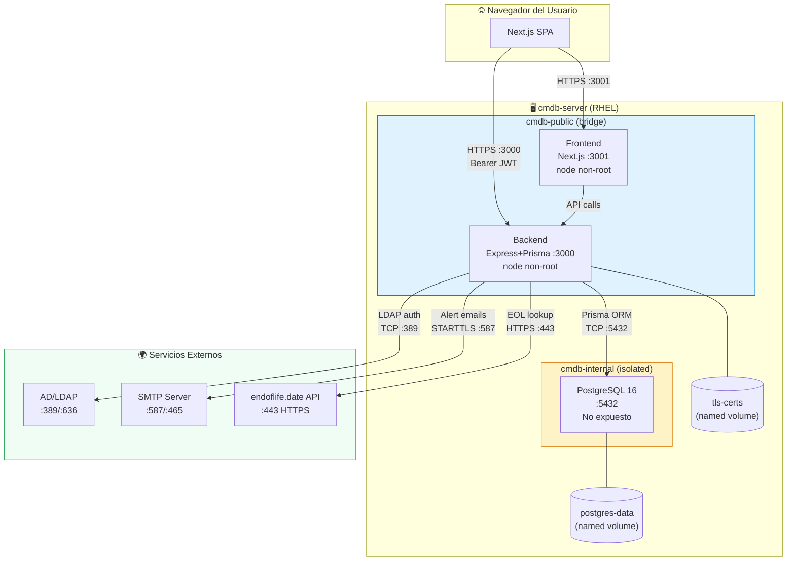

# 🏗️ CMDB Enterprise Platform — Arquitectura Técnica

**Versión:** 1.0.0  
**Fecha:** 2026-03-15  
**Estado:** Producción

---

## Índice

1. [Visión General](#1-visión-general)
2. [Stack Tecnológico](#2-stack-tecnológico)
3. [Topología de Contenedores](#3-topología-de-contenedores)
4. [Redes y Puertos](#4-redes-y-puertos)
5. [Flujos de Tráfico](#5-flujos-de-tráfico)
6. [Diagrama de Arquitectura (Mermaid)](#6-diagrama-de-arquitectura-mermaid)
7. [Modelo de Datos (Entidades Principales)](#7-modelo-de-datos-entidades-principales)
8. [Módulos Funcionales](#8-módulos-funcionales)
9. [Seguridad](#9-seguridad)
10. [Decisiones de Diseño](#10-decisiones-de-diseño)

---

## 1. Visión General

CMDB Enterprise Platform es una aplicación web full-stack de gestión de inventario tecnológico (Configuration Management Database). Permite a las organizaciones registrar, clasificar y monitorizar sus activos de TI (servidores, redes, software, dispositivos de usuario), integrando herramientas de seguridad (Greenbone, CrowdStrike), gestión de contratos y alertas proactivas por email.

La plataforma se despliega como un conjunto de contenedores Docker orquestados con Docker Compose, diseñada para ejecutarse en servidores Linux (Red Hat Enterprise Linux 8/9) con soporte para Podman.

---

## 2. Stack Tecnológico

### Frontend
| Componente | Tecnología | Versión |
|------------|-----------|---------|
| Framework  | Next.js    | 16.x    |
| Lenguaje   | TypeScript | 5.x     |
| Estilos    | Tailwind CSS | 4.x   |
| Iconos     | Lucide React | 0.577 |
| Parsing CSV | PapaParse | 5.x    |
| Mapas de dependencias | ReactFlow | 11.x |
| i18n       | Custom Context (sin librería) | — |
| Autenticación | JWT localStorage + AuthContext | — |

### Backend
| Componente | Tecnología | Versión |
|------------|-----------|---------|
| Runtime    | Node.js    | 20.x (Alpine) |
| Framework  | Express.js | 5.x     |
| ORM        | Prisma     | 5.x     |
| Lenguaje   | TypeScript | 5.x     |
| Autenticación | JWT (jsonwebtoken) + bcrypt | 9.x / 6.x |
| MFA        | speakeasy (TOTP RFC 6238) | 2.x |
| QR Code    | qrcode     | 1.5.x   |
| LDAP       | ldap-authentication | 4.x |
| Seguridad HTTP | Helmet | 8.x   |
| Alertas Email | nodemailer | 8.x  |
| Scheduler  | node-cron  | 4.x     |
| HTTPS      | Node.js https (built-in) | — |

### Base de Datos
| Componente | Tecnología | Versión |
|------------|-----------|---------|
| Motor      | PostgreSQL | 16 (Alpine) |
| UI Admin   | Adminer    | latest (dev only) |

### Infraestructura
| Componente | Tecnología |
|------------|-----------|
| Contenedores | Docker Engine 24+ / Podman 4+ |
| Orquestación | Docker Compose v2 |
| SO Objetivo  | RHEL 8/9, CentOS Stream 9 |
| SSL/TLS      | OpenSSL (certificados autofirmados o CA corporativa) |

---

## 3. Topología de Contenedores

```
┌─────────────────────────────────────────────────────────────────────┐
│                        HOST: cmdb-server                             │
│                                                                     │
│  ┌──────────────────────────────────────────────────────────────┐  │
│  │                     cmdb-public network                      │  │
│  │                                                              │  │
│  │   ┌─────────────────────┐    ┌────────────────────────────┐ │  │
│  │   │   cmdb-frontend      │    │      cmdb-backend          │ │  │
│  │   │   Next.js :3001      │───▶│   Express + Prisma :3000   │ │  │
│  │   │   (node non-root)    │    │   (node non-root)          │ │  │
│  │   └─────────────────────┘    └────────────┬───────────────┘ │  │
│  │          ▲                                │                  │  │
│  └──────────┼────────────────────────────────┼──────────────────┘  │
│             │                                │                     │
│         :3001                          ┌─────▼──────────────────┐  │
│         HOST                           │   cmdb-internal network │  │
│                                        │                        │  │
│                                  ┌─────▼──────────────────────┐ │  │
│                                  │   cmdb-postgres-prod        │ │  │
│                                  │   PostgreSQL 16 :5432       │ │  │
│                                  │   (NO expuesto al host)    │ │  │
│                                  └────────────────────────────┘ │  │
│                                        └────────────────────────┘  │
│                                                                     │
│   Puertos expuestos al exterior:  :3000 (API)   :3001 (UI)         │
└─────────────────────────────────────────────────────────────────────┘
```

---

## 4. Redes y Puertos

### Redes Docker

| Red | Tipo | Descripción |
|-----|------|-------------|
| `cmdb-public` | Bridge | Frontend ↔ Backend ↔ Host |
| `cmdb-internal` | Bridge (internal: true) | Backend ↔ PostgreSQL solo — **sin acceso externo** |

### Puertos y Protocolos

| Servicio | Puerto Interno | Puerto Host | Protocolo | Descripción |
|---------|---------------|-------------|-----------|-------------|
| Frontend (Next.js) | 3001 | 3001 | HTTP/HTTPS | Interfaz web de usuario |
| Backend (Express) | 3000 | 3000 | HTTP / HTTPS (TLS) | API REST |
| PostgreSQL | 5432 | **NO EXPUESTO** | TCP | Solo accesible desde cmdb-internal |
| Adminer (dev) | 8080 | 8080 | HTTP | UI de administración DB (development only) |

### Puertos de Integraciones Externas (salientes)

| Destino | Puerto | Protocolo | Descripción |
|---------|--------|-----------|-------------|
| Active Directory / LDAP | 389 | TCP/LDAP | Autenticación LDAP sin TLS |
| Active Directory / LDAPS | 636 | TCP/LDAPS | Autenticación LDAP con TLS |
| SMTP (Gmail, O365) | 587 | TCP/STARTTLS | Envío de alertas email |
| SMTP SSL | 465 | TCP/TLS | Envío de alertas email (modo seguro) |
| endoflife.date API | 443 | HTTPS | Consulta EOL/EOS de productos |
| Park Place Technologies | 443 | HTTPS | EOSL hardware enterprise (browser) |
| Cloud-Shelf | 443 | HTTPS | Búsqueda hardware (browser) |
| Greenbone (upload) | — | — | JSON report upload (sin conexión directa) |
| CrowdStrike (upload) | — | — | JSON report upload (sin conexión directa) |

---

## 5. Flujos de Tráfico

### Flujo de Autenticación Local
```
Browser → Frontend (3001) → API /api/auth/login (3000)
  └── bcrypt.compare(password) → PostgreSQL (5432)
  └── jwt.sign() → Token JWT (8h)
  └── [Si MFA activo] → speakeasy.totp.verify()
  └── Token → localStorage (browser)
```

### Flujo de Autenticación LDAP
```
Browser → Frontend (3001) → API /api/auth/login (3000)
  └── ldap-authentication → AD/LDAP (389/636)
  └── [Auto-provisioning] → PostgreSQL (5432)
  └── jwt.sign() → Token JWT (8h)
  └── Token → localStorage (browser)
```

### Flujo de API Protegida
```
Browser → Frontend → API (con Bearer Token)
  └── authenticateToken() → jwt.verify()
  └── requireAdmin() (si aplica)
  └── Prisma ORM → PostgreSQL (5432, red interna)
  └── JSON response → Browser
```

### Flujo de Motor de Alertas (Cron Diario)
```
node-cron (08:30 AM Europe/Madrid)
  └── runAlertScan() → PostgreSQL (5432)
      ├── CIs con EoL/EoS < 30 días
      ├── Contratos próximos a vencer
      └── Vulnerabilidades CRITICAL/HIGH abiertas
  └── buildAlertHtml() → HTML report
  └── nodemailer.sendMail() → SMTP (587/465)
      └── ALERT_RECIPIENT inbox
```

### Flujo de Integración Greenbone
```
Admin sube JSON → POST /api/integrations/greenbone
  └── Normalización de CVEs
  └── Match CI por hostname
  └── UPDATE configuration_items.vulnerabilities (JSONB)
  └── Audit log entry
```

### Flujo HTTPS (cuando HTTPS_ENABLED=true)
```
Browser → Frontend (3001) [HTTP]
Browser → API (3000) [HTTPS/TLS]
  └── TLS: certificado en cmdb-tls-certs volume
  └── Helmet HSTS header
  └── CORS strict: origen en CORS_ORIGINS
```

---

## 6. Diagrama de Arquitectura (Mermaid)



---

## 7. Modelo de Datos (Entidades Principales)

```
users                    configuration_items (CIs)
  ├── id (UUID)             ├── id (UUID)
  ├── username              ├── name
  ├── email                 ├── apiSlug (unique)
  ├── password (bcrypt)     ├── criticality (enum)
  ├── role (ADMIN/VIEWER)   ├── environment (enum)
  ├── active                ├── ciType
  ├── mfa_secret            ├── status
  └── mfa_enabled           ├── eolDate / eosDate
                            ├── lastCheckDate
                            ├── verificationSource
                            ├── vulnerabilities (JSONB)
                            ├── agentStatus (JSONB)
                            ├── branchId → branches
                            ├── ciModelId → device_models
                            ├── businessOwnerId → users
                            └── technicalLeadId → users

vendors      contracts         hardware          software
  └── name     ├── contractNumber  ├── serialNumber    ├── version
               ├── startDate       ├── model           └── licenseType
               ├── endDate         └── manufacturer
               ├── vendorId
               └── parentContractId (addendums)

support_areas  branches     manufacturers  device_models  providers
  └── name       ├── name     └── name         ├── name       └── name
                 ├── code                       └── manufacturerId
                 └── supportAreaId

audit_logs
  ├── action
  ├── entity / entity_id
  ├── user_email
  └── created_at
```

---

## 8. Módulos Funcionales

| Módulo | Ruta Frontend | Endpoints Backend |
|--------|--------------|-------------------|
| Dashboard | `/` | `GET /api/cis`, `GET /api/contracts` |
| Inventario | `/inventory` | `GET/POST /api/cis`, `POST /api/cis/bulk` |
| Vulnerabilidades | `/vulnerabilities` | `PATCH /api/vulnerabilities` |
| Contratos | `/contracts` | `GET/POST /api/contracts` |
| Datos Maestros | `/admin/masters` | `GET/POST/DELETE /api/masters/*` |
| Auditoría | `/audit` | `GET /api/audit-logs` |
| Integraciones | `/integrations` | `POST /api/integrations/greenbone|crowdstrike` |
| Reportes | `/reports` | (client-side PDF/CSV generation) |
| Configuración | `/settings` | `GET/PATCH /api/users/*` |
| Perfil | `/profile` | `GET/POST /api/users/me/mfa/*` |
| Mapa | `/map` | `GET /api/cis` (ReactFlow) |
| Auth | `/login` | `POST /api/auth/login` |

---

## 9. Seguridad

| Control | Implementación |
|---------|---------------|
| Autenticación | JWT HS256 (8h) + bcrypt cost-10 |
| MFA | TOTP RFC 6238 (speakeasy) |
| LDAP/AD | Opcional via ldap-authentication |
| RBAC | ADMIN / VIEWER con `requireAdmin` middleware |
| Headers HTTP | Helmet 8.x (X-Frame, X-Content-Type, HSTS, XSS) |
| CORS | Lista blanca explícita (CORS_ORIGINS env var) |
| HTTPS | Node.js https module + certificados en volumen Docker |
| DB Aislada | Red `cmdb-internal` — puerto 5432 nunca expuesto |
| Secretos | Variables de entorno — nunca en código fuente |
| Audit Log | Tabla `audit_logs` con todas las acciones administrativas |
| Cumplimiento | ISO 27001 A.9.2 / A.10.1 / A.12.4 (ver SECURITY_AUDIT.md) |

---

## 10. Decisiones de Diseño

| Decisión | Alternativas consideradas | Justificación |
|----------|--------------------------|---------------|
| Next.js App Router | Pages Router, Vite+React | Soporte standalone Docker, SSR, layouts nativos |
| Prisma ORM | TypeORM, Sequelize, SQL puro | Type-safety, migrations automáticas, soporte JSONB |
| JWT en localStorage | Cookies httpOnly, Session | Compatibilidad CORS cross-origin sin servidor de sesión |
| JSONB para vulns/agents | Tablas relacionales separadas | Flexibilidad de esquema, datos heterogéneos por fuente |
| node-cron | Bull, Agenda | Sin dependencia de Redis; simplicidad para alertas diarias |
| i18n custom context | next-intl, react-i18next | Sin App Router complication, bundle mínimo, control total |
| Alpine base images | Ubuntu, Debian | Imagen mínima (~50MB), menor superficie de ataque |
| non-root USER node | root (default) | Requisito de hardening: principio de mínimo privilegio |
