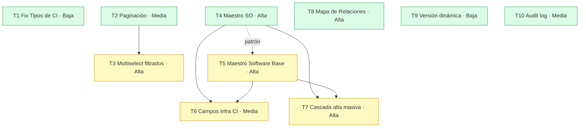

# Plan de desarrollo v2.7.0 — Mejoras y Correcciones CMDB Enterprise Platform

> Estado general: ✅ **COMPLETADO** — 10/10 tareas completadas (T1, T2, T3, T4, T5, T6, T7, T8, T9, T10)
> Rama base: `develop`
> Target: `main` tag `v2.7.0`
> Fecha de inicio: 2026-06-11
> Última actualización: 2026-06-12
> Plan documento: `docs/PLAN_v2.7.0.md`
> Flujo: feature branches desde `develop`, merge **vía PR** (no merge directo). Parar tras cada tarea para revisión.

> ⚠️ Prerequisito: v2.6.1 ya mergeada y publicada (main tag `v2.6.1`, desplegada en prod 2026-06-10).

---

## Resumen ejecutivo

v2.7.0 agrupa **10 tareas** en 7 fases: un bugfix crítico (creación de Tipos de CI), mejoras de UX en listados (paginación configurable + multiselección "todos los filtrados"), dos nuevos datos maestros (**Sistema Operativo** y **Software Base**) con sus relaciones M:M a CI/Documento/Licencia, nuevos campos de infraestructura en CI, creación en cascada durante el alta masiva, la expansión del **Mapa de Relaciones** (renombrado + nuevos tipos de relación con semántica por tipo de CI), versión dinámica en el footer y mejoras del registro de auditoría. Las tareas de schema (T4, T5, T6) son la columna vertebral: habilitan T7 (cascada) y parte de T6 (FK a OS). Se respeta la convención de módulos (`backend/src/modules/`), migraciones manuales con `IF NOT EXISTS`, audit insert-only, i18n en 6 idiomas y compliance OWASP/ISO/GDPR/NIS2.

---

## Decisiones arquitectónicas y preguntas abiertas

> Estas decisiones afectan al alcance. Marcadas con **[Q]** las que requieren confirmación del usuario antes de ejecutar.

| # | Decisión / Pregunta | Propuesta |
|---|---------------------|-----------|
| **D1** | **Ubicación backend de los nuevos maestros (OS, Software Base).** CLAUDE.md prohíbe ampliar `index.ts` salvo init de módulos. | ✅ **DECIDIDO:** módulo `backend/src/modules/catalog/` (router + schemas + queries + audit) para OperatingSystem y BaseSoftware, montado desde `index.ts`. Patrón DCIM. |
| **D2** | **T1 — cómo resolver el `code` faltante en Tipos de CI.** | ✅ **DECIDIDO:** auto-generar `code` en backend desde `name` (slug uppercase, colisión → sufijo incremental) cuando no venga del cliente. UI sin cambios. |
| **D3** | **T6 — distinguir físico vs virtual** para `cpuModel` (físico) vs `vCpus` (virtual). | ✅ **DECIDIDO:** determinar por **categoría del CIType**. El mapeo exacto categoría→físico/virtual se confirmará al iniciar T6 (tras inspeccionar las categorías reales de `CITypeCategory`). |
| **D4** | **T8 — duplicación semántica `CONNECTED_TO`/`CONNECTS_TO`, `HOSTS`.** El enum no tiene restricciones por tipo de CI nativas. | Mantener valores existentes (compat), añadir los nuevos, y documentar/validar restricciones por tipo de CI en el backend (Zod + tabla de matriz). Las restricciones se aplican en `AddRelationModal` (filtrado de opciones) y se revalidan en backend. |
| **D5** | **3D room view (R3F).** El `PLAN_v2.6.0.md` difirió el 3D del DCIM a "v2.7.0". | ✅ **DECIDIDO (2026-06-10):** queda **fuera de v2.7.0**. Se incluirá en el **siguiente plan (v2.8.0)** una vez finalizada v2.7.0. Ver § Backlog v2.8.0. |
| **D6** | **CHANGELOG.md no existe.** El checklist final lo requiere. | Crear `CHANGELOG.md` (formato Keep a Changelog) en la tarea de cierre, con entrada `[2.7.0]`. |
| D7 | **Migraciones** | Manuales, timestamped, `IF NOT EXISTS`, `prisma migrate deploy`. Nunca `migrate dev`. Una migración por tarea de schema (T4, T5, T6, T8). |
| D8 | **Tests** | Jest para lógica backend nueva (cascada T7, validación T6/T8, auto-code T1). `webapp-testing` (Playwright) para flujos UI clave. |

---

## Tabla maestra de tareas

| ID | Tarea | Fase | Complejidad | Rama | Depende de | Estado |
|----|-------|------|-------------|------|------------|--------|
| **T1** | Fix creación de Tipos de CI | 1 | Baja | `feature/fix-ci-types-master` | — | ✅ COMPLETADA (PR #90) |
| **T2** | Paginación con selector de registros/página | 2 | Media | `feature/pagination-records-per-page` | — | ✅ COMPLETADA (PR #92) |
| **T3** | Multiselect "todos los filtrados" | 2 | Alta | `feature/bulk-select-all-filtered` | T2 | ✅ COMPLETADA (PR #93) |
| **T4** | Maestro: Sistema Operativo | 3 | Alta | `feature/catalog-operating-system` | — | ✅ COMPLETADA (PR #94) |
| **T5** | Maestro: Software Base | 3 | Alta | `feature/master-base-software` | (T4 patrón) | ✅ COMPLETADA (PR #95) |
| **T6** | Nuevos campos de infraestructura en CI | 4 | Media | `feature/ci-infrastructure-fields` | T4, T5 | ✅ COMPLETADA (PR #96) |
| **T7** | Creación en cascada en alta masiva | 5 | Alta | `feature/bulk-import-cascade` | T4, T5 | ✅ COMPLETADA (PR #97) |
| **T8** | Mapa de Relaciones: renombrar + nuevos tipos | 6 | Alta | `feature/relation-map-types` | — | ✅ COMPLETADA (PR #98) |
| **T9** | Versión dinámica en footer | 7 | Baja | `feature/dynamic-version` | — | ✅ COMPLETADA (PR #91) |
| **T10** | Mejoras en Registro de Eventos (audit) | 7 | Media | `feature/audit-log-improvements` | — | ✅ COMPLETADA (PR #99) |

Leyenda estado: ⬜ PENDIENTE · 🟡 EN PROGRESO · ✅ COMPLETADA · ❌ BLOQUEADA

---

## Diagrama de dependencias

**Independientes (pueden arrancar en cualquier momento):** T1, T2, T4, T8, T9, T10.
**Secuenciales:** T3←T2; T6←(T4,T5); T7←(T4,T5); T5 reusa patrón de T4.

---

## Orden de ejecución propuesto

Dado el requisito de **parar tras cada tarea**, el orden secuencial recomendado optimiza desbloqueos tempranos:

1. **T1** (bugfix rápido, sin dependencias — victoria temprana)
2. **T9** (versión dinámica, rápida, independiente)
3. **T2** (paginación) → desbloquea T3
4. **T3** (multiselect filtrados)
5. **T4** (Maestro SO) → desbloquea T6, T7
6. **T5** (Maestro Software Base, reusa patrón T4)
7. **T6** (campos infra CI, ya con OS/SW Base disponibles)
8. **T7** (cascada alta masiva)
9. **T8** (Mapa de Relaciones)
10. **T10** (mejoras audit)
11. **Cierre:** CHANGELOG, tag v2.7.0, plan completado.

> Si se aprobara paralelización (varias ramas a la vez), los grupos independientes {T1, T9, T2, T4, T8, T10} podrían repartirse; pero el flujo "parar y revisar por tarea" del prompt favorece el orden secuencial.

---

## Estrategia de pruebas y verificación v2.7.0

> Añadido 2026-06-12 por petición del usuario. Aplica a **todas** las tareas (T1–T10, incl. las ya completadas, que se cubren retroactivamente en la pasada final).

### 1. Tests funcionales

- **Método:** suites de peticiones `curl` contra la API desplegada (nginx → backend) + verificación de UI donde aplique. Sin infraestructura Jest en el repo, los tests funcionales se ejecutan contra el entorno real y se documentan con comando, resultado esperado y resultado obtenido.
- **Credenciales:** `claude@cmdb.local` (AUDITOR) para lecturas y verificación de RBAC (403 esperado en escrituras); cuenta ADMIN de prueba con MFA pre-enrolada vía seed para los flujos de escritura.
- **Cobertura mínima por tarea:** caso feliz, caso de validación (400), caso RBAC (403), caso de conflicto/guarda (409) si aplica, y verificación de registro `AuditLog`.
- **Entregable:** `docs/testing/FUNCTIONAL_TESTS_v2.7.0.md` con tabla de casos por tarea y veredicto PASS/FAIL real (no aspiracional).

### 2. Tests OWASP (Top 10 2021)

- Revisión A01–A10 de **cada endpoint/flujo nuevo** del release: catalog (OS, BaseSoftware), asociaciones CI↔BSW, campos infra CI, cascada bulk-import, tipos de relación, filtro audit.
- Verificaciones activas donde sea posible (p. ej. intento de SQLi en filtros LIKE, path traversal en params UUID, escalada AUDITOR→escritura, inyección en payloads Zod).
- **Entregable:** `docs/security/OWASP_v2.7.0.md` (formato `owasp-v2.6.0.md`), con severidades y estado (abierto/mitigado).

### 3. Tests de compliance normativo

- **ISO 27001:2022** — A.8.15 (todas las escrituras nuevas generan `AuditLog`; insert-only verificado), A.9.2 (cambios de acceso auditados), A.8.12 (sin secretos hardcodeados en código nuevo).
- **GDPR** — sin nuevos campos PII en v2.7.0 (verificar); sin datos personales en logs nuevos; los `details` JSONB de T10 no deben volcar PII (usar IDs).
- **NIS2** — sin consumo no acotado (topes de paginación, batch en cascada); nuevos maestros desactivables de forma independiente; logging compatible con notificación 24/72h.
- **ISO 22301** — migraciones con `IF NOT EXISTS` re-ejecutables; arranque limpio < 15 min verificado tras rebuild; sin nuevos puntos únicos de fallo.
- **Entregable:** `docs/security/COMPLIANCE_v2.7.0.md` (formato `COMPLIANCE_v2.6.0.md`).

### 4. Subtareas de test por tarea

Cada tarea restante (T5–T10) incorpora estas subtareas; las completadas (T1–T4, T9) se cubren retroactivamente en la pasada final de tests:

- [ ] Tests funcionales de la tarea ejecutados y documentados
- [ ] Revisión OWASP de los endpoints/flujos de la tarea
- [ ] Revisión compliance (ISO 27001 / GDPR / NIS2 / ISO 22301) de la tarea

---

## FASE 1 — Bugs Críticos

### Tarea 1 (T1): Fix creación de Tipos de CI en Datos Maestros

| Campo | Valor |
|---|---|
| ID | T1 |
| Rama | `feature/fix-ci-types-master` |
| Estado | ✅ COMPLETADA |
| Complejidad | Baja |
| Depende de | — |
| Inicio / Fin | 2026-06-11 / 2026-06-11 |
| Commits | PR #90 — `fix(masters): auto-generate CIType code from name` |
| Notas | D2 opción A aplicada: auto-code backend (slug uppercase + sufijo incremental en colisión). Test Jest diferido (sin infraestructura Jest en el repo). |

**Causa raíz (confirmada en exploración):** `frontend/app/admin/masters/page.tsx:114` define `newCIType = { name: "", categoryCode: "" }` (sin `code`), pero `POST /api/masters/ci-types` (`backend/src/index.ts:3166`) exige `code`, `name` y `categoryCode`. El frontend nunca envía `code` → error 400 *"code, name and categoryCode are required"*.

**Archivos a modificar:**
- `backend/src/index.ts` (handler `POST /api/masters/ci-types`, ~3158-3172) — auto-generar `code` (D2 opción A) **o** —
- `frontend/app/admin/masters/page.tsx` — añadir input `code` (D2 opción B)
- `frontend/locales/{6}.json` si se añade UI nueva
- Test Jest del auto-code (colisión, normalización)

**Skills:** `find-bugs`, `graphify`, `express-typescript`, `prisma-client-api`, `frontend-design`
**Commits estimados (1-2):**
- `fix(masters): auto-generate code for CI types when omitted` (o `fix(masters): add code input to CI type form`)

#### Subtareas
- [x] Confirmar decisión D2 con usuario
- [x] Implementar fix (backend auto-code o frontend input)
- [ ] Test unitario de generación/normalización de `code` *(diferido — no hay infraestructura Jest en el repo)*
- [x] Validar en UI con `claude@cmdb.local`
- [x] `tsc --noEmit` + health check
- [x] Commit + push + PR a `develop` (PR #90, merged 2026-06-11)
- [x] Actualizar PLAN_v2.7.0.md

---

## FASE 2 — Mejoras de UX y Paginación

### Tarea 2 (T2): Paginación con selector de registros por página

| Campo | Valor |
|---|---|
| ID | T2 |
| Rama | `feature/pagination-records-per-page` |
| Estado | ✅ COMPLETADA — PR #92 (merged 2026-06-11) |
| Complejidad | Media |
| Depende de | — |

**Alcance:** Inventario (`frontend/app/inventory/page.tsx`), Contratos (`contracts/page.tsx`), Documentos (`documents/page.tsx`), Licencias (`licenses/page.tsx`) y demás listados paginados.
**Requisito:** Selector "registros por página" (10/25/50/100/250), preferencia persistida en `localStorage`. Backend debe aceptar `pageSize` (con tope máximo validado, p. ej. 250, para evitar consumo no acotado — NIS2 disponibilidad).

**Skills:** `vercel-react-best-practices`, `frontend-design`, `prisma-client-api`
**Commits estimados (2-3):**
- `feat(pagination): add records-per-page selector with localStorage persistence`
- `feat(api): accept validated pageSize param on list endpoints`

#### Subtareas
- [x] Componente reutilizable `PageSizeSelector`
- [x] Hook `usePageSize` con `localStorage` (clave `cmdb_page_size`, opciones 10/25/50/100/250)
- [x] Integrar en inventory / contracts / documents / licenses
- [x] Backend: validar `pageSize` (topes `*_MAX_PAGE_SIZE` reducidos 500→250)
- [x] i18n (6 idiomas — namespace `pagination.*`)
- [x] tsc + health + commit + PR (#92) + actualizar plan

### Tarea 3 (T3): Multiselect — "todos los filtrados" vs "solo página"

| Campo | Valor |
|---|---|
| ID | T3 |
| Rama | `feature/bulk-select-all-filtered` |
| Estado | ✅ COMPLETADA — PR #93 (merged 2026-06-11) |
| Complejidad | Alta |
| Depende de | T2 |

**Requisito:** Dropdown en checkbox de cabecera del inventario: "Seleccionar esta página" (default) vs "Seleccionar todos los que cumplen el filtro". La edición masiva (`BulkUpdateCIModal`) debe operar en ambos modos. Backend acepta `ids[]` **o** `selectAllFiltered: true` + objeto de filtros (resuelve los IDs server-side con los mismos filtros del listado).

**Riesgo:** Edición masiva sobre miles de registros → operar en transacción acotada/batched, con confirmación explícita de recuento. Reusar guardas de `BulkUpdateCIModal` existentes.

**Skills:** `vercel-react-best-practices`, `frontend-design`, `express-typescript`, `prisma-client-api`
**Commits estimados (2-3):**
- `feat(inventory): select-all-filtered dropdown in bulk selection`
- `feat(api): bulk update accepts selectAllFiltered + filter payload`

#### Subtareas
- [x] UI dropdown de modo de selección (checkbox dividido + ▼ en cabecera)
- [x] Estado de selección (página vs filtrado) en inventory + banner de modo
- [x] ~~Backend: resolver IDs por filtro server-side~~ *(N/A — la paginación es client-side, el listado filtrado completo ya está en memoria; los IDs se resuelven en cliente sin payload de filtros)*
- [x] Audit log de bulk update (reutiliza el flujo existente de `BulkUpdateCIModal` con los IDs resueltos)
- [x] i18n + confirmación de recuento (namespace `inventory.bulk.*`)
- [x] tsc + health + commit + PR (#93) + actualizar plan

---

## FASE 3 — Nuevos Datos Maestros

### Tarea 4 (T4): Maestro — Sistema Operativo

| Campo | Valor |
|---|---|
| ID | T4 |
| Rama | `feature/catalog-operating-system` |
| Estado | ✅ COMPLETADA — PR #94 (merged 2026-06-12) |
| Complejidad | Alta |
| Depende de | — (D1: módulo `catalog`) |

**Schema (migración manual):** modelos `OperatingSystem`, `DocumentOperatingSystem`, `LicenseOperatingSystem` (según spec del prompt). FK `manufacturer` (Restrict), join M:M con Document y License, relación 1:M a CI (`operatingSystemId` se añade en T6).
**Backend:** módulo `backend/src/modules/catalog/` — CRUD `/api/catalog/operating-systems`, validación Zod, audit insert-only, `requireUuidParam`.
**Frontend:** nueva pestaña en `/admin/masters` (patrón CIType/LicenseType), asociación documentos/licencias.
**i18n:** claves en 6 idiomas.

**Skills:** `prisma-development`, `supabase-postgres-best-practices`, `express-typescript`, `vercel-react-best-practices`, `frontend-design`, `documentation-writer`
**Commits estimados (4-5):**
- `feat(db): add operating_systems + join tables migration`
- `feat(catalog): OperatingSystem CRUD module + audit`
- `feat(masters): Operating System tab in /admin/masters`
- `feat(catalog): document/license association for OS`
- `docs(manual): document Operating System master`

#### Subtareas
- [x] Migración SQL manual (`IF NOT EXISTS`) + `migrate deploy` (`20260612100000_catalog_operating_systems`)
- [x] `prisma generate` (modelos `OperatingSystem`, `DocumentOperatingSystem`, `LicenseOperatingSystem`)
- [x] Módulo `catalog/` router+schemas+queries+audit (OS) — GET abierto a roles autenticados, escrituras ADMIN, delete con guarda 409 si en uso, auto-code servidor
- [x] Montar router en `index.ts` (solo init: `/api/catalog`)
- [x] Frontend: pestaña OS + CRUD en `/admin/masters`
- [ ] Asociación documentos/licencias en UI *(capa DB lista — join tables + modelos; la UI de asociación se integrará con T5/T6 cuando documentos/licencias incorporen selector de OS)*
- [x] i18n (6)
- [ ] docs (manual de usuario) *(pendiente — agrupar con actualización doc de cierre)*
- [x] tsc + health + commit + PR (#94) + actualizar plan
- [x] *(Extra)* Dockerfile backend: despin de versiones tesseract-ocr que rompían el build Alpine

### Tarea 5 (T5): Maestro — Software Base

| Campo | Valor |
|---|---|
| ID | T5 |
| Rama | `feature/master-base-software` |
| Estado | ⬜ PENDIENTE |
| Complejidad | Alta |
| Depende de | T4 (reusa patrón módulo `catalog`) |

**Schema:** `BaseSoftware`, `CIBaseSoftware` (M:M CI↔SW Base), `DocumentBaseSoftware`, `LicenseBaseSoftware`. FK manufacturer (Restrict).
**Backend:** ampliar módulo `catalog/` — CRUD `/api/catalog/base-software`.
**Frontend:** pestaña en `/admin/masters`; en `CIDetailModal` pestaña "Software Base" (asociar/desasociar, patrón pestaña Documentos). Asociación restringida a servidores físicos/virtuales (validar por ciType — ver D3).

**Skills:** idénticos a T4.
**Commits estimados (4-5):** análogos a T4 (`feat(db)…`, `feat(catalog)…`, `feat(masters)…`, `feat(ci-detail): Base Software tab`, `docs…`).

#### Subtareas
- [ ] Migración SQL manual + `migrate deploy` + `prisma generate`
- [ ] Módulo `catalog/` CRUD Software Base + audit
- [ ] Frontend: pestaña masters + pestaña en CIDetailModal
- [ ] Validación ciType (físico/virtual) — depende D3
- [ ] i18n (6) + docs
- [ ] Tests funcionales + revisión OWASP + revisión compliance (ver § Estrategia de pruebas)
- [ ] tsc + health + commit + PR + actualizar plan

---

## FASE 4 — Mejoras en CIs de Infraestructura

### Tarea 6 (T6): Nuevos campos de infraestructura en CI

| Campo | Valor |
|---|---|
| ID | T6 |
| Rama | `feature/ci-infrastructure-fields` |
| Estado | ⬜ PENDIENTE |
| Complejidad | Media |
| Depende de | T4, T5 |

**Schema:** añadir a `CI`: `cpuModel`, `vCpus`, `ram`, `disk`, `adminIp`, `mgmtIp`, `hostName`, `clusterName`, `operatingSystemId` (FK→OperatingSystem, SetNull), `firmwareVersion`, `dns`; relación `baseSoftwares CIBaseSoftware[]`.
**Backend:** actualizar `CICreateSchema`/`CIUpdateSchema` (Zod). Validar exclusión mutua `cpuModel` (físico) ↔ `vCpus` (virtual) según ciType (D3).
**Frontend:** `AddCIModal`, `EditCIModal`, `CIDetailModal` (mostrar campos; selector OS).
**i18n:** 6 idiomas.

**Skills:** `prisma-development`, `express-typescript`, `vercel-react-best-practices`, `frontend-design`
**Commits estimados (3-4):**
- `feat(db): add infrastructure fields to CI`
- `feat(ci): infra fields in create/update schemas + validation`
- `feat(ci): infra fields in Add/Edit/Detail modals`

#### Subtareas
- [ ] Migración SQL (campos + FK OS) + `migrate deploy` + generate
- [ ] Zod schemas + validación exclusión mutua (D3)
- [ ] Modales Add/Edit/Detail + selector OS
- [ ] i18n (6)
- [ ] Tests funcionales + revisión OWASP + revisión compliance (ver § Estrategia de pruebas)
- [ ] tsc + health + commit + PR + actualizar plan

---

## FASE 5 — Alta Masiva de CIs

### Tarea 7 (T7): Creación en cascada durante alta masiva

| Campo | Valor |
|---|---|
| ID | T7 |
| Rama | `feature/bulk-import-cascade` |
| Estado | ⬜ PENDIENTE |
| Complejidad | Alta |
| Depende de | T4, T5 |

**Contexto:** Ya existe cascada de `Manufacturer` + `DeviceModel` con audit `CREATE_MASTER` en el commit de bulk-import (`backend/src/index.ts:~5045/5063`). T7 **extiende** ese patrón a **Software Base** y **Sistema Operativo**.
**Reglas:** dentro de la misma `$transaction`; `findFirst`+`create` o `upsert`; reutilizar por clave natural (manufacturer: `name`; OS: `name`+`version`; SW Base: `name`+`version`+`manufacturer`); audit `CASCADE_CREATE` (o mantener `CREATE_MASTER` con `source`) por entidad creada.

**Skills:** `prisma-client-api`, `express-typescript`, `find-bugs`, `graphify`
**Commits estimados (2-3):**
- `feat(ci-bulk): cascade-create OS + base software on commit`
- `test(ci-bulk): cascade upsert idempotency`

#### Subtareas
- [ ] Extender lógica de commit de batch (OS + SW Base)
- [ ] Upsert idempotente por clave natural
- [ ] Audit de cascada
- [ ] Tests funcionales (idempotencia, reutilización) + revisión OWASP + compliance
- [ ] tsc + health + commit + PR + actualizar plan

---

## FASE 6 — Mapa de Relaciones

### Tarea 8 (T8): Renombrar "Mapa de Dependencias" → "Mapa de Relaciones" + nuevos tipos

| Campo | Valor |
|---|---|
| ID | T8 |
| Rama | `feature/relation-map-types` |
| Estado | ⬜ PENDIENTE |
| Complejidad | Alta |
| Depende de | — |

**Rename:** Sidebar, `app/map/page.tsx`, locales (6), `docs/USER_MANUAL.md`(.en), `docs/ARCHITECTURE.md`.
**Enum `RelationType`:** mantener los 5 existentes (compat) + añadir: `CONTAINS, COMPOSED_OF, ATTACHED_TO, CONNECTS_TO, UPLINKS_TO, REPLICATES_TO, POWERS, PROTECTS, RUNS_ON, QUERIES, LICENSES, MANAGES` (migración SQL `ALTER TYPE ... ADD VALUE IF NOT EXISTS`).
**Semántica/restricciones por tipo de CI:** documentar matriz y validar en `AddRelationModal` (filtrar destinos válidos) + revalidar en backend (D4).
**UI mapa:** colores/estilos por categoría (Estructural / Red / Energía / Lógica) + leyenda.

**Skills:** `prisma-development`, `react-flow-node-ts`, `vercel-react-best-practices`, `frontend-design`, `documentation-writer`
**Commits estimados (4-5):**
- `feat(db): extend RelationType enum`
- `refactor(map): rename Dependency Map → Relation Map (UI + i18n)`
- `feat(map): relation categories with color coding + legend`
- `feat(relations): CI-type restriction matrix validation`
- `docs(manual): relation types + semantics`

#### Subtareas
- [ ] Migración enum (`ADD VALUE IF NOT EXISTS`, una por valor)
- [ ] Rename completo (UI + i18n + docs)
- [ ] Matriz de restricciones (constante compartida) + validación Zod backend
- [ ] `AddRelationModal`: filtrar relaciones válidas por tipo origen/destino
- [ ] ReactFlow: estilos por categoría + leyenda
- [ ] i18n (6) + docs
- [ ] Tests funcionales + revisión OWASP + revisión compliance (ver § Estrategia de pruebas)
- [ ] tsc + health + commit + PR + actualizar plan

---

## FASE 7 — Versión Dinámica y Registro de Eventos

### Tarea 9 (T9): Versión dinámica en el footer

| Campo | Valor |
|---|---|
| ID | T9 |
| Rama | `feature/dynamic-version` |
| Estado | ✅ COMPLETADA — PR #91 (merged 2026-06-11) |
| Complejidad | Baja |
| Depende de | — |

**Contexto:** footer usa `t("footer.copyright")` en `Sidebar.tsx:171`; la versión está en los locales (no dinámica).
**Solución (Opción A — build-time):** script `prebuild` que escribe `frontend/public/version.json` con `version` (de `package.json`/`git describe`), `commit` (`git rev-parse --short HEAD`), `buildDate`. Frontend lo lee con `fetch('/version.json')` al montar y lo muestra en el footer. Funciona offline, sin llamada API extra.

**Skills:** `vercel-react-best-practices`, `gh-fix-ci`, `pre-commit-standards`
**Commits estimados (1-2):**
- `feat(version): build-time version.json + dynamic footer`

#### Subtareas
- [x] Script `scripts/gen-version.mjs` + hook `prebuild` (prefiere env `GIT_COMMIT` para builds Docker sin `.git`; ARG en Dockerfile + compose)
- [x] `version.json` en `.gitignore` (artefacto generado)
- [x] Footer lee y muestra versión + commit (`Sidebar.tsx`)
- [x] i18n del footer (clave `footer.version`; `footer.copyright` sin versión hardcodeada)
- [x] tsc + health + commit + PR (#91) + actualizar plan

### Tarea 10 (T10): Mejoras en Registro de Eventos (Audit Log)

| Campo | Valor |
|---|---|
| ID | T10 |
| Rama | `feature/audit-log-improvements` |
| Estado | ⬜ PENDIENTE |
| Complejidad | Media |
| Depende de | — |

**Requisitos:**
1. `details` (JSONB) legible y estructurado: `{ changes: [{field, old, new}], description }`. Actualizar puntos de inserción de audit en escrituras clave.
2. Búsqueda por nombre en columna "Nombre" en `app/audit/page.tsx` (input filtro, como el de email).
3. Query `GET /api/audit-logs` (`index.ts:2533`): añadir filtro por nombre de entidad resuelto (LEFT JOIN / subquery; o campo denormalizado `entityName`). Mantener tagged template literals; escapar LIKE (`%`,`_`,`\`).

**Skills:** `prisma-client-api`, `express-typescript`, `supabase-postgres-best-practices`, `vercel-react-best-practices`, `frontend-design`
**Commits estimados (2-3):**
- `feat(audit): structured human-readable details payload`
- `feat(audit): name filter in audit log query + UI`

#### Subtareas
- [ ] Helper para construir `details` estructurado (changes + description)
- [ ] Aplicar a escrituras de CI (y otras clave)
- [ ] Query: filtro por nombre (LEFT JOIN, LIKE escapado)
- [ ] UI: input de filtro por nombre
- [ ] i18n (6)
- [ ] Tests funcionales + revisión OWASP + revisión compliance (ver § Estrategia de pruebas)
- [ ] tsc + health + commit + PR + actualizar plan

---

## Cierre v2.7.0

- [ ] Todas las tareas mergeadas a `develop` vía PR
- [ ] `docs/PLAN_v2.7.0.md` 100% ✅ y fechado
- [ ] Tests funcionales ejecutados y documentados → `docs/testing/FUNCTIONAL_TESTS_v2.7.0.md`
- [ ] Revisión OWASP de todos los endpoints nuevos → `docs/security/OWASP_v2.7.0.md`
- [ ] Revisión compliance (ISO 27001 / GDPR / NIS2 / ISO 22301) → `docs/security/COMPLIANCE_v2.7.0.md`
- [ ] Actualizar `scripts/install.sh` y `scripts/update.sh` para v2.7.0 (GIT_COMMIT, build fiable, nginx restart)
- [ ] Crear `CHANGELOG.md` con entrada `[2.7.0]` (D6)
- [ ] Actualizar `docs/USER_MANUAL.md`(.en), `SYSADMIN_MANUAL`(.en), `ARCHITECTURE`(.en) y `README.md`
- [ ] Crear `docs/RELEASE_v2.7.0.md` (release notes + checklist de tag, pendiente de revisión del usuario)
- [ ] Crear `docs/PLAN_v2.8.0.md` (Plugin Engine — solo planificación, sin ejecución)
- [ ] `tsc --noEmit` limpio · rebuild · health
- [ ] ⚠️ **El tag `v2.7.0` y el merge develop→main quedan PENDIENTES de revisión manual del usuario** — no se ejecutan de forma autónoma

---

## Backlog v2.8.0 (fuera de alcance de v2.7.0)

- **Vista 3D del DCIM (React Three Fiber / R3F):** diferida desde `PLAN_v2.6.0.md` (M7) y confirmada fuera de v2.7.0 el 2026-06-10. Se planificará y ejecutará en el siguiente ciclo (v2.8.0) tras cerrar v2.7.0. Incluiría: render 3D de salas/racks, navegación de cámara, y reutilización de los datos de footprint/placement ya existentes del DCIM 2D.

---

## Riesgos identificados

| Riesgo | Impacto | Mitigación |
|--------|---------|------------|
| T3 edición masiva "todos los filtrados" sobre miles de CIs | Bloqueo DB / timeout (NIS2 disponibilidad) | Operación batched + tope + confirmación de recuento + audit del recuento real |
| T6/T8 migraciones de enum y FK en prod | Downtime / fallo de migración | `IF NOT EXISTS` / `ADD VALUE IF NOT EXISTS`, probar en dev compose antes de prod (ISO 22301) |
| T8 enum: PostgreSQL no permite varios `ADD VALUE` en misma transacción en versiones antiguas | Migración falla | Una sentencia `ADD VALUE` por valor, fuera de transacción si aplica |
| Convención de módulos vs masters en `index.ts` (D1) | Deriva arquitectónica | Confirmar D1; mantener CRUD nuevo en `modules/catalog/` |
| i18n incompleto (6 idiomas) | UI con claves crudas | Checklist por tarea: toda clave nueva en los 6 archivos |
| Solapamiento semántico `CONNECTED_TO`/`CONNECTS_TO` | Confusión de datos | Documentar; considerar deprecación futura de los antiguos (no en v2.7.0) |
| Auto-code T1 colisión de `code` | Duplicados / 409 | Normalizar + sufijo incremental + índice único existente |

---

## Estimación global

- **Tareas:** 10 · **Ramas/PRs:** 10 (+1 cierre) · **Commits estimados:** ~28-34 (código) + ~11 (actualizaciones de plan) + cierre.
- **Migraciones de schema:** 4 (T4, T5, T6, T8).
- **Tareas con i18n (6 idiomas):** T2, T3, T4, T5, T6, T8, T9, T10.
