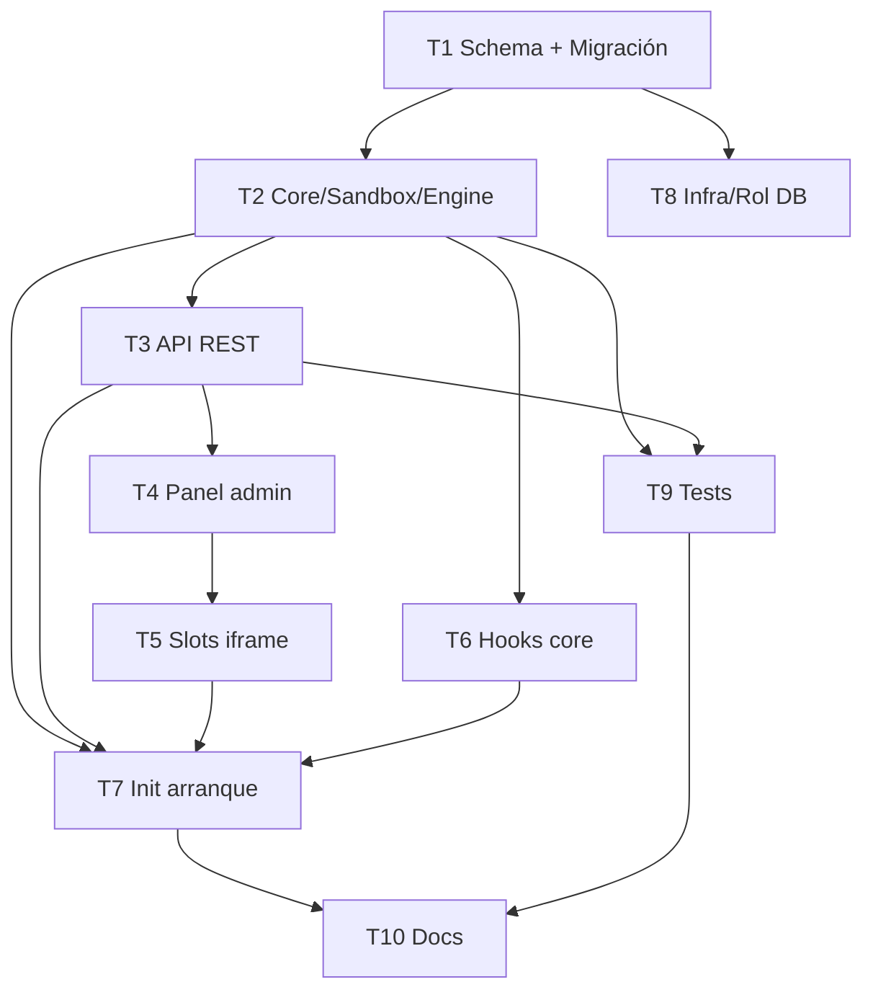

# Plan de desarrollo v2.8.0 — Plugin Engine (Motor de Plugins)

> Estado general: ✅ **PLAN COMPLETADO** (T1–T10 mergeadas a develop) — pendiente pase de endurecimiento v2.8.1 (issues #109–#116) antes de tag `v2.8.0`
> Rama base: `develop`
> Target: `main` tag `v2.8.0`
> Fecha de inicio: 2026-06-12
> Última actualización: 2026-06-12
> Plan documento: `docs/PLAN_v2.8.0.md`
> Flujo: feature branches desde `develop`, merge **vía PR** (no merge directo). Parar tras cada tarea para revisión.

> ⚠️ Prerequisito: v2.7.0 ya mergeada y publicada (main tag `v2.7.0`, commit `e6fa640`, 2026-06-12).

---

## Resumen ejecutivo

v2.8.0 implementa un **Motor de Plugins** completo que permite a usuarios con rol ADMIN instalar, activar, desactivar y desinstalar extensiones sin comprometer la integridad, seguridad ni compliance de la plataforma. Los plugins extienden el CMDB mediante: nuevas tablas (migraciones DDL aisladas con rol DB restringido), endpoints REST propios, UI por iframe aislado, hooks del ciclo de vida del core y cron jobs.

**Modelo de confianza:** `vm.Script` pure-trust — la frontera de seguridad es el gate de admisión (firma Ed25519 + checksum SHA-256 + checklist + 4-eyes en producción), no el runtime. El contexto vm se endurece al máximo (congelado, sin fs/process/require). Documentado explícitamente.

**Datos:** migraciones DDL con prefijo `plg_<id>_`, ejecutadas por rol PostgreSQL `cmdb_plugin` sin privilegios sobre tablas core; allowlist DDL; down-migrations + backup JSON en uninstall.

**UI:** plugin sirve su interfaz bajo `/api/plugins/:id/ui`; host la embebe en `<iframe sandbox>`; puente `postMessage` para token efímero + locale + tema.

---

## Decisiones de arquitectura (cerradas)

| # | Decisión | Elegida |
|---|----------|---------|
| D1 | Sandbox | `vm.Script` pure-trust + gate de admisión (firma Ed25519, 4-eyes, checklist) |
| D2 | Datos de plugin | Migraciones DDL con rol DB restringido (`cmdb_plugin`) + prefijo `plg_<id>_` |
| D3 | UI de plugin | iframe aislado `<iframe sandbox>` + puente `postMessage` |
| D4 | Alcance v2.8.0 | Completo (10 tareas): incluye marketplace, firma, 3 guías de doc. El rollback de versión queda como placeholder `501` (operación multi-paso no construida; ver `docs/PLUGIN_ENGINE.md` §endpoints) |

---

## Tabla maestra de tareas

| ID | Tarea | Fase | Complejidad | Rama | Depende de | Estado |
|----|-------|------|-------------|------|------------|--------|
| **T1** | Schema Prisma + migración (6 modelos) | 1 | Media | `feature/plugin-engine-schema` | — | ✅ COMPLETADA (PR #100) |
| **T2** | Backend core: engine, sandbox, registries, validator, migration-runner | 1 | Alta | `feature/plugin-engine-core` | T1 | ✅ COMPLETADA (PR #102) |
| **T3** | API REST router (12 endpoints + 4-eyes + audit) | 1 | Alta | `feature/plugin-engine-api` | T2 | ✅ COMPLETADA (PR #103) |
| **T4** | Frontend panel admin (`/plugins/admin`) | 2 | Media | `feature/plugin-engine-frontend-admin` | T3 | ✅ COMPLETADA (PR #105) |
| **T5** | Slots por iframe + PluginContext + puente postMessage | 2 | Alta | `feature/plugin-engine-slots` | T4 | ✅ COMPLETADA (PR #106) |
| **T6** | Hooks del core en index.ts (emitHook) | 3 | Alta | `feature/plugin-engine-hooks` | T2 | ✅ COMPLETADA (PR #104) |
| **T7** | Inicialización del engine en arranque + reactivación | 3 | Media | `feature/plugin-engine-init` | T2,T3,T5,T6 | ✅ COMPLETADA (PR #107) |
| **T8** | Infra: volumen Docker, rol DB cmdb_plugin, env vars, CSP iframe | 4 | Media | `feature/plugin-engine-infra` | T1 | ✅ COMPLETADA (PR #101) |
| **T9** | Tests Jest (validator, sandbox, lifecycle, api) | 4 | Media | `feature/plugin-engine-tests` | T2,T3 | ✅ COMPLETADA (PR #105) |
| **T10** | Documentación (3 guías nuevas + 6 docs actualizados + CHANGELOG) | 5 | Media | `feature/plugin-engine-docs` | T1–T9 | ✅ COMPLETADA (PR #108) |

### Cierre — revisión post-merge (2026-06-13)

- **OWASP Top 10:** `docs/security/OWASP_v2.8.0.md` — 0 Crítico / 0 Alto (seguridad) / 3 Medio / Lows. Modelo de confianza D1 (gate de admisión) validado.
- **Revisión de código:** 4 hallazgos High **funcionales** (runtime no cableado end-to-end: hooks/cron/routes sin registrar, proxy Prisma `{}`, panel admin con mismatch de shape, ruta `/ui` inexistente) + 3 Medium de seguridad + 9 Low. Backlog: `docs/BACKLOG_v2.8.0.md`.
- **GitHub issues:** #109–#116 (H-01..H-04, M-01..M-03, umbrella Low).
- **Estado:** las 10 tareas del plan completadas y mergeadas a `develop`. **No** se ha tagueado `v2.8.0` ni mergeado a `main`: el runtime de ejecución de plugins (H-01..H-04) requiere un pase de endurecimiento v2.8.1 antes de declarar la feature operativa. La maquinaria de gobierno (lifecycle, firma, audit, 4-eyes, aislamiento DDL) sí está completa y es segura.

Leyenda estado: ⬜ PENDIENTE · 🟡 EN PROGRESO · ✅ COMPLETADA · ❌ BLOQUEADA

---

## Diagrama de dependencias

---

## Orden de ejecución

1. **T1** → 2. **T8 + T2** (paralelo, ambos dependen solo de T1) → 3. **T3 + T6 + T9** (paralelo, dependen de T2) → 4. **T4** → 5. **T5** → 6. **T7** (integra todo) → 7. **T10** (cierre documental)

Parar tras cada tarea para revisión del usuario antes de continuar.

---

## T1 — Schema Prisma + migración

| Campo | Valor |
|-------|-------|
| ID | T1 |
| Rama | `feature/plugin-engine-schema` |
| Estado | ✅ COMPLETADA |
| Inicio | 2026-06-12 |
| Fin | 2026-06-12 |
| PR | #100 |
| Commits | 1b6010f |

### Subtareas
- [x] Añadir modelos PluginRegistry, PluginHook, PluginCronJob, PluginRoute, PluginDataBackup, PluginDataStore a `backend/prisma/schema.prisma`
- [x] Crear migración SQL manual en `backend/prisma/migrations/20260612200000_plugin_engine/migration.sql`
- [x] Aplicar migración con `prisma migrate deploy`
- [x] Verificar `tsc --noEmit` sin nuevos errores
- [x] Commit y PR a develop

### Modelos
6 modelos nuevos siguiendo convenciones del repo (`@db.Uuid`, `@@map` snake_case, índices en FKs, `onDelete: Cascade`):
- `PluginRegistry` — registro central, campos de gobierno (status, checksum, approvedBy/At, dataRetention, lastError)
- `PluginHook` — hooks registrados por plugin (event, priority, handlerCode, isActive)
- `PluginCronJob` — cron jobs del plugin (schedule, lastRunAt, nextRunAt)
- `PluginRoute` — rutas REST del plugin (method, path, requiresAuth, requiredRole)
- `PluginDataBackup` — backups JSON pre-uninstall (backupPath, sizeBytes, reason)
- `PluginDataStore` — almacenamiento JSONB ligero sin DDL (tableName, entityId, pluginId, data)

---

## T2 — Backend Core

| Campo | Valor |
|-------|-------|
| Estado | 🟡 PR #102 abierto |
| Rama | `feature/plugin-engine-core` |
| Commit | 6f82662 |
| PR | #102 |

Archivos: `backend/src/modules/plugins/{engine,schemas,audit,middleware,router,index}.ts`
Engine: PluginLifecycleManager, HookRegistry, RouteRegistry, CronRegistry, PluginValidator, MigrationRunner, SandboxExecutor (vm.Script, timeout 5s, contexto congelado).

---

## T3 — API REST Router (pendiente)

| Campo | Valor |
|-------|-------|
| Estado | ⬜ PENDIENTE |

12 endpoints ADMIN: upload, validate, install, activate (4-eyes en prod), deactivate, uninstall, config GET/PATCH, logs, rollback, marketplace, list. Audit `PLUGIN_*` en toda escritura.

---

## T4 — Panel Admin Frontend (pendiente)

| Campo | Valor |
|-------|-------|
| Estado | ⬜ PENDIENTE |

`frontend/app/plugins/admin/page.tsx` + `PluginConfigModal` + `PluginLogViewer` + `frontend/lib/plugin-registry.ts`. i18n 6 idiomas.

---

## T5 — Slots iframe + PluginContext (pendiente)

| Campo | Valor |
|-------|-------|
| Estado | ⬜ PENDIENTE |

`frontend/app/plugins/[id]/ui/page.tsx` (embed iframe), `frontend/contexts/PluginContext.tsx`, `frontend/components/plugins/PluginSlot.tsx`. Slots: DashboardWidget, CIDetailTab, ContractDetailTab, TopBarMenu, SettingsPanel, InventoryColumn, MapOverlay. Puente `postMessage`: token efímero + locale + theme.

---

## T6 — Hooks del Core (pendiente)

| Campo | Valor |
|-------|-------|
| Estado | ⬜ PENDIENTE |

Instrumentar en `index.ts` los puntos localizados (líneas reales):
- POST /api/cis (1445), PATCH /api/cis/:id (1671), DELETE /api/cis/:id (1891)
- POST /api/contracts (2015), POST /api/documents (5757), POST /api/licenses (7512)
- POST /api/auth/login (904) + users, RAG

Patrón: `emitHook('pre*')` (puede cancelar) → operación Prisma → `emitHook('post*')`. Early-return si no hay plugins activos.

---

## T7 — Inicialización del Engine (pendiente)

| Campo | Valor |
|-------|-------|
| Estado | ⬜ PENDIENTE |

`initializePluginEngine(app, prisma)` al final de `index.ts`: leer plugins ACTIVE, reactivarlos (rutas+hooks+cron). Si un plugin falla → marcarlo ERROR, no bloquear arranque.

---

## T8 — Infra Docker + Rol DB

| Campo | Valor |
|-------|-------|
| Estado | 🟡 PR #101 abierto |
| Rama | `feature/plugin-engine-infra` |
| Commit | ae9d2ca |
| PR | #101 |

Volumen `cmdb-plugins` en compose files. Rol PostgreSQL `cmdb_plugin` (GRANT mínimo, REVOKE sobre core). Env vars en `.env.example`. CSP `frame-src 'self'` en nginx: ya compatible (no requirió cambios).

---

## T9 — Tests Jest (pendiente)

| Campo | Valor |
|-------|-------|
| Estado | ⬜ PENDIENTE |

`backend/src/modules/plugins/__tests__/`: validator.test.ts, sandbox.test.ts (timeout, acceso fs/process denegado), lifecycle.test.ts, api.test.ts. Plugin "hello-world" de referencia como prueba de integración.

---

## T10 — Documentación (pendiente)

| Campo | Valor |
|-------|-------|
| Estado | ⬜ PENDIENTE |

Nuevos: `docs/PLUGIN_ENGINE.md`, `docs/PLUGIN_DEVELOPMENT_GUIDE.md`, `docs/PLUGIN_SECURITY_CHECKLIST.md`.
Actualizados: ARCHITECTURE, USER_MANUAL, SYSADMIN_MANUAL, SECURITY_AUDIT, README, CHANGELOG.
