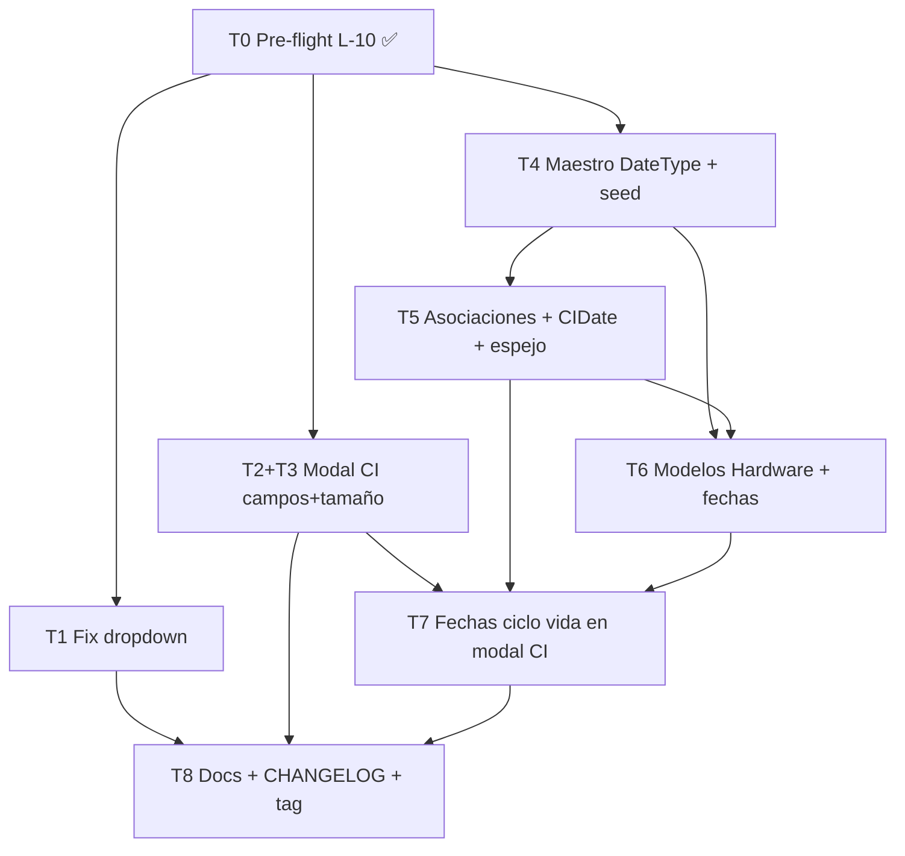

# Plan v2.8.2 — Correcciones y Mejoras CMDB

> Documento vivo de seguimiento del plan v2.8.2.
> Actualizar tras cada tarea completada.
> Última actualización: 2026-06-14.
> Base: tag `v2.8.1` (Plugin Engine — runtime + hardening completo).

---

## 1. Resumen ejecutivo

v2.8.2 agrupa **7 tareas** en tres frentes:

1. **Bug de UI** — fix del desplegable de selección masiva en inventario (clipado por `overflow-x-auto`).
2. **Mejora del modal de CI** — campos por tipo + ensanchar + layout de dos columnas + sección de fechas de ciclo de vida.
3. **Subsistema de Fechas de Ciclo de Vida** — maestro `DateType` (con seed de ~16 tipos reales de fabricantes), tablas de asociación para OS / SW Base / Modelos de HW / CI, columnas espejo para compatibilidad con el auto-sync EOL/EOS existente (`index.ts` intacto).

Adicionalmente, se hace **catch-up completo del README** para reflejar todas las funcionalidades desde v2.7.0.

---

## 2. Decisiones arquitectónicas (aprobadas en sesión 2026-06-14)

| Decisión | Elección |
|---|---|
| Integración EOL/EOS existente | **Unificar con columnas espejo** — DateType = fuente de verdad lógica; `eolDate`/`eosDate` en CI y DeviceModel se mantienen como caché auto-mantenido. `index.ts` (62 refs), reports, heatmap, alertas: **INTACTOS**. |
| Modelos de Hardware (T6) | **Renombrar + fechas** (sin M2M docs/licencias). |
| Documentación | **Catch-up completo del README** (features v2.7.0–v2.8.2). |

### Patrón espejo (crítico para entender T4/T5/T7)

```
DateType (fuente de verdad)
  ├── CIDate               ← EOL/EOS del CI propio
  ├── OperatingSystemDate  ← ciclo de vida de OS
  ├── BaseSoftwareDate     ← ciclo de vida de SW Base
  └── DeviceModelDate      ← ciclo de vida de Modelo HW

Columnas espejo (caché, SIN eliminar):
  CI.eolDate / CI.eosDate
  DeviceModel.eolDate / DeviceModel.eosDate

Lógica de escritura:
  - eolService.ts (index.ts) sigue escribiendo las columnas → sin tocar
  - módulo catalog: al guardar/actualizar una fila DateType de tipo
    'end-of-life' / 'end-of-support', refleja el valor en la columna espejo
  - Migración de datos: poblar CIDate y DeviceModelDate desde las
    columnas actuales (idempotente, con backup y conteo previo)
```

---

## 3. Tareas y estado

### T0 — Pre-flight: fix L-10 + base en `develop` ✅ COMPLETADA

| Campo | Valor |
|---|---|
| Rama | `fix/plugins-l10-comment` |
| Estado | ✅ COMPLETADA 2026-06-14 |
| Commits | `28896d6` — `fix(plugins): align MigrationRunner comment with hard-fail behaviour (L-10)` |
| PR | Pendiente push/PR |

**Descripción:** Rescatar el comentario L-10 de `engine.ts` (corregido en main, sin commit) a una rama desde `develop`. Incluye actualización de `PLAN_v2.8.1.md` marcando L-10 como corregido.

---

### T1 — Fix desplegable de selección masiva ✅ COMPLETADA

| Campo | Valor |
|---|---|
| Rama | `fix/bulk-select-dropdown` |
| Complejidad | Baja |
| Dependencias | T0 |
| Skills | `vercel-react-best-practices`, `frontend-design`, `find-bugs`, `webapp-testing` |

**Descripción del bug:** El menú de selección masiva (`showSelectDropdown`) se renderiza como `absolute top-full` dentro de un contenedor con `overflow-x-auto` (`inventory/page.tsx:650`). `overflow-x-auto` recorta también el eje Y, por lo que el menú queda clipado independientemente del `z-20` asignado.

**Fix:** Portar el menú a un **portal** (`ReactDOM.createPortal`) con posición `fixed` calculada desde `getBoundingClientRect()` del botón disparador. Conservar: click-outside, cierre con Escape, las dos opciones ("Seleccionar todos de esta página" / "Seleccionar todos los filtrados"), comportamiento responsive.

**Archivos a modificar:**
- `frontend/app/inventory/page.tsx` — lógica del portal y posición
- (posible) `frontend/components/SelectAllMenu.tsx` — componente extraído si mejora la legibilidad

**Commits estimados:** 2
```
fix(inventory): render bulk-select menu in portal to escape overflow clip
docs(plan): mark T1 as completed
```

---

### T2+T3 — Modal de CI: campos por tipo + ensanchar ✅ COMPLETADA

| Campo | Valor |
|---|---|
| Rama | `feature/ci-modal-fields-and-size` |
| Complejidad | Media |
| Dependencias | T0 |
| Skills | `frontend-design`, `vercel-react-best-practices`, `webapp-testing`, `prisma-client-api` |

**Por qué fusionadas:** Ambas tareas reescriben `CIDetailModal.tsx`; hacerlas en commits separados sobre la misma rama evita conflictos de merge.

**T3 — Ensanchar y layout:**
- `max-w-3xl` → `max-w-6xl` (ancho máximo en desktop)
- `max-h-[90vh]` ya correcto — no tocar
- Layout **dos columnas** en desktop (`lg:grid-cols-2`): izquierda = info general + gobierno, derecha = hardware/red/SO/SW base
- Móvil: una columna, sin cambios de comportamiento
- Header y footer fijos; body scrollable

**T2 — Campos por tipo (huecos reales):**
El modal ya renderiza: cpuModel, vCpus, hostName, clusterName, adminIp, mgmtIp, operatingSystem, firmwareVersion, eolDate/eosDate.
**Faltan:** `ram`, `disk`, `dns`, `ci.ciModel` (modelo de HW), lista de SW base (`baseSoftwares`).
- Añadir campos faltantes agrupados en secciones: **General** / **Hardware** / **Red** / **SO & SW Base**
- Filtrado por tipo de CI (si ciType es networking: mostrar adminIp/mgmtIp/firmware; si es servidor: mostrar ram/disk/cpuModel…)
- `ciModel` debe mostrarse como nombre de fabricante + nombre de modelo (requiere que el endpoint GET CI incluya el `include` de `ciModel { name, manufacturer { name } }`)
- Lista de SW base: nombre de cada entrada de `CIBaseSoftware`
- Campos vacíos: no mostrar fila (comportamiento actual)

**Backend:** Verificar que `GET /api/cis/:id` incluya `ciModel.manufacturer` y `baseSoftwares.baseSoftware` en el `include` de Prisma. Si no, añadir al endpoint (dentro de `index.ts`, sólo ampliar el `include` existente — no es añadir lógica nueva).

**Archivos a modificar:**
- `frontend/components/CIDetailModal.tsx`
- `frontend/locales/{en,es,de,pt,fr,it}.json` (nuevas claves si las hay)
- `backend/src/index.ts` — sólo para ampliar el `include` en `GET /api/cis/:id` si hace falta

**Commits estimados:** 3
```
feat(ci-modal): widen to max-w-6xl + two-column responsive layout (T3)
feat(ci-modal): type-aware grouped fields — ram/disk/dns/model/base-sw (T2)
docs(plan): mark T2+T3 as completed
```

---

### T4 — Maestro Tipos de Fechas (`DateType`) ✅ COMPLETADA

| Campo | Valor |
|---|---|
| Rama | `feature/master-date-types` |
| Complejidad | Media |
| Dependencias | T0 |
| Skills | `prisma-development`, `express-typescript`, `vibesec-skill`, `frontend-design`, `documentation-writer` |

**Schema Prisma (nuevo):**
```prisma
model DateType {
  id          String            @id @default(uuid()) @db.Uuid
  code        String            @unique @db.VarChar(50)
  name        String            @db.VarChar(255)
  description String?
  category    DateTypeCategory
  sortOrder   Int               @default(0) @map("sort_order")
  isSystem    Boolean           @default(false) @map("is_system")

  createdAt   DateTime          @default(now()) @map("created_at")
  updatedAt   DateTime          @updatedAt @map("updated_at")

  ciDates           CIDate[]
  osDates           OperatingSystemDate[]
  bswDates          BaseSoftwareDate[]
  deviceModelDates  DeviceModelDate[]

  @@index([category])
  @@index([sortOrder])
  @@map("date_types")
}

enum DateTypeCategory {
  HARDWARE
  SOFTWARE
  OS
  GENERAL
}
```

**Seed (incluido en la migración SQL, idempotente con `ON CONFLICT DO NOTHING`):**

| Código | Nombre | Categoría | isSystem |
|---|---|---|---|
| `general-availability` | General Availability (GA) | GENERAL | true |
| `end-of-sale` | End of Sale (EOS) | HARDWARE | true |
| `end-of-life` | End of Life (EOL) | GENERAL | true |
| `end-of-support` | End of Support | SOFTWARE | true |
| `end-of-extended-support` | End of Extended Support | SOFTWARE | true |
| `premier-support-end` | End of Premier Support | OS | true |
| `sustaining-support-end` | End of Sustaining Support | OS | true |
| `security-patch-end` | End of Security Patches | OS | true |
| `warranty-end` | End of Warranty | HARDWARE | true |
| `hardware-maintenance-end` | End of Hardware Maintenance | HARDWARE | true |
| `software-maintenance-end` | End of Software Maintenance | SOFTWARE | true |
| `last-ship-date` | Last Ship Date | HARDWARE | true |
| `end-of-engineering` | End of Engineering (EOE) | HARDWARE | true |
| `end-of-service-life` | End of Service Life (EOSL) | HARDWARE | true |
| `driver-firmware-end` | End of Driver/Firmware Updates | HARDWARE | true |
| `contract-renewal` | Contract Renewal Date | GENERAL | false |

Los códigos `end-of-life` y `end-of-support` son los **canónicos de espejo** (T5).

**Backend:** Añadir a módulo `catalog`:
- `GET /api/catalog/date-types` — público (lectura)
- `POST /api/catalog/date-types` — requireAdmin
- `PATCH /api/catalog/date-types/:id` — requireAdmin (isSystem sólo permite editar nombre/desc/sortOrder, no code/category/isSystem)
- `DELETE /api/catalog/date-types/:id` — requireAdmin, bloquear si `isSystem=true`
- Validación Zod, auditoría insert-only

**Frontend:** Nueva pestaña **"Tipos de Fechas"** en `/admin/masters` con CRUD completo. i18n ×6.

**Regla UI:** si `isSystem=true`, ocultar/deshabilitar botón eliminar y bloquear edición de code/category/isSystem.

**Archivos a modificar:**
- `backend/prisma/schema.prisma`
- `backend/prisma/migrations/<ts>_date_types/migration.sql`
- `backend/src/modules/catalog/{schemas,queries,router,audit}.ts`
- `frontend/app/admin/masters/page.tsx`
- `frontend/locales/*.json`

**Commits estimados:** 4
```
feat(catalog): DateType model + enum + seed in migration (T4)
feat(catalog): date-types CRUD endpoints + Zod + audit (T4)
feat(masters-ui): date-types tab + i18n ×6 (T4)
docs(plan): mark T4 as completed
```

---

### T5 — Asociaciones de fechas + CIDate + migración + columnas espejo ✅ COMPLETADA

| Campo | Valor |
|---|---|
| Rama | `feature/master-date-associations` |
| Complejidad | **Alta+** |
| Dependencias | **T4** |
| Skills | `prisma-development`, `express-typescript`, `frontend-design`, `vibesec-skill`, `supabase-postgres-best-practices` |

**Schema Prisma (4 tablas nuevas):**

```prisma
model CIDate {
  id          String   @id @default(uuid()) @db.Uuid
  ciId        String   @db.Uuid @map("ci_id")
  dateTypeId  String   @db.Uuid @map("date_type_id")
  dateValue   DateTime @map("date_value")
  notes       String?
  createdAt   DateTime @default(now()) @map("created_at")
  updatedAt   DateTime @updatedAt @map("updated_at")

  ci       CI       @relation(fields: [ciId], references: [id], onDelete: Cascade, onUpdate: Cascade)
  dateType DateType @relation(fields: [dateTypeId], references: [id], onDelete: Restrict, onUpdate: Cascade)

  @@unique([ciId, dateTypeId])
  @@index([ciId])
  @@map("ci_dates")
}

model OperatingSystemDate {
  id                String   @id @default(uuid()) @db.Uuid
  operatingSystemId String   @db.Uuid @map("operating_system_id")
  dateTypeId        String   @db.Uuid @map("date_type_id")
  dateValue         DateTime @map("date_value")
  notes             String?
  createdAt         DateTime @default(now()) @map("created_at")
  updatedAt         DateTime @updatedAt @map("updated_at")

  operatingSystem OperatingSystem @relation(fields: [operatingSystemId], references: [id], onDelete: Cascade, onUpdate: Cascade)
  dateType        DateType        @relation(fields: [dateTypeId], references: [id], onDelete: Restrict, onUpdate: Cascade)

  @@unique([operatingSystemId, dateTypeId])
  @@index([operatingSystemId])
  @@map("operating_system_dates")
}

model BaseSoftwareDate {
  id             String   @id @default(uuid()) @db.Uuid
  baseSoftwareId String   @db.Uuid @map("base_software_id")
  dateTypeId     String   @db.Uuid @map("date_type_id")
  dateValue      DateTime @map("date_value")
  notes          String?
  createdAt      DateTime @default(now()) @map("created_at")
  updatedAt      DateTime @updatedAt @map("updated_at")

  baseSoftware BaseSoftware @relation(fields: [baseSoftwareId], references: [id], onDelete: Cascade, onUpdate: Cascade)
  dateType     DateType     @relation(fields: [dateTypeId], references: [id], onDelete: Restrict, onUpdate: Cascade)

  @@unique([baseSoftwareId, dateTypeId])
  @@index([baseSoftwareId])
  @@map("base_software_dates")
}

model DeviceModelDate {
  id              String   @id @default(uuid()) @db.Uuid
  deviceModelId   String   @db.Uuid @map("device_model_id")
  dateTypeId      String   @db.Uuid @map("date_type_id")
  dateValue       DateTime @map("date_value")
  notes           String?
  createdAt       DateTime @default(now()) @map("created_at")
  updatedAt       DateTime @updatedAt @map("updated_at")

  deviceModel DeviceModel @relation(fields: [deviceModelId], references: [id], onDelete: Cascade, onUpdate: Cascade)
  dateType    DateType    @relation(fields: [dateTypeId], references: [id], onDelete: Restrict, onUpdate: Cascade)

  @@unique([deviceModelId, dateTypeId])
  @@index([deviceModelId])
  @@map("device_model_dates")
}
```

**Migración de datos (idempotente):**
- Poblar `CIDate` desde `CI.eolDate` (code=`end-of-life`) y `CI.eosDate` (code=`end-of-support`) donde no sea NULL y no exista ya la fila.
- Poblar `DeviceModelDate` desde `DeviceModel.eolDate` y `DeviceModel.eosDate` análogamente.
- Backup previo: `SELECT COUNT(*) INTO @n_ci_dates...` con log de la operación.
- Las columnas espejo **permanecen** en el schema.

**Trigger DB (en la migración SQL) para mantener sincronía espejo:**
```sql
-- Cuando se inserta/actualiza una fila CIDate de tipo end-of-life → refleja en CI.eol_date
-- Cuando se inserta/actualiza una fila CIDate de tipo end-of-support → refleja en CI.eos_date
-- Análogo para DeviceModelDate
```

**Backend — endpoints genéricos en módulo `catalog`:**
- `GET /api/catalog/cis/:id/dates`
- `POST /api/catalog/cis/:id/dates` — requireAdmin
- `PATCH /api/catalog/cis/:id/dates/:dateId` — requireAdmin
- `DELETE /api/catalog/cis/:id/dates/:dateId` — requireAdmin
- Mismo patrón para `operating-systems`, `base-software`, `device-models`
- Cada POST/PATCH lanza reflejo en columna espejo si el `code` es canónico

**Frontend — componente reutilizable `LifecycleDatesEditor`:**
- Props: `entityType`, `entityId`, `categoryFilter` (HARDWARE|SOFTWARE|OS|GENERAL)
- Tabla de fechas ya asociadas con editar/eliminar
- Selector de DateType filtrado por categoría + date picker + campo notas
- Validación: no duplicar tipo de fecha para el mismo item
- Usado en: detalle de OS, detalle de SW Base, detalle de Modelo HW (T6), detalle de CI (T7, read-only)

**Archivos a modificar:**
- `backend/prisma/schema.prisma`
- `backend/prisma/migrations/<ts>_entity_dates/migration.sql` (incluye triggers espejo)
- `backend/src/modules/catalog/{schemas,queries,router,audit}.ts`
- `frontend/components/LifecycleDatesEditor.tsx` (nuevo)
- `frontend/app/admin/masters/page.tsx`
- `frontend/locales/*.json`

**Commits estimados:** 5
```
feat(catalog): 4 entity-date tables + data migration + mirror triggers (T5)
feat(catalog): generic lifecycle-date endpoints for ci/os/bsw/device-model (T5)
feat(ui): LifecycleDatesEditor reusable component + i18n (T5)
feat(masters-ui): wire LifecycleDatesEditor in OS and SW Base detail panels (T5)
docs(plan): mark T5 as completed
```

---

### T6 — Modelos → Modelos de Hardware + fechas ✅ COMPLETADA

| Campo | Valor |
|---|---|
| Rama | `feature/hardware-models-rename-dates` |
| Complejidad | Media |
| Dependencias | T4, T5 |
| Skills | `frontend-design`, `documentation-writer` |

**Cambios:**
1. **i18n ×6** — cambiar cadenas `masters.tabs.models` / equivalentes → "Modelos de Hardware" / "Hardware Models" / etc. en los 6 archivos de locales.
2. **masters page** — pestaña `tab="models"` → `tab="hardware-models"` (o mantener id, solo cambiar label). Añadir sección de fechas usando `LifecycleDatesEditor` con `categoryFilter="HARDWARE"` en el panel de detalle/edición de modelo.
3. **Sidebar** — sin cambios (la entrada es `/admin/masters`, genérica).
4. **USER_MANUAL** (ES + EN) — renombrar sección y documentar gestión de fechas de ciclo de vida de modelos.

**No incluido:** M2M docs/licencias para DeviceModel (descartado por decisión del usuario).

**Archivos a modificar:**
- `frontend/locales/*.json`
- `frontend/app/admin/masters/page.tsx`
- `docs/USER_MANUAL.md` + `docs/USER_MANUAL.en.md`

**Commits estimados:** 2
```
feat(masters): rename Models → Hardware Models + wire LifecycleDatesEditor (T6)
docs(manual): hardware models lifecycle dates (T6)
```

---

### T7 — Fechas de ciclo de vida en modal de CI ✅ COMPLETADA

| Campo | Valor |
|---|---|
| Rama | `feature/ci-modal-lifecycle-dates` |
| Complejidad | Media |
| Dependencias | T2+T3, T4, T5, T6 |
| Skills | `frontend-design`, `prisma-client-api`, `express-typescript`, `webapp-testing` |

**Backend — endpoint agregador:**
`GET /api/catalog/cis/:ciId/lifecycle-dates` — devuelve fechas propias del CI (CIDate) + fechas del SO asociado (OperatingSystemDate) + fechas del modelo HW (DeviceModelDate) + fechas de cada SW base (BaseSoftwareDate). Una sola query con múltiples `include`. El campo `source` identifica de dónde viene cada fecha.

Respuesta ejemplo:
```json
[
  { "source": "CI", "dateType": { "code": "end-of-life", "name": "End of Life", "sortOrder": 2 }, "dateValue": "2027-01-01", "notes": null },
  { "source": "OperatingSystem", "entityName": "RHEL 9", "dateType": { "code": "premier-support-end", ... }, "dateValue": "2032-05-31" },
  { "source": "DeviceModel", "entityName": "Dell PowerEdge R750", "dateType": { "code": "warranty-end", ... }, "dateValue": "2026-12-31" }
]
```

**Frontend — sección en `CIDetailModal`:**
- Nueva sección **"Fechas de Ciclo de Vida"** (en la segunda columna del layout de T3, parte inferior)
- Tabla con columnas: Tipo de fecha / Fuente / Fecha / Notas
- Ordenado por `DateType.sortOrder`
- Fechas localizadas (`toLocaleDateString` según locale del usuario)
- Badge **rojo "Vencido"** si fecha < hoy
- Badge **ámbar "< 90 días"** si fecha entre hoy y hoy+90d
- Sin edición en el modal (read-only; la edición se hace en la página de masters)

**Archivos a modificar:**
- `backend/src/modules/catalog/{queries,router}.ts`
- `frontend/components/CIDetailModal.tsx`
- `frontend/locales/*.json`

**Commits estimados:** 3
```
feat(catalog): CI lifecycle-dates aggregator endpoint (T7)
feat(ci-modal): lifecycle dates section with expiry badges (T7)
docs(plan): mark T7 as completed
```

---

### T8 — Documentación catch-up + CHANGELOG + tag v2.8.2 ✅ COMPLETADA

| Campo | Valor |
|---|---|
| Rama | `docs/v2.8.2` |
| Complejidad | Media |
| Dependencias | Todas |
| Skills | `documentation-writer` |

**Archivos a actualizar:**
- `README.md` — catch-up completo: Plugin Engine (v2.8.0/2.8.1), DCIM (v2.6.0/2.6.1), maestros (SO, SW Base, Tipos de Fecha, Modelos de HW), multiselect bulk, mapa de relaciones, tabla de features, stack actualizado, variables de entorno.
- `docs/ARCHITECTURE.md` + `.en.md` — nuevas tablas (DateType, CIDate, OperatingSystemDate, BaseSoftwareDate, DeviceModelDate), patrón espejo documentado, diagrama Mermaid actualizado.
- `docs/USER_MANUAL.md` + `.en.md` — secciones nuevas: Tipos de Fechas, Modelos de Hardware, Fechas de Ciclo de Vida en modal CI, dropdown selección masiva mejorado.
- `docs/SYSADMIN_MANUAL.md` + `.en.md` — patrón espejo, triggers DB, seed de DateType (post-migración), variables de entorno nuevas si las hay.
- `CHANGELOG.md` — entrada `## [2.8.2] — 2026-06-14` con todas las tareas.
- `docs/PLAN_v2.8.2.md` (este archivo) — marcar todas las tareas como ✅ COMPLETADA.

**Commits estimados:** 3
```
docs: v2.8.2 catch-up README + ARCHITECTURE + manuals
docs(changelog): add v2.8.2 entry
docs(plan): mark v2.8.2 plan as completed — all tasks merged
```

---

## 4. Diagrama de dependencias



---

## 5. Orden de ejecución

Secuencial con gate de revisión por tarea:

```
T0 ✅ → T1 ✅ → T2+T3 ✅ → T4 ✅ → T5 ✅ → T6 ✅ → T7 ✅ → T8 ✅
```

*(T1, T2+T3 y T4 son independientes entre sí y podrían paralelizarse con subagentes, pero el gate de revisión los mantiene secuenciales.)*

---

## 6. Riesgos y mitigaciones

| ID | Riesgo | Mitigación |
|----|--------|------------|
| R1 | Deriva columna espejo ↔ DateType | Escritura vía trigger DB (migración) + única vía de escritura desde módulo catalog |
| R2 | Migración de datos EOL/EOS → CIDate/DeviceModelDate | Idempotente (`ON CONFLICT DO NOTHING`), backup conteo previo, dry-run verificable |
| R3 | Regresión en cron alertas / heatmap DCIM | Columnas espejo intactas; `index.ts` y `eolService.ts` sin modificar |
| R4 | Reflow `CIDetailModal` (1136 líneas) | Incremental por commits + screenshots desktop/móvil (`webapp-testing`) |
| R5 | Restricción `index.ts` | 100% del backend nuevo en módulo `catalog`; solo ampliación de `include` en `index.ts` si imprescindible |
| R6 | i18n 6 ficheros | Checklist de claves en cada PR |
| R7 | OWASP/SSRF en endpoints nuevos | `vibesec-skill` en T4/T5/T7 |
| R8 | Conflicto de PR si T5 y T6 se solapan | T5 se mergea antes de abrir T6 |

---

## 7. Checklist de entrega final

- [ ] T0 Pre-flight mergeado a `develop` (PR)
- [ ] T1 Fix dropdown — PR mergeado, verificado desktop+móvil
- [ ] T2+T3 Modal CI — PR mergeado, campos visibles, layout 2 col
- [ ] T4 DateType — PR mergeado, seed aplicado, CRUD funcional
- [ ] T5 Asociaciones — PR mergeado, espejo verificado, migración de datos OK
- [ ] T6 Modelos Hardware — PR mergeado, renombrado + fechas funcional
- [ ] T7 Fechas en modal CI — PR mergeado, badges vencimiento funcionando
- [ ] T8 Docs — README catch-up, CHANGELOG, ARCHITECTURE, manuales actualizados
- [ ] `tsc --noEmit` 0 errores nuevos en cada PR
- [ ] Rebuild + health check tras cada PR mergeado
- [ ] Tag `v2.8.2` creado y pusheado
- [ ] `docs/PLAN_v2.8.2.md` todas las tareas ✅

---

## 8. Instrucción de reanudación tras corte de sesión

Si la sesión se reinicia:
1. Leer esta sección 3 para identificar la primera tarea `⬜ PENDIENTE` o `🟡 EN PROGRESO`.
2. Verificar `git status` y `git log --oneline -10` para confirmar el estado real.
3. Verificar la sección **Plan Activo** en `CLAUDE.md`.
4. **NO asumir** nada que no esté confirmado por el estado del repo.
5. Continuar desde la tarea marcada como 🟡 o la primera ⬜ después de la última ✅.
