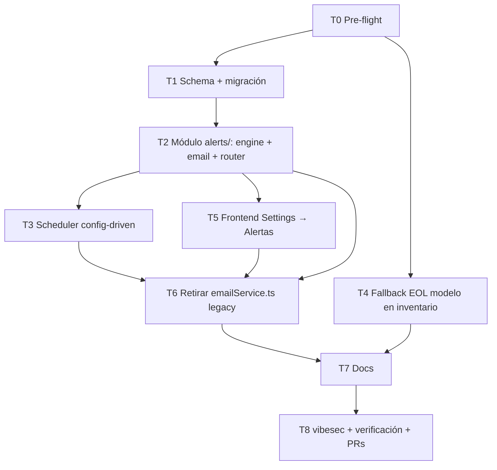

# Plan v2.8.4 — Módulo de Alertas Email Profesional

> Documento vivo de seguimiento del plan v2.8.4.
> Actualizar tras cada tarea completada.
> Última actualización: 2026-06-15.
> Base: tag `v2.8.3` (CI lifecycle dates + modal CRUD unificado).

---

## 1. Resumen ejecutivo

v2.8.4 convierte el script de alertas email en un **módulo profesional** (`backend/src/modules/alerts/`), y añade dos mejoras de inventario solicitadas:

1. **Alertas email garantía/mantenimiento** — el escáner actual solo lee `eol_date`/`eos_date`. Se extiende para leer `ci_dates` (warranty-end, maintenance-end) y licencias.
2. **Fallback EOL del modelo en inventario** — cuando un CI no tiene EOL propio, el inventario y las alertas usan el EOL del modelo de HW asociado.
3. **Profesionalización del módulo de alertas** — motor config-driven, reglas por categoría con umbrales y destinatarios, historial persistido, i18n del email, scheduler inteligente (sin ruido), UI de configuración en Settings.

---

## 2. Decisiones arquitectónicas (aprobadas en sesión 2026-06-15)

| # | Decisión | Elección |
|---|----------|----------|
| D1 | Credenciales SMTP | **Quedan en ENV** (SMTP_HOST/PORT/SECURE/USER/PASS). Exigencia de CLAUDE.md A.8.12. La UI gestiona reglas/destinatarios, **no** las credenciales. |
| D2 | Horario de envío | **Configurable en BD** (`alert_config.sendTimeHour/Minute`). Cron de sistema bate cada hora; el motor compara con la hora configurada + dedup idempotente vía `alert_runs`. |
| D3 | Supresión de ruido | **`suppressUnchanged = true` (default).** Si el fingerprint de alertas coincide con el último run exitoso → estado SKIPPED, no se envía. Configurable por el admin. |
| D4 | Routing | **Destinatarios globales + override por categoría** en `alert_rules`. Routing al responsable (businessOwner/technicalLead) diferido a versión futura por complejidad y GDPR. |
| D5 | Esquema BD | **3 tablas dedicadas**: `alert_config` (singleton), `alert_rules` (6 filas seed), `alert_runs` (historial). NO dentro de `app_settings`. |
| D6 | i18n del email | **Locale único** configurado en `alert_config.locale` (es/en/de/pt/fr/it). No por destinatario. |
| D7 | Scope | **T0–T8 completo** aprobado en sesión. |

### Módulo de alertas — arquitectura de componentes

```
backend/src/modules/alerts/
  ├── schemas.ts        — Zod: config, rules, runs (request/response)
  ├── queries.ts        — Prisma queries: read config/rules, persist AlertRun
  ├── engine.ts         — scanAlerts(): lee ci_dates, eol_date, contratos, vulns, licencias
  ├── email-builder.ts  — buildAlertHtml(): plantilla i18n, badges severidad
  ├── smtp-transport.ts — sendEmail(): nodemailer desde ENV, no expone credenciales
  ├── scheduler.ts      — hourlyTick(): compara hora, dedup, dispara runAndSendAlerts()
  ├── audit.ts          — insertAlertAudit(): AuditLog helper
  └── router.ts         — /api/alerts: config, rules, test, run-now, history
```

### Flujo de datos (cumplimiento A.5.37)

```
[CRON hourly tick] → scheduler.ts
  → queries.getConfig() + queries.getRules()
  → engine.scanAlerts()  ← lee: ci_dates, configuration_items (eol/eos + ciModel fallback),
                                   contracts, vulnerabilities, licenses
  → engine.fingerprint() → si coincide con último run + suppressUnchanged → SKIPPED
  → email-builder.buildHtml(locale, rules)
  → smtp-transport.send(recipients)
  → queries.persistRun(AlertRun)
  → audit.insertAlertAudit()
```

### Regla de compliance (no negociable)

- **A.8.12**: SMTP creds solo en ENV. La tabla `alert_config` **nunca** almacena SMTP_PASS ni SMTP_USER.
- **A.8.15**: cada envío y cada cambio de configuración genera un registro en `audit_logs`.
- **A01**: `/api/alerts/*` con `requireAdmin` (excepto lectura de config para admins).
- **A03**: solo Prisma tagged template literals.
- **GDPR**: la tabla `alert_runs.recipients` almacena emails (PII) — se incluye en el flujo documentado (A.5.37); `DELETE /api/users/:id/erase` NO elimina `alert_runs` (historial de sistema, no datos del sujeto).

---

## 3. Tareas y estado

### T0 — Pre-flight ⬜ PENDIENTE

| Campo | Valor |
|---|---|
| Rama | `feature/alerts-module-v2.8.4` (desde `develop`) |
| Complejidad | Baja |
| Dependencias | ninguna |
| Skills | — |

**Descripción:**
1. Crear `docs/PLAN_v2.8.4.md` (este archivo).
2. Crear rama `feature/alerts-module-v2.8.4` desde `develop`.
3. Verificar baseline `npx tsc --noEmit` — registrar errores pre-existentes conocidos.
4. Confirmar que `develop` y `main` están sincronizados (`v2.8.3`).

**Archivos:**
- `docs/PLAN_v2.8.4.md` (nuevo)
- `CLAUDE.md` — sección Plan Activo actualizada

**Commits estimados:** 1
```
docs(plan): add PLAN_v2.8.4.md + update Plan Activo in CLAUDE.md (T0)
```

---

### T1 — Schema Prisma + migración SQL ⬜ PENDIENTE

| Campo | Valor |
|---|---|
| Rama | `feature/alerts-module-v2.8.4` |
| Complejidad | Media |
| Dependencias | T0 |
| Skills | `prisma-development`, `supabase-postgres-best-practices` |

**Nuevos modelos Prisma:**

```prisma
model AlertConfig {
  id                String   @id @default("default")   // singleton — siempre id="default"
  enabled           Boolean  @default(true)
  sendTimeHour      Int      @default(8)  @map("send_time_hour")
  sendTimeMinute    Int      @default(30) @map("send_time_minute")
  timezone          String   @default("UTC")  @db.VarChar(64)
  locale            String   @default("es")   @db.VarChar(10)
  recipients        String[] // lista global de emails destinatarios
  sendAllClear      Boolean  @default(false)  @map("send_all_clear")
  suppressUnchanged Boolean  @default(true)   @map("suppress_unchanged")
  updatedAt         DateTime @updatedAt       @map("updated_at")

  @@map("alert_config")
}

model AlertRule {
  id                String   @id @default(uuid()) @db.Uuid
  category          String   @unique @db.VarChar(50)
  // categorías: eol | eos | warranty | maintenance | contract | vulnerability | license
  enabled           Boolean  @default(true)
  warnDays          Int      @default(30) @map("warn_days")
  recipients        String[] // override; vacío → usa AlertConfig.recipients
  updatedAt         DateTime @updatedAt @map("updated_at")

  @@map("alert_rules")
}

model AlertRun {
  id          String    @id @default(uuid()) @db.Uuid
  trigger     String    @db.VarChar(20)   // CRON | MANUAL
  startedAt   DateTime  @default(now()) @map("started_at")
  finishedAt  DateTime? @map("finished_at")
  status      String    @db.VarChar(20)
  // SENT | ALL_CLEAR | SKIPPED | FAILED
  totalAlerts Int       @default(0) @map("total_alerts")
  breakdown   Json      @default("{}")
  // { eol:n, eos:n, warranty:n, maintenance:n, contract:n, vulnerability:n, license:n, fingerprint:"sha256..." }
  recipients  String[]
  messageId   String?   @db.VarChar(255) @map("message_id")
  errorMsg    String?   @map("error_msg")

  @@index([startedAt(sort: Desc)])
  @@map("alert_runs")
}
```

**Migración SQL** (`backend/prisma/migrations/<ts>_alert_module/migration.sql`):
- `CREATE TABLE alert_config (...)` con `DEFAULT FALSE` en `send_all_clear`, `DEFAULT TRUE` en `suppress_unchanged`.
- `CREATE TABLE alert_rules (...)` con `UNIQUE(category)`.
- `CREATE TABLE alert_runs (...)` con índice `started_at DESC`.
- **Seed idempotente** — `INSERT INTO alert_config ... ON CONFLICT (id) DO NOTHING`.
- **Seed de 7 reglas** — `ON CONFLICT (category) DO NOTHING`:

| Categoría | warnDays | enabled |
|---|---|---|
| `eol` | 90 | true |
| `eos` | 90 | true |
| `warranty` | 60 | true |
| `maintenance` | 60 | true |
| `contract` | 60 | true |
| `vulnerability` | 0 (sin umbral — siempre alerta) | true |
| `license` | 30 | true |

**Archivos a modificar:**
- `backend/prisma/schema.prisma`
- `backend/prisma/migrations/<ts>_alert_module/migration.sql` (nuevo)

**Post-migración:** `docker exec cmdb-backend npx prisma generate`

**Commits estimados:** 2
```
feat(schema): AlertConfig + AlertRule + AlertRun models (T1)
feat(migration): alert_module tables + seed defaults (T1)
```

---

### T2 — Módulo `alerts/`: motor + email + transporte + router ⬜ PENDIENTE

| Campo | Valor |
|---|---|
| Rama | `feature/alerts-module-v2.8.4` |
| Complejidad | **Alta** |
| Dependencias | T1 |
| Skills | `express-typescript`, `prisma-client-api`, `api-security-hardening`, `vibesec-skill`, `owasp-security` |

#### T2.1 — `queries.ts`

```typescript
// Lecturas
getConfig(): Promise<AlertConfig>
getRules(): Promise<AlertRule[]>
getHistory(limit: number): Promise<AlertRun[]>
getLastSuccessfulRun(): Promise<AlertRun | null>

// Escritura
upsertConfig(data: AlertConfigUpdate): Promise<AlertConfig>
upsertRule(category: string, data: AlertRuleUpdate): Promise<AlertRule>
persistRun(data: AlertRunCreate): Promise<AlertRun>
finishRun(id: string, data: AlertRunFinish): Promise<AlertRun>
```

#### T2.2 — `engine.ts` — `scanAlerts()`

El escáner construye una lista de `AlertItem[]`. Fuentes:

| Fuente | Categoría | Método de lectura |
|---|---|---|
| `configuration_items.eol_date` propio | `eol` | Columna directa (actual) |
| `device_models.eol_date` (fallback si CI sin EOL propio) | `eol` | JOIN via `ci.ci_model_id` |
| `configuration_items.eos_date` + fallback modelo | `eos` | Ídem |
| `ci_dates` WHERE `date_type.code = 'warranty-end'` | `warranty` | JOIN ci_dates → date_types |
| `ci_dates` WHERE `date_type.code = 'maintenance-end'` | `maintenance` | JOIN ci_dates → date_types |
| `contracts.end_date` | `contract` | Columna directa (actual) |
| Vulnerabilidades CRITICAL/HIGH estado abierto | `vulnerability` | Actual |
| `licenses` expiradas / próximas | `license` | `license.expirationDate` |

**Fingerprint**: `sha256(JSON.stringify(items.map(i => i.entityId + i.category).sort()))` — comparado con `lastRun.breakdown.fingerprint` si `suppressUnchanged=true`.

**Lógica de severidad** (por categoría + regla):
- `status: "expired"` si `dateValue <= today`
- `status: "critical"` si `dateValue <= today + 7d`
- `status: "warning"` si `dateValue <= today + rule.warnDays`

#### T2.3 — `email-builder.ts` — `buildAlertHtml(items, locale)`

- Plantillas en 6 idiomas (es/en/de/pt/fr/it): `locale/alerts/{lang}.json` con claves de cadenas del email.
- Estructura HTML: cabecera con logo/nombre empresa, sección por categoría, tabla de items con badge severidad (rojo/ámbar/naranja), pie de página con link al CMDB + timestamp.
- `htmlEscape()` en todos los valores interpolados (A03).
- Sin datos personales en el cuerpo del email — solo IDs y nombres de entidades (GDPR).

#### T2.4 — `smtp-transport.ts` — `sendEmail(html, subject, recipients)`

- Nodemailer con config desde `process.env.SMTP_*`. Lee en el momento del envío (no cacheado al inicio, permite reinicio sin rebuild).
- No loga SMTP_PASS nunca.
- Devuelve `{ messageId: string }` o lanza error que el caller captura.

#### T2.5 — `router.ts` — `/api/alerts`

| Método | Ruta | Auth | Descripción |
|---|---|---|---|
| `GET` | `/api/alerts/config` | requireAdmin | Leer configuración actual |
| `PUT` | `/api/alerts/config` | requireAdmin | Actualizar config (Zod + audit) |
| `GET` | `/api/alerts/rules` | requireAdmin | Listar reglas |
| `PUT` | `/api/alerts/rules/:category` | requireAdmin | Actualizar una regla (Zod + audit) |
| `POST` | `/api/alerts/test` | requireAdmin | Envío de prueba (trigger=MANUAL, ignora suppressUnchanged) |
| `POST` | `/api/alerts/run-now` | requireAdmin | Escaneo inmediato real (trigger=MANUAL) |
| `GET` | `/api/alerts/history` | requireAdmin | Historial de runs (últimos 50) |

**Seguridad:**
- Todos los endpoints con `requireAdmin` (A01).
- Validación Zod en PUT (A03).
- `recipients` — validar formato email con Zod `z.string().email()` en array (A03).
- No exponer `SMTP_*` env en ninguna respuesta (A02).
- Rate limiting heredado del global `express-rate-limit` (A07).

#### T2.6 — `audit.ts`

```typescript
insertAlertConfigAudit(action: "UPDATE_CONFIG"|"UPDATE_RULE"|"TEST_SEND"|"RUN_NOW", userEmail: string, detail: object): Promise<void>
```

Inserta en `AuditLog` con `entity="AlertConfig"`, `entity_id="default"` o `category`.

**Archivos a crear:**
- `backend/src/modules/alerts/schemas.ts`
- `backend/src/modules/alerts/queries.ts`
- `backend/src/modules/alerts/engine.ts`
- `backend/src/modules/alerts/email-builder.ts`
- `backend/src/modules/alerts/smtp-transport.ts`
- `backend/src/modules/alerts/audit.ts`
- `backend/src/modules/alerts/router.ts`
- `frontend/locales/alerts/{es,en,de,pt,fr,it}.json` (strings del email)

**Archivos a modificar:**
- `backend/src/index.ts` — montar `alertsRouter` con `app.use('/api/alerts', alertsRouter)`

**Commits estimados:** 6
```
feat(alerts): queries + engine scan (eol/eos/warranty/maintenance/contract/vuln/license) (T2)
feat(alerts): email-builder i18n ×6 + htmlEscape (T2)
feat(alerts): smtp-transport — nodemailer from ENV (T2)
feat(alerts): router /api/alerts CRUD config+rules+history+test+run-now (T2)
feat(alerts): audit log helper (T2)
feat(index): mount alerts router (T2)
```

---

### T3 — Scheduler config-driven + dedup idempotente ⬜ PENDIENTE

| Campo | Valor |
|---|---|
| Rama | `feature/alerts-module-v2.8.4` |
| Complejidad | Media |
| Dependencias | T2 |
| Skills | `cron`, `express-typescript` |

**Descripción:**

Sustituir el cron fijo `cron.schedule(CRON_SCHEDULE, ...)` de `index.ts` por un **ticker horario** que:
1. Lee `AlertConfig` de BD (caché 5 min — para no golpear DB en cada tick).
2. Si `config.enabled = false` → salir.
3. Compara hora actual (en `config.timezone`) con `sendTimeHour:sendTimeMinute` → si no coincide → salir.
4. Consulta `alert_runs` — si ya existe un run `status IN (SENT, ALL_CLEAR, SKIPPED)` con `started_at >= hoy 00:00` → salir (idempotente, evita doble envío si el proceso se reinicia en la misma hora).
5. Llama a `runAndSendAlerts(trigger="CRON")`.
6. Captura excepciones → persiste `AlertRun { status: "FAILED", errorMsg }` + log interno (sin exponer stack al exterior).

```typescript
// scheduler.ts
export function startAlertScheduler(prisma: PrismaClient): void {
  cron.schedule('0 * * * *', async () => { // cada hora en punto
    try {
      await hourlyTick(prisma);
    } catch (err) {
      logger.error('alert-scheduler-uncaught', err instanceof Error ? err.message : String(err));
    }
  });
}
```

**Archivos a crear:**
- `backend/src/modules/alerts/scheduler.ts`

**Archivos a modificar:**
- `backend/src/index.ts` — reemplazar `cron.schedule(CRON_SCHEDULE, ...)` antiguo por `startAlertScheduler(prisma)`

**Commits estimados:** 2
```
feat(alerts): config-driven scheduler + idempotent dedup (T3)
feat(index): replace legacy alert cron with alert scheduler (T3)
```

---

### T4 — Fallback EOL del modelo en inventario ⬜ PENDIENTE

| Campo | Valor |
|---|---|
| Rama | `feature/alerts-module-v2.8.4` |
| Complejidad | Media |
| Dependencias | T0 |
| Skills | `prisma-client-api`, `frontend-design`, `vercel-react-best-practices` |

**Problema:** `CI_INCLUDE` (línea ~583 de `index.ts`) no incluye `ciModel`. Cuando un CI tiene `ci_model_id` pero no `eol_date` propio, el inventario muestra "—" aunque el modelo tenga fecha EOL.

#### T4.1 — Backend: ampliar `CI_INCLUDE`

Añadir a `CI_INCLUDE`:
```typescript
ciModel: {
  select: { id: true, name: true, eolDate: true, eosDate: true }
}
```

Añadir a la función de serialización (o al objeto de respuesta directamente):
```typescript
eolEffective: ci.eolDate ?? ci.ciModel?.eolDate ?? null,
eosEffective: ci.eosDate ?? ci.ciModel?.eosDate ?? null,
eolSource: ci.eolDate ? 'ci' : (ci.ciModel?.eolDate ? 'model' : null),
eosSource: ci.eosDate ? 'ci' : (ci.ciModel?.eosDate ? 'model' : null),
```

**Efecto colateral positivo:** el motor de alertas T2 ya usa `eolEffective` en su escaneo, por lo que los CIs sin EOL propio pero con modelo sí aparecerán en las alertas.

#### T4.2 — Frontend: inventario

- Columna EOL en `frontend/app/inventory/page.tsx` — renderizar `eolEffective` en lugar de `eol_date`.
- Si `eolSource === 'model'`: mostrar fecha con badge gris pequeño `(modelo)` / `(model)` / etc. (i18n ×6).
- Badge de expiración: calcular sobre `eolEffective`.
- Filtro/orden por EOL: ya ordena por `eol_date`; actualizar a `eolEffective` en frontend (ordenación cliente-side ya existente).

#### T4.3 — i18n ×6

Clave nueva: `inventory.eol_from_model` = "(modelo)" / "(model)" / "(Modell)" / "(modelo)" / "(modèle)" / "(modello)".

**Archivos a modificar:**
- `backend/src/index.ts` — sección `CI_INCLUDE` + serialización CI
- `frontend/app/inventory/page.tsx`
- `frontend/locales/*.json`

**Commits estimados:** 3
```
feat(ci): add ciModel.eolDate/eosDate to CI_INCLUDE + eolEffective/eosEffective fields (T4)
feat(inventory): show eolEffective with (modelo) badge when source=model (T4)
feat(i18n): eol_from_model key ×6 locales (T4)
```

---

### T5 — Frontend: Settings → Alertas ⬜ PENDIENTE

| Campo | Valor |
|---|---|
| Rama | `feature/alerts-module-v2.8.4` |
| Complejidad | **Alta** |
| Dependencias | T2 |
| Skills | `frontend-design`, `vercel-react-best-practices`, `webapp-testing` |

**Nueva sección en `frontend/app/settings/page.tsx`** (o tab dedicado si el tamaño lo justifica).

#### Subsecciones

**1. Estado SMTP** (solo lectura, derivado de ENV — no muestra credenciales):
- Pill "Configurado" / "No configurado" (basado en presencia de `SMTP_HOST` en respuesta de `/api/alerts/config`).
- Host + puerto derivados de la config que el backend puede exponer de forma segura (`smtpHost`, `smtpPort`, sin USER/PASS).

**2. Configuración global** (formulario PUT `/api/alerts/config`):
- Toggle "Activar alertas email".
- Selector hora de envío (HH:MM, selectores separados o time input).
- Selector timezone (lista de zonas comunes: UTC, Europe/Madrid, America/Mexico_City, etc.).
- Selector locale del email (es/en/de/pt/fr/it con flags).
- Toggle "Enviar correo all-clear" (cuando no hay alertas).
- Toggle "Suprimir si sin cambios" (`suppressUnchanged`).
- Campo de destinatarios globales (lista editable de emails, add/remove chips).

**3. Reglas por categoría** (tabla con PUT `/api/alerts/rules/:category`):
| Columna | Tipo |
|---|---|
| Categoría (readonly) | badge |
| Activada | toggle |
| Días de aviso | number input |
| Destinatarios override | chips editable (vacío = global) |

**4. Acciones** (botones):
- "Enviar correo de prueba" → POST `/api/alerts/test` — muestra toast con estado.
- "Ejecutar ahora" → POST `/api/alerts/run-now` — muestra toast con resultado (total alertas, estado).

**5. Historial de ejecuciones** (tabla GET `/api/alerts/history`):
Columnas: Fecha/hora | Disparador | Estado | Total alertas | Destinatarios | ID mensaje.
Badge de estado: SENT (verde) / ALL_CLEAR (azul) / SKIPPED (gris) / FAILED (rojo).
Últimas 50 entradas, paginación simple.

**i18n ×6:** claves bajo `settings.alerts.*`.

**Archivos a modificar:**
- `frontend/app/settings/page.tsx`
- `frontend/locales/*.json`

**Archivos nuevos (si se extrae componente):**
- `frontend/components/AlertsSettings.tsx`

**Commits estimados:** 4
```
feat(settings-ui): alerts config form + SMTP status pill (T5)
feat(settings-ui): alert rules table per-category (T5)
feat(settings-ui): alert history table + run-now/test buttons (T5)
feat(i18n): settings.alerts.* keys ×6 (T5)
```

---

### T6 — Retirar `emailService.ts` legacy ⬜ PENDIENTE

| Campo | Valor |
|---|---|
| Rama | `feature/alerts-module-v2.8.4` |
| Complejidad | Baja |
| Dependencias | T2, T3, T5 |
| Skills | `express-typescript` |

**Descripción:**

El `emailService.ts` actual:
- Instancia un segundo `PrismaClient` (anti-patrón — genera conexiones extra).
- Tiene el motor de escaneo hardcodeado en español, con la lógica duplicada en T2.
- Es un archivo de servicio suelto, no un módulo.

**Acciones:**
1. Reemplazar el cuerpo de `runAndSendAlerts()` por una delegación al nuevo módulo.
2. `sendAlertReport()` → delegar a `smtp-transport.ts`.
3. Eliminar la instancia secundaria de `PrismaClient`.
4. El archivo puede mantenerse como shim de una línea o eliminarse si todos los imports se actualizan.
5. `POST /api/admin/test-email` (index.ts ~6914) → redirigir a la misma lógica que `POST /api/alerts/test`.

**Objetivo:** cero instancias secundarias de `PrismaClient`, cero lógica de escaneo duplicada.

**Archivos a modificar:**
- `backend/src/services/emailService.ts`
- `backend/src/index.ts` (import test-email endpoint)

**Commits estimados:** 1
```
refactor(alerts): retire emailService.ts legacy scanner + secondary PrismaClient (T6)
```

---

### T7 — Documentación ⬜ PENDIENTE

| Campo | Valor |
|---|---|
| Rama | `feature/alerts-module-v2.8.4` |
| Complejidad | Media |
| Dependencias | T2, T4, T5, T6 |
| Skills | `documentation-writer` |

**Archivos a actualizar:**

- **`docs/USER_MANUAL.md` + `.en.md`** — §15 Alertas Email: reescritura completa. Subsecciones: qué monitoriza, configuración desde Settings → Alertas, reglas por categoría, historial, cómo enviar correo de prueba, EOL heredado del modelo (mención en §4 Inventario).
- **`docs/SYSADMIN_MANUAL.md` + `.en.md`** — Variables de entorno SMTP (sin cambio, pero documentar que credenciales son SOLO env), nueva tabla `alert_config` (editable desde UI), `alert_rules` (editable desde UI), `alert_runs` (solo lectura, historial), scheduler hourly tick, flujo de datos completo (A.5.37 ISO 27001), cómo forzar un run manual.
- **`docs/ARCHITECTURE.md` + `.en.md`** — añadir módulo `alerts/` al diagrama de módulos, nuevas tablas al esquema de BD, flujo de datos de alertas.
- **`CHANGELOG.md`** — entrada `## [2.8.4] — YYYY-MM-DD` con todas las features/refactors.
- **`docs/PLAN_v2.8.4.md`** (este archivo) — marcar todas las tareas ✅.

**Commits estimados:** 3
```
docs(manual): v2.8.4 alerts module — user + sysadmin sections (T7)
docs(architecture): alerts module diagram + new tables (T7)
docs(changelog): add v2.8.4 entry (T7)
```

---

### T8 — vibesec + verificación + PRs ⬜ PENDIENTE

| Campo | Valor |
|---|---|
| Rama | `feature/alerts-module-v2.8.4` |
| Complejidad | Baja |
| Dependencias | Todas |
| Skills | `vibesec-skill`, `find-bugs`, `superpowers:verification-before-completion` |

**Checklist de verificación:**

- [ ] `vibesec-skill` en endpoints `/api/alerts` — OWASP A01/A02/A03/A07/A10.
- [ ] `npx tsc --noEmit` — cero errores nuevos (más allá de los pre-existentes conocidos).
- [ ] Rebuild Docker + health check: `curl -sk https://localhost/api/health`.
- [ ] Login con `claude@cmdb.local` — verificar que inventario muestra EOL/modelo correcto.
- [ ] Settings → Alertas visible para AUDITOR (solo lectura si rol no admin → 403 en edición).
- [ ] Verificar que el scheduler no produce doble envío si el proceso se reinicia durante la hora configurada.
- [ ] Abrir PR(s) a `develop`.

**Commits estimados:** 1 (correcciones de vibesec si las hay)
```
fix(alerts): vibesec findings — [descripción] (T8)
```

---

## 4. Diagrama de dependencias



---

## 5. Orden de ejecución

```
T0 → T1 → T2 → T3 → [T4 paralelo con T5] → T6 → T7 → T8
```

T4 es independiente de T2/T3/T5 tras T0 — puede paralelizarse con un subagente si el contexto lo permite.

---

## 6. Riesgos y mitigaciones

| ID | Riesgo | Mitigación |
|----|--------|------------|
| R1 | Regresión en alertas existentes (EOL/EOS/contratos/vulns) | Motor T2 replica la lógica actual + extensión. Envío de prueba (`POST /api/alerts/test`) verificable antes de activar el scheduler. |
| R2 | Doble envío si proceso se reinicia en la ventana horaria | Dedup idempotente: query `alert_runs` con `started_at >= today 00:00` antes de disparar. |
| R3 | SMTP creds expuestos en respuesta API | `smtp-transport.ts` lee solo desde ENV. El endpoint `/api/alerts/config` NUNCA devuelve campos `SMTP_*`. Validación en vibesec T8. |
| R4 | `ciModel.eolDate` NULL en CIs sin modelo asignado | `?? null` en `eolEffective` — el frontend trata null igual que antes. |
| R5 | Instancia secundaria PrismaClient en emailService.ts | T6 la elimina. Si T6 se pospone, el riesgo es de conexiones extra, no de seguridad. |
| R6 | Test de mutaciones (ADMIN requerido) | Tests unitarios del engine/builder; verificación manual en navegador como ADMIN. |
| R7 | Strings del email hardcodeados → rotura de i18n | Plantillas en `locales/alerts/{lang}.json`; TypeScript typed keys via `z.enum`. |
| R8 | `alert_runs` crece sin límite | Purge cron (futura mejora): retener últimos 90d. En v2.8.4: historial UI muestra últimos 50; tabla crece lentamente. |

---

## 7. Checklist de entrega final

- [ ] T0 Pre-flight — plan creado, rama creada
- [ ] T1 Schema + migración — prisma generate OK, seed aplicado
- [ ] T2 Módulo alerts/ — endpoints funcionales, engine cubre las 7 categorías
- [ ] T3 Scheduler — reemplaza cron antiguo, dedup verificado
- [ ] T4 Fallback EOL modelo — inventario muestra "(modelo)", alerts escanea ambos
- [ ] T5 Settings → Alertas — UI completa con historial y botones test/run-now
- [ ] T6 emailService.ts — sin instancia secundaria PrismaClient, sin lógica duplicada
- [ ] T7 Docs — USER_MANUAL, SYSADMIN, ARCHITECTURE, CHANGELOG actualizados
- [ ] T8 vibesec OK — 0 C/H en OWASP, `tsc --noEmit` limpio, health check OK
- [ ] PR(s) a `develop` + review + merge
- [ ] Merge `develop` → `main`
- [ ] Tag `v2.8.4`

---

## 8. Instrucción de reanudación tras corte de sesión

Si la sesión se reinicia:
1. Leer `CLAUDE.md` → sección **Plan Activo** para la tarea actual.
2. Verificar `git log --oneline -10` y `git status`.
3. Localizar la primera tarea `⬜ PENDIENTE` o `🟡 EN PROGRESO` en la sección 3.
4. **NO asumir** nada que no esté confirmado por el estado del repo.
5. La rama es `feature/alerts-module-v2.8.4` (o la rama activa indicada en Plan Activo).
6. Credenciales de test: `claude@cmdb.local` / `Claude@Test24!` (AUDITOR — no usar admin).
7. Comandos de deploy: ver `CLAUDE.md` → Environment & Commands y `memory/ops_podman_builds.md`.
