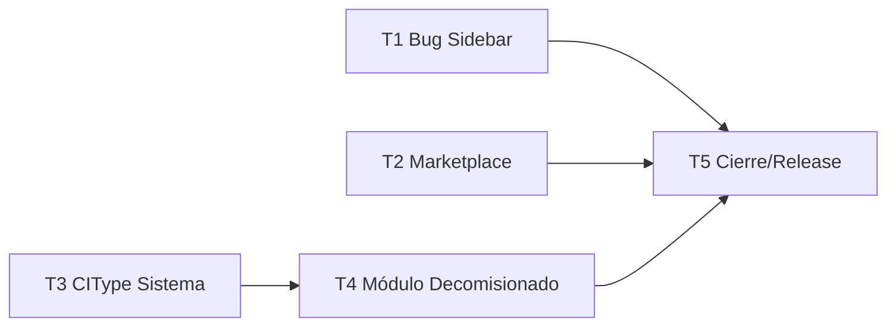

# Plan v2.8.5 — Bug Sidebar + Marketplace + Módulo Decomisionado

> Documento vivo de seguimiento del plan v2.8.5.
> Actualizar tras cada tarea completada.
> Última actualización: 2026-06-15.
> Base: tag `v2.8.4` (módulo alertas email profesional).

---

## 1. Resumen ejecutivo

v2.8.5 entrega tres bloques independientes:

1. **Bug fix crítico** — Sidebar duplicado en `/plugins/admin` (y latente en `/admin/certificates`) por doble envoltura de `AppShell`. Fix de 1-2 commits.
2. **Marketplace de plugins completo** — el proxy `/api/plugins/marketplace` ya existe pero falta endurecimiento (Zod upstream, cache TTL, allowlist SSRF), flujo de instalación desde marketplace (`POST /marketplace/install`) y rejilla UI con filtros. Plus documentación.
3. **Módulo Decomisionado (core)** — nuevo módulo `backend/src/modules/decommission/` + `frontend/app/decommission/` para gestionar planes de desconexión de sistemas: inventario recursivo (CTE sobre `CIRelation`), Gantt, CRUD docs/contratos/licencias, validación de fechas padre-hijo, impresión selectiva. La "fecha de baja" usa el DateType existente `decommission-date` vía `CIDate`.

---

## 2. Decisiones arquitectónicas (aprobadas 2026-06-15)

| # | Decisión | Elección |
|---|----------|----------|
| D1 | Implementación del Decomisionado | **Módulo core** (patrón DCIM): `backend/src/modules/decommission/` + `frontend/app/decommission/`. No plugin iframe. |
| D2 | Fecha de baja del CI Sistema | **Reusar DateType/CIDate** con el DateType existente `code='decommission-date'` (`Fecha de Baja Programada`). Sin columna nueva. |
| D3 | Alcance del Marketplace | **Completo**: hardening backend + cache + allowlist SSRF + flujo de instalación + rejilla UI con filtros + docs. |
| D4 | CIType "Sistema" | Seed idempotente en migración. El DateType `decommission-date` ya existe (migración `20260614100000_date_types`). No se recrea. |
| D5 | Gantt | Evaluar `gantt-task-react` vs SVG custom al iniciar T4. Si dependencia nueva → `npm audit` obligatorio y consulta explícita. |
| D6 | SSRF en marketplace | `PLUGIN_MARKETPLACE_URL` y `downloadUrl` del JSON upstream validadas contra allowlist HTTPS-only, sin IP privadas, sin `file://`. |

---

## 3. Tareas

### T1 · Fix Sidebar duplicado — `fix/plugin-admin-sidebar-duplicated`

**Estado:** ✅ COMPLETADA — 2026-06-15
**Complejidad:** Baja
**Rama:** `fix/plugin-admin-sidebar-duplicated`

**Causa raíz:** `app/layout.tsx:28` envuelve TODAS las páginas en `<AppShell>`. Las páginas `plugins/admin/page.tsx` (L328, L339) y `admin/certificates/page.tsx` (L119) también renderizan `<AppShell>` → doble Sidebar.

**Fix:** Sustituir `<AppShell>` interno por `<>…</>` (fragment) en ambas páginas. Quitar import de `AppShell`.

**Archivos:**
- `frontend/app/plugins/admin/page.tsx`
- `frontend/app/admin/certificates/page.tsx`

**Skills:** `vercel-react-best-practices`, `find-bugs`, `webapp-testing`
**DoD:** Sidebar único en ambas rutas, verificación visual.
**Commits estimados:** 1-2
**Commits realizados:** `4e85362` fix(ui): remove double AppShell wrapper in plugins/admin and admin/certificates
**PR:** pendiente apertura

---

### T2 · Marketplace completo — `feature/plugin-marketplace`

**Estado:** ✅ COMPLETADA — 2026-06-15
**Complejidad:** Media
**Rama:** `feature/plugin-marketplace`

**Entregado:**
- `assertSafeUrl()`: SSRF allowlist HTTPS-only, sin IPs privadas/loopback (A10)
- `MarketplaceResponseSchema` (Zod): valida JSON upstream, strip de `downloadUrl` antes de responder al browser
- Cache in-memory 5 min (Map + expiresAt)
- `GET /marketplace` hardened (Zod + cache + SSRF + rate-limit heredado)
- `POST /marketplace/install`: descarga ZIP, magic bytes, SHA-256, manifest, dedup, create UPLOADED → inline validate → inline install
- UI: buscador, filtro categoría, badge `minPlatformVersion`, botón install real con spinner/badge, refresh
- i18n ×6 (6 claves nuevas en todos los locale files)
- `docs/PLUGIN_MARKETPLACE.md` creado
- `tsc --noEmit` limpio

**Commits realizados:** `ac5d523` feat(marketplace): harden proxy + add one-click install + filter UI
**PR:** #147 (merged)

---

### T3 · Seed CIType "Sistema" — `feature/ci-type-sistema`

**Estado:** ✅ COMPLETADA — 2026-06-15
**Complejidad:** Baja
**Rama:** `feature/ci-type-sistema`

**Migración idempotente** (`ON CONFLICT DO NOTHING`) que siembra:
- CITypeCategory **"LOGICAL"** (Lógico / Aplicación, sort_order 7) — categoría nueva para entes lógicos
- CIType **"SISTEMA"** bajo categoría `LOGICAL` — para planes de decomisionado
- **NO** se crea DateType `decommission-date` — ya existía en `20260614100000_date_types`

**Archivos:**
- `backend/prisma/migrations/20260615130000_add_ci_type_sistema/migration.sql` ✅
- Migración registrada en `_prisma_migrations` y aplicada en prod postgres ✅

**Skills:** `prisma-development`, `supabase-postgres-best-practices`
**Commits realizados:** `f82f3e0` feat(data): seed CITypeCategory LOGICAL and CIType SISTEMA
**PR:** #145

---

### T4 · Módulo Decomisionado — `feature/decommission-plan`

**Estado:** ✅ COMPLETADA — 2026-06-15
**Complejidad:** Alta
**Rama:** `feature/decommission-plan`
**Depende de:** T3

**Schema (migración manual idempotente):**
- `decommission_plan` (id, name, system_ci_id, status DRAFT/ACTIVE/COMPLETED/CANCELLED, created_by, created_at, updated_at, completed_at)
- `decommission_plan_ci` (id, plan_id, ci_id, parent_ci_id?, depth, is_shared, scheduled_date, notes, sort_order)
- `decommission_plan_document` (id, plan_id, document_id, source AUTO/MANUAL)
- `decommission_plan_contract` (id, plan_id, contract_id, source AUTO/MANUAL)
- `decommission_plan_license` (id, plan_id, license_id, source AUTO/MANUAL)

**Backend `modules/decommission/`:**
- `schemas.ts` — Zod: PlanCreate, PlanUpdate, CIUpdate
- `queries.ts` — Prisma queries
- `middleware.ts` — requirePlanOwner, validatePlanStatus
- `audit.ts` — insertDecommissionAudit()
- `router.ts` — rutas (ver tabla)
- `__tests__/` — tests unitarios/integración

| Método | Ruta | Descripción |
|--------|------|-------------|
| GET | `/api/decommission/plans` | Listar planes |
| POST | `/api/decommission/plans` | Crear plan (requiere systemCiId) |
| GET | `/api/decommission/plans/:id` | Detalle de plan |
| PATCH | `/api/decommission/plans/:id` | Actualizar plan |
| DELETE | `/api/decommission/plans/:id` | Eliminar plan |
| POST | `/api/decommission/plans/:id/generate` | Generar inventario CIs (CTE recursiva, exige CIDate decommission-date) |
| GET | `/api/decommission/plans/:id/cis` | Listar CIs del plan con anidación |
| PATCH | `/api/decommission/plans/:id/cis/:ciId` | Actualizar fecha/notes de CI en plan |
| GET | `/api/decommission/plans/:id/gantt` | Datos Gantt |
| GET | `/api/decommission/plans/:id/export` | Exportar Excel |
| GET/POST/DELETE | `/api/decommission/plans/:id/documents` | CRUD documentos |
| GET/POST/DELETE | `/api/decommission/plans/:id/contracts` | CRUD contratos |
| GET/POST/DELETE | `/api/decommission/plans/:id/licenses` | CRUD licencias |

**Lógica `/generate`:**
1. Verificar CI es de tipo "Sistema"
2. Verificar que tiene `CIDate` con `DateType.code = 'decommission-date'` → error 400 si falta
3. CTE recursiva sobre `CIRelation` con set de visitados + límite profundidad (anti-ciclos)
4. Calcular `depth`, `isShared` (relacionado con otro CI tipo "Sistema" distinto)
5. Heredar AUTO docs/contratos/licencias
6. `scheduledDate` default = fecha de baja del Sistema

**Validación de fechas:** `fecha_hijo ≤ fecha_padre` → warning en response + badge rojo en UI.

**Frontend `app/decommission/`:**
- `page.tsx` — lista de planes (tabla + botón Nuevo Plan)
- `[id]/page.tsx` — detalle: inventario jerárquico, Gantt, docs, contratos, licencias, impresión
- i18n ×6 (claves en los 6 `locales/*.json`)

**Skills:** `prisma-development`, `vibesec-skill`, `express-typescript`, `react-flow-node-ts`, `frontend-design`, `documentation-writer`
**Commits realizados:** `feature/decommission-plan` branch (múltiples commits — schema, backend, frontend, i18n)
**PR:** #146 (merged)

---

### T5 · Cierre v2.8.5 — (en `develop` → `main`)

**Estado:** ✅ COMPLETADA — 2026-06-15
**Complejidad:** Media
**Depende de:** T1, T2, T3, T4

**Checklist:**
- [x] `README.md` — badge v2.8.5, features marketplace + decomisionado
- [x] `CHANGELOG.md` — entrada `[2.8.5] - 2026-06-15`
- [x] `docs/PLUGIN_MARKETPLACE.md` — creado en T2
- [x] `CLAUDE.md` sección Plan Activo — estado v2.8.5 LIBERADA
- [x] MEMORY.md — actualizado
- [x] PR `develop` → `main` — mergeado
- [x] Tag `v2.8.5` en `main` + Release GitHub

---

## 4. Diagrama de dependencias

## 5. Orden de ejecución

**Secuencia:** T1 → T3 → T4 → T2 → T5
(T1, T2, T3 son paralelizables entre sí)

## 6. Riesgos

| ID | Riesgo | Mitigación |
|----|--------|-----------|
| R1 | Dependencia Gantt nueva | `npm audit` + alternativa SVG custom si CVEs |
| R2 | Ciclos en CIRelation | CTE con set visitados + tope profundidad (patrón del mapa) |
| R3 | SSRF en downloadUrl marketplace | Allowlist HTTPS, no IPs privadas, no file://, checksum |
| R4 | Base develop desactualizada | `git checkout develop && git pull` al inicio |
