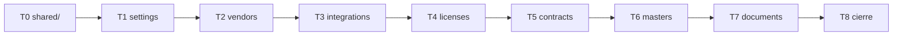

# PLAN v2.9.0 — Modularización del backend (Strangler + tests)

> **Documento VIVO.** Actualízalo tras cada tarea (marca ✅, anota rama/PR/commit).
> **Análisis y justificación:** `docs/REFACTOR_ANALYSIS_v2.9.0.md`.
> **Estado global:** ⏳ PENDIENTE DE INICIO (plan aprobado, ejecución no comenzada).

---

## 🔄 PROTOCOLO DE REANUDACIÓN — LEER PRIMERO (tras `/clear` o sesión nueva)

1. **Lee** `CLAUDE.md` (convenciones — no las contradigas) y este fichero completo.
2. **Lee** `docs/REFACTOR_ANALYSIS_v2.9.0.md` (alcance y arquitectura objetivo).
3. **Estado real:** `git status`, `git log --oneline -15`, `git branch -a`. Mira la tabla de progreso (§Progreso) para saber la última tarea ✅ y cuál sigue.
4. **Continúa por la siguiente tarea pendiente** en orden (T0 → T1 → … → T7). **No saltes tareas.**
5. **Modelo:** ejecución en **Sonnet**. **Para tras cada módulo** (cada PR) y espera revisión del usuario.
6. **Si hay discrepancia entre el plan y el código real, PREGUNTA** — no asumas.

### Reglas de oro de esta refactorización (innegociables)
- **CERO cambio de comportamiento.** Mismos paths, payloads, códigos HTTP, mensajes y auditoría. Solo se mueve/extrae código.
- **develop-first.** Todo va a `develop` en **ramas diferenciadas** (`refactor/<dominio>-module`) vía PR. **NO tocar `main`** hasta orden explícita del usuario ([[workflow-develop-first]]).
- **Tests-primero por módulo** (jest + supertest). Patrón de referencia: `backend/src/modules/plugins/__tests__/`.
- **Módulo = referencia DCIM** (`backend/src/modules/dcim/`): `router.ts` (exporta `create<Dominio>Router(prisma)`), `schemas.ts`, `queries.ts`, `audit.ts`, `middleware.ts` (solo si aplica). **Sin `index.ts` barrel** — convención real del repo: se importa `from './modules/<dominio>/router'` (solo `plugins` usa `index.ts`). Ficheros extra (`engine.ts`, `scheduler.ts`, `__tests__/`) según necesidad.
- **Documentación** se actualiza en cada tarea (ver §Documentación).
- **Auditoría:** toda escritura inserta en `audit_logs` (insert-only) — mantener idéntico.
- **Seguridad:** `$queryRaw` con tagged templates; LIKE escapa `%_\` con `ESCAPE '\'`; respuestas sin stack/errores Prisma crudos.
- **Acceso admin disponible** para smoke tests y tests que requieren ADMIN: usar el temp-admin MFA documentado en `CLAUDE.md` (`claude-admin@cmdb.local`, sembrar/borrar) o el AUDITOR `claude@cmdb.local` para lectura.
- **Docker:** `sg docker -c "..."` o `podman-compose -f docker-compose.prod.yml`. Nunca `npm install` en host. Migraciones: directorio timestamped + `migration.sql` con `IF NOT EXISTS` + `prisma migrate deploy` (NO `migrate dev`).
- **Errores TS pre-existentes a ignorar:** `Property 'license'...`, `Property 'licenseUser'...`.

---

## Alcance v2.9.0

**Principio de granularidad:** **un módulo por prefijo de path de primer nivel** (`app.use('/api/<X>', …)`). Impuesto por la regla cero-cambio-de-URLs: el código no se reagrupa por afinidad de dominio si eso obligaría a mover una URL. Por eso `masters` se queda como un único módulo aunque contenga master-data de otros dominios.

**Entran (perímetro CRUD, ~108 rutas):** `settings`, `vendors`, `integrations`, `licenses`, `contracts`, `masters`, `documents`.
**Fuera (fase futura):** `cis`+`relations`, núcleo crítico (`auth`/SSO/MFA, `users`, `audit-logs`, `chat`/RAG, `admin`, `cron`, misc). Ver §Roadmap restante.

---

## Workflow canónico por tarea de módulo (Tn)

```
1. git checkout develop && git pull origin develop
2. git checkout -b refactor/<dominio>-module
3. Escribir tests supertest del dominio (endpoints ACTUALES) → correr contra legacy → VERDE
4. Crear backend/src/modules/<dominio>/ (router [exporta createRouter], schemas, queries, audit, [middleware])
5. Mover código de index.ts al módulo; montar router en index.ts; BORRAR rutas legacy (mismo PR)
6. Re-correr tests → siguen VERDES. tsc --noEmit limpio.
7. Rebuild contenedor backend + health OK + smoke como admin de endpoints clave
8. Actualizar este PLAN (marcar ✅, anotar rama/commit) + memoria + docs afectadas
9. Commit(s) atómicos:  refactor(<dominio>): extract <Dominio> domain to backend/src/modules/<dominio>/
10. Push + PR a develop. PARAR y esperar revisión del usuario.
```

**Gate de verificación por módulo:** tsc limpio · jest del módulo verde (happy-path + 401/403 RBAC + 400/422 validación + audit_logs en escrituras) · contenedor build OK · health OK · smoke admin OK.

---

## Tareas

### T0 — Fundación `backend/src/shared/`
Rama `refactor/shared-foundation`. Extraer de `index.ts` a `shared/middleware` (`authenticateToken`, `requireAdmin`/`requireAdminRole`, `requireAudit`, `requireUuidParam`), `shared/utils` (`auditLog`, `pagination`, `likeEscape`, `response`) y `shared/schemas/common.ts`. `index.ts` importa desde `shared/`. **Verificación crítica:** smoke test de login + una ruta protegida (401 sin token, 200 con token) — el comportamiento de auth no cambia.
**Estado:** ⬜ pendiente

### T1 — `settings` (5 rutas) — establece patrón
Rama `refactor/settings-module`. Primer módulo: valida `shared/` + patrón de tests.
**Estado:** ⬜ pendiente

### T2 — `vendors` (4 rutas)
Rama `refactor/vendors-module`.
**Estado:** ⬜ pendiente

### T3 — `integrations` (2 rutas) — SSRF-sensible (Greenbone/CrowdStrike)
Rama `refactor/integrations-module`. **Borderline por tamaño** (solo 2 rutas): se extrae igualmente porque (a) es superficie SSRF que conviene aislar y (b) es área que crecerá con más integraciones. Si al llegar resulta trivial/acoplada al núcleo, alternativa válida: dejarla en `index.ts`. Mantener allowlist/validación de URLs salientes idéntica.
**Estado:** ⬜ pendiente

### T4 — `licenses` (14 rutas) — CRUD + M2M (`_LicenseToCI`, `LicenseUser`)
Rama `refactor/licenses-module`. Cuidado con A/B de las join tables Prisma.
**Estado:** ⬜ pendiente

### T5 — `contracts` (9 rutas) — CRUD + adendas + M2M
Rama `refactor/contracts-module`.
**Estado:** ⬜ pendiente

### T6 — `masters` (43 rutas) — el mayor; datos maestros
Rama `refactor/masters-module`. **Un solo módulo** montado en `/api/masters` (impuesto por la regla cero-cambio-de-URLs: aunque `license-types`/`document-types`/`device-models` sean master-data de otros dominios, viven bajo `/api/masters/*` y no se pueden mover). Sub-entidades (~12): `manufacturers`, `ci-types`(+categories), `device-models`(+sync-eol), `cost-centers`, `branches`, `support-areas`, `document-types`, `license-types`(+categories), `license-metrics`(+categories), `sync-catalog`. **Organizar internamente por entidad** (secciones/sub-routers en `router.ts`; `queries.ts`/`schemas.ts` por entidad), NO fragmentar en 12 módulos. Ojo `sync-catalog`/`device-models/:id/sync-eol` tocan EOL/catalog → mantener comportamiento idéntico.
**Estado:** ⬜ pendiente

### T7 — `documents` (31 rutas) — CRUD + upload + versiones + bulk
Rama `refactor/documents-module`. Mantener validación magic-bytes y nombres UUID idénticos.
**Estado:** ⬜ pendiente

### T8 — Cierre v2.9.0
Actualizar `ARCHITECTURE.md`/`.en`, `README.md`, `CHANGELOG.md [2.9.0]`, `CLAUDE.md` Plan Activo. Verificación global (smoke completo). **NO merge a main** hasta orden del usuario.
**Estado:** ⬜ pendiente

---

## Diagrama de dependencias / orden



---

## Documentación (actualizar según corresponda)
- **Por módulo:** si un endpoint/flujo se describe en `ARCHITECTURE.md`/`.en`, reflejar la nueva ubicación. (Los paths NO cambian → USER_MANUAL normalmente intacto; verificar.)
- **Al cierre (T8):** `ARCHITECTURE.md`/`.en` (estructura de módulos + `shared/` + diagrama), `README.md` (estructura backend), `CHANGELOG.md` (`## [2.9.0]`), `CLAUDE.md` Plan Activo.

## Roadmap restante para `index.ts` limpio (post-v2.9.0)
Ver `docs/REFACTOR_ANALYSIS_v2.9.0.md` §7:
- **F-Hard-1:** `cis` + `relations` (mover `CI_INCLUDE`, tests bulk/relaciones/mapa).
- **F-Hard-2:** red de tests del núcleo PRIMERO → `chat`/RAG, `users` (RBAC+GDPR), `audit-logs`, `auth`/SSO/MFA (+ resolver #152 otplib), `cron`, misc.
- **F-Cleanup:** `index.ts` < 500 líneas (orquestador puro); migrar copias locales de `requireAdmin` de los 5 módulos existentes a `shared/`.

---

## Progreso (tabla viva — actualizar tras cada tarea)

| Tarea | Dominio | Rama | PR | Estado | Commit |
|---|---|---|---|---|---|
| T0 | shared/ | `refactor/shared-foundation` | #154 | ✅ | 77d05c9 |
| T1 | settings | `refactor/settings-module` | — | ⬜ | — |
| T2 | vendors | `refactor/vendors-module` | — | ⬜ | — |
| T3 | integrations | `refactor/integrations-module` | — | ⬜ | — |
| T4 | licenses | `refactor/licenses-module` | — | ⬜ | — |
| T5 | contracts | `refactor/contracts-module` | — | ⬜ | — |
| T6 | masters | `refactor/masters-module` | — | ⬜ | — |
| T7 | documents | `refactor/documents-module` | — | ⬜ | — |
| T8 | cierre | — | — | ⬜ | — |

**Última acción:** T0 completado — PR #154 abierto (`refactor/shared-foundation`). Pendiente merge a develop + redeploy prod, luego continuar con T1.
**Última actualización:** 2026-06-19.
