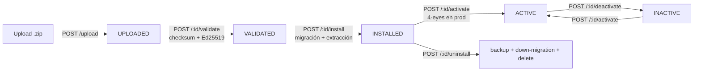
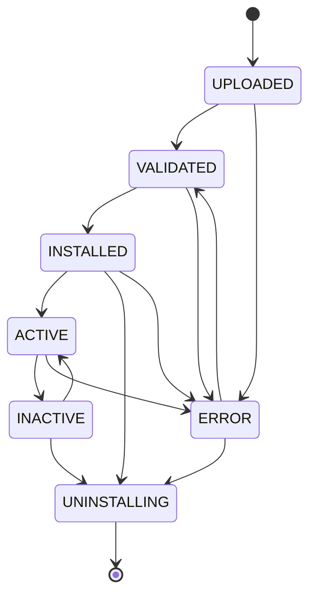

# Motor de Plugins (Plugin Engine) — Referencia técnica

> Versión: v2.8.1 · Audiencia: arquitectos, desarrolladores backend, equipo de plataforma
> Documentos relacionados: [PLUGIN_DEVELOPMENT_GUIDE.md](PLUGIN_DEVELOPMENT_GUIDE.md) (cómo construir un plugin) · [PLUGIN_SECURITY_CHECKLIST.md](PLUGIN_SECURITY_CHECKLIST.md) (gate de admisión 4-eyes)

Esta guía describe **lo que el motor hace realmente** según el código fuente en `backend/src/modules/plugins/`. No describe capacidades planificadas que no estén implementadas; las brechas conocidas se señalan explícitamente en la sección [Estado de implementación](#estado-de-implementación).

---

## 1. Visión general

El Motor de Plugins permite a usuarios con rol **ADMIN** extender el CMDB sin modificar el core ni romper sus garantías de seguridad y compliance. Un plugin es un bundle **`.zip`** (único formato aceptado — extracción unzip-only) que puede aportar:

- **Hooks** del ciclo de vida del core (p. ej. ejecutar lógica tras crear un CI).
- **Migraciones DDL aisladas** que crean tablas propias con prefijo `plg_<id>_`.
- **Cron jobs** programados (node-cron).
- **UI por iframe** embebida en slots predefinidos del frontend (servida en `GET /api/plugins/:id/ui`).
- **Rutas REST** declaradas en el manifest, servidas dinámicamente bajo `/api/ext/:pluginId/*`.

> **Runtime cableado (v2.8.1).** El registro en vivo de hooks/cron/routes, el proxy Prisma con scope y el servido de UI están **implementados**. Ver [Estado de implementación](#11-estado-de-implementación).

El módulo vive en `backend/src/modules/plugins/` siguiendo la **convención de módulos** del repo (router, schemas, middleware, queries, audit, engine), montado desde `index.ts`. No añade código a `index.ts` salvo los puntos de emisión de hooks y la llamada de arranque.

### Arquitectura de alto nivel

```
                 ┌──────────────────────────────────────────────────────────┐
                 │                    backend (Express)                      │
  ADMIN ──────▶  │  /api/plugins/*  ──▶ router.ts (12 endpoints, requireAdmin)│
  (panel admin)  │                         │                                 │
                 │                         ▼                                 │
                 │   engine.ts:  PluginValidator · LifecycleManager          │
                 │               SandboxExecutor (vm.Script) · MigrationRunner│
                 │               HookRegistry · CronRegistry · RouteRegistry  │
                 │                         │                                 │
                 │   index.ts:  emitHook('pre*'/'post*')  ◀── puntos del core │
                 │                         │                                 │
                 └─────────────────────────┼─────────────────────────────────┘
                                           ▼
                          PostgreSQL: plugin_registry, plugin_hooks,
                          plugin_cron_jobs, plugin_routes,
                          plugin_data_backups, plugin_data_store,
                          + tablas plg_<id>_* creadas por el rol cmdb_plugin

  Browser ──▶ frontend: PluginProvider → PluginSlot → <iframe sandbox> ──▶ /api/plugins/:id/ui
```

### Flujo de admisión (upload → activate)



---

## 2. Modelo de confianza (D1)

> **El runtime `vm` NO es la frontera de seguridad.** La documentación de Node.js lo declara textualmente: *"The vm module is not a security mechanism."* Un plugin malicioso aprobado por error por un revisor humano **puede escapar** del sandbox. El sandbox es defensa en profundidad, no el control primario.

La **frontera de seguridad real es el gate de admisión**, una combinación de controles técnicos y humanos:

| Control | Dónde | Qué verifica |
|---------|-------|--------------|
| Firma **Ed25519** | `router.ts` → `crypto.verify` con `PLUGIN_SIGNING_PUBLIC_KEY` | Que el bundle proviene de un editor de confianza (firma sobre el checksum) |
| Checksum **SHA-256** | `PluginValidator.validateChecksum` | Que el `.zip` no se alteró tras la subida |
| **Magic bytes** + extensión | `PluginValidator.validateUploadedFile` | Que el archivo es realmente un zip (`504b`) y tiene extensión `.zip`; rechaza symlinks (la extracción es unzip-only) |
| **Allowlist DDL** + prefijo `plg_` | `PluginValidator.validateMigrationSql` | Que la migración no toca tablas core |
| **Checklist de revisión** humana | [PLUGIN_SECURITY_CHECKLIST.md](PLUGIN_SECURITY_CHECKLIST.md) | Que el código no exfiltra PII, no accede a `process`/`require`/`fs`, no hace `fetch` a hosts no declarados |
| Aprobación **4-eyes** en producción | `router.ts` → `/:id/activate` | Que un segundo ADMIN distinto al solicitante autoriza la activación |

### Endurecimiento del sandbox (defensa en profundidad)

`SandboxExecutor.runHandler` (en `engine.ts`) ejecuta el código del plugin con `vm.Script` sobre un **contexto congelado** (`Object.freeze` antes de `vm.createContext`). El contexto expone deliberadamente un subconjunto mínimo:

- **Disponible:** `prisma` (proxy), `logger`, `config` (congelado), `fetch` (restringido), `console`, `JSON`, `Math`, `Date`, `parseInt`, `parseFloat`, `isNaN`, `isFinite`, `encodeURIComponent`, `decodeURIComponent`, y los datos del evento en `__pluginData__`.
- **Bloqueado (forzado a `undefined`):** `process`, `require`, `module`, `exports`, `global`, `globalThis`, `__filename`, `__dirname`, `setTimeout`, `setInterval`, `clearTimeout`, `clearInterval`, **`eval`** y **`Function`** (constructor). No se inyecta `fs` ni `child_process`.
- **Timeout:** `SANDBOX_TIMEOUT_MS = 5000` ms. Al superarlo se lanza `PLUGIN_TIMEOUT`.
- **`fetch` restringido (anti-SSRF, OWASP A10):** el wrapper `safeFetch` valida el `origin` de cada URL contra `allowedHosts` del manifest; si no coincide, lanza `PLUGIN_SSRF`.

> El sandbox usa `vm`, no `worker_threads` ni un proceso aislado. Por eso el gate de admisión es imprescindible: es la única barrera fuerte.

---

## 3. Ciclo de vida del plugin

La máquina de estados la implementa `PluginLifecycleManager` en `engine.ts`. Las transiciones válidas son estrictas; cualquier otra se rechaza con 409.



| Estado | Significado | Transiciones permitidas |
|--------|-------------|-------------------------|
| `UPLOADED` | Bundle subido y registrado; manifest parseado | `VALIDATED`, `ERROR` |
| `VALIDATED` | Checksum (+ firma si presente) verificados; manifest re-validado | `INSTALLED`, `ERROR` |
| `INSTALLED` | Migración ejecutada; bundle extraído a `installed/`; hooks/cron/routes parseados a sus tablas | `ACTIVE`, `UNINSTALLING`, `ERROR` |
| `ACTIVE` | Hooks/cron/routes registrados en vivo; plugin en ejecución | `INACTIVE`, `ERROR` |
| `INACTIVE` | Desactivado; código presente pero sin registrar | `ACTIVE`, `UNINSTALLING` |
| `ERROR` | Fallo en validación, instalación o reactivación; `lastError` poblado | `UNINSTALLING`, `VALIDATED` |
| `UNINSTALLING` | Estado terminal durante el borrado | — |

> **Nota de implementación:** `/:id/activate` y `/:id/deactivate` actualizan el estado directamente (con sus propios chequeos de estado origen) en lugar de pasar por `canTransition`. El conjunto de transiciones de arriba es el contrato declarado por `PluginLifecycleManager.validTransitions`.

---

## 4. Modelos de datos

Seis modelos Prisma en `backend/prisma/schema.prisma` (todos con PK `uuid`, `@@map` snake_case, índices en FKs y `onDelete: Cascade` hacia `PluginRegistry`).

### `PluginRegistry` (`plugin_registry`)
Registro central y de gobierno de cada plugin.

| Campo | Tipo | Notas |
|-------|------|-------|
| `id` | uuid (PK) | Clave primaria interna |
| `pluginId` | string único | `id` del manifest (kebab-case) |
| `name`, `version`, `author`, `license` | string | Metadatos del manifest |
| `status` | string | Estado del ciclo de vida |
| `manifest` | Json | Manifest completo validado |
| `config` | Json (`{}`) | Configuración mutable (inyectada al sandbox) |
| `permissions` | string[] | Permisos declarados |
| `checksum` | string | SHA-256 del bundle |
| `installedAt`, `updatedAt` | DateTime | Timestamps |
| `lastError` | string? | Último error (si `ERROR`) |
| `approvedBy`, `approvedAt` | string?/DateTime? | Quién y cuándo aprobó la activación (4-eyes) |
| `dataRetention` | string (`HARD`) | Política de retención de datos del plugin |

### `PluginHook` (`plugin_hooks`)
Hooks registrados por el plugin.

| Campo | Tipo | Notas |
|-------|------|-------|
| `event` | string | Nombre del evento (p. ej. `postCreateCI`) |
| `priority` | int (50) | Orden de ejecución ascendente |
| `handlerCode` | string | Código fuente JS del handler |
| `isActive` | bool (true) | Si el hook está activo |

### `PluginCronJob` (`plugin_cron_jobs`)
Tareas programadas del plugin.

| Campo | Tipo | Notas |
|-------|------|-------|
| `name`, `schedule` | string | Nombre y expresión cron |
| `handlerCode` | string | Código del job |
| `isActive` | bool (true) | Si el job está activo |
| `lastRunAt`, `nextRunAt` | DateTime? | Última/próxima ejecución |

### `PluginRoute` (`plugin_routes`)
Rutas REST del plugin; al activar se cargan en el `RouteRegistry` y se sirven en `/api/ext/:pluginId/<path>`.

| Campo | Tipo | Notas |
|-------|------|-------|
| `method`, `path` | string | Verbo y ruta (únicos por `pluginId`) |
| `handlerCode` | string | Código del handler |
| `isActive` | bool (true) | Si la ruta está activa |
| `requiresAuth` | bool (true) | Si requiere autenticación |
| `requiredRole` | string? | Rol mínimo requerido |

### `PluginDataBackup` (`plugin_data_backups`)
Backups JSON de los datos del plugin antes de desinstalar.

| Campo | Tipo | Notas |
|-------|------|-------|
| `backupPath` | string | Ruta del fichero JSON de backup |
| `sizeBytes` | int | Tamaño del backup |
| `reason` | string | Motivo (p. ej. `UNINSTALL`) |
| `createdAt` | DateTime | Timestamp |

### `PluginDataStore` (`plugin_data_store`)
Almacén JSONB ligero para plugins que no necesitan DDL propio. Clave única `(tableName, entityId, pluginId)`.

| Campo | Tipo | Notas |
|-------|------|-------|
| `tableName` | string | Nombre lógico de la "tabla" |
| `entityId` | uuid | Identificador de la entidad |
| `pluginId` | string | Plugin propietario |
| `data` | Json | Carga de datos |

---

## 5. Sistema de hooks

El core emite eventos en puntos clave mediante `emitHook(event, data, type)` (exportado por `engine.ts`). El `HookRegistry` mantiene, por evento, una lista de handlers ordenada por `priority` ascendente.

- **Pre-hooks** (`type: 'pre'`): se ejecutan **antes** de la operación. Si cualquiera devuelve `{ cancel: true, reason }`, el core aborta la operación y responde `409` con el `reason`. Errores del handler se registran pero **no** cancelan.
- **Post-hooks** (`type: 'post'`, por defecto): se ejecutan **después** con `Promise.allSettled` (fire-and-forget). Sus errores se registran y **nunca** se propagan al core.
- **Coste cero en reposo:** `emitHook` hace early-return si `hookRegistry.hasHandlers(event)` es falso. Un despliegue sin plugins activos no paga sobrecoste.

### Eventos emitidos por el core

Verificados en `backend/src/index.ts`:

| Evento | Tipo | Punto del core | Payload |
|--------|------|----------------|---------|
| `preCreateCI` | pre | `POST /api/cis` | `{ body, user }` |
| `postCreateCI` | post | `POST /api/cis` | `{ id, body, user }` |
| `preUpdateCI` | pre | `PATCH /api/cis/:id` | `{ id, body, user }` |
| `postUpdateCI` | post | `PATCH /api/cis/:id` | `{ id, body, user }` |
| `preDeleteCI` | pre | `DELETE /api/cis/:id` | `{ id, user }` |
| `postDeleteCI` | post | `DELETE /api/cis/:id` | `{ id, user }` |
| `preCreateContract` | pre | `POST /api/contracts` | `{ body, user }` |
| `postCreateContract` | post | `POST /api/contracts` | `{ id, body, user }` |
| `preCreateDocument` | pre | `POST /api/documents` | `{ body, user }` |
| `postCreateDocument` | post | `POST /api/documents` | `{ id, body, user }` |
| `preCreateLicense` | pre | `POST /api/licenses` | `{ body, user }` |
| `postCreateLicense` | post | `POST /api/licenses` | `{ id, body, user }` |
| `postLogin` | post | `POST /api/auth/login` | `{ userId, role, email }` |

> `postLogin` **no** se emite para tokens limitados (cuando el ADMIN aún debe completar el setup de MFA).

---

## 6. Endpoints REST

Todas las rutas se montan bajo `/api/plugins` y aplican `pluginRateLimiter` (100 req/min por IP+plugin) y `requireAdmin` (solo rol ADMIN). Las rutas con `:id` validan que sea UUID y cargan el plugin con `requirePluginExists`.

| # | Método | Path | Descripción |
|---|--------|------|-------------|
| 1 | `GET` | `/api/plugins` | Lista todos los plugins registrados (con manifest y permisos) |
| 2 | `GET` | `/api/plugins/marketplace` | Proxy al marketplace configurado (nunca acepta URL del cliente — A10) |
| 3 | `POST` | `/api/plugins/upload` | Sube un bundle; valida magic bytes, extrae y valida el manifest, calcula checksum, crea registro `UPLOADED` |
| 4 | `POST` | `/api/plugins/:id/validate` | Verifica checksum + firma Ed25519 (si presente) + re-valida manifest → `VALIDATED` |
| 5 | `POST` | `/api/plugins/:id/install` | Ejecuta `migration.sql` (si existe) y extrae el bundle a `installed/` → `INSTALLED` |
| 6 | `POST` | `/api/plugins/:id/activate` | Activa el plugin; en producción exige `approvalToken` 4-eyes → `ACTIVE` |
| 7 | `POST` | `/api/plugins/:id/deactivate` | Desactiva un plugin `ACTIVE` → `INACTIVE` |
| 8 | `POST` | `/api/plugins/:id/uninstall` | Backup JSON + down-migration + borrado de ficheros y registro |
| 9 | `GET` | `/api/plugins/:id/config` | Devuelve la configuración actual del plugin |
| 10 | `PATCH` | `/api/plugins/:id/config` | Fusiona claves nuevas en la configuración existente |
| 11 | `GET` | `/api/plugins/:id/logs` | Lee los `audit_logs` del plugin (`entity='PLUGIN'`); soporta `?limit` (máx 200) y `?since` |
| 12 | `POST` | `/api/plugins/:id/rollback` | Rollback de versión — **no implementado** (responde `501`) |

**Auditoría:** toda escritura inserta un registro en `audit_logs` con `entity='PLUGIN'` vía `pluginAudit()`. Acciones: `PLUGIN_UPLOADED`, `PLUGIN_VALIDATED`, `PLUGIN_VALIDATION_FAILED`, `PLUGIN_INSTALLED`, `PLUGIN_ACTIVATED`, `PLUGIN_DEACTIVATED`, `PLUGIN_UNINSTALLED`, `PLUGIN_CONFIG_UPDATED`, `PLUGIN_ERROR`.

### Endpoints dinámicos servidos por el runtime (v2.8.1)

Además del router de gestión, dos routers atienden el tráfico en vivo de los plugins activos. **No** requieren rol ADMIN: aplican la autenticación que corresponda según el caso.

| Método | Path | Router | Auth | Descripción |
|--------|------|--------|------|-------------|
| (según ruta) | `/api/ext/:pluginId/<path>` | `createPluginExtRouter` | por ruta | **Rutas dinámicas del plugin.** El dispatcher empareja `método + path` contra el `RouteRegistry` en vivo y ejecuta el handler en el sandbox. Aplica `requiresAuth`/`requiredRole` de cada ruta y el rate-limit del módulo. `404` si no hay coincidencia |
| `GET`/`HEAD` | `/api/plugins/:id/ui[/*]` | `createPluginPublicRouter` | sesión válida (cualquier rol) | **UI del plugin.** Sirve `installed/<id>/ui/*` (por defecto `index.html`) con CSP estricta; valida `?slot` contra `manifest.uiSlots`. Montado **antes** del router de gestión |

> El `RouteRegistry` **no** monta/desmonta rutas de Express dinámicamente (Express 5 no lo permite de forma limpia): un único dispatcher en `/api/ext/:pluginId/*` empareja contra el registro, lo que sí es seguro de modificar en vivo. El emparejamiento es exacto por método + path (sin patrones de parámetros en v2.8.1).

### Aprobación 4-eyes (activación en producción)

Solo se exige cuando `NODE_ENV === 'production'` **y** `PLUGIN_REQUIRE_APPROVAL_PROD === 'true'`. El `approvalToken` es un JWT (firmado con el `JWT_SECRET` de la plataforma) que debe:

1. Verificar correctamente (no expirado, firma válida).
2. Pertenecer a un usuario con rol `ADMIN`.
3. Ser de un ADMIN **distinto** al solicitante (no coinciden `id` ni `email`). Si coinciden → `403` por violación 4-eyes.

---

## 7. Sistema de slots UI

El frontend embebe la UI de cada plugin activo en **slots** predefinidos mediante iframes aislados (decisión D3).

### Componentes
- **`PluginContext.tsx`** — `PluginProvider` (montado en `app/layout.tsx`) carga `GET /api/plugins`, filtra los `ACTIVE` y agrupa sus `manifest.uiSlots` en `slotsByName`. Expone `usePlugins()`.
- **`PluginSlot.tsx`** — `<PluginSlot slotName="..." context={...} />`. Renderiza un `PluginIframe` por cada plugin registrado en ese slot. Si no hay ninguno, renderiza `null` (coste cero).
- **`PluginIframe.tsx`** — embebe `<iframe sandbox="allow-scripts allow-same-origin">` cuyo `src` es `/api/plugins/:id/ui?slot=<slot>`. Gestiona el puente `postMessage`.

### Los 7 slots

| Slot | Ubicación prevista |
|------|--------------------|
| `DashboardWidget` | Widget en el dashboard |
| `CIDetailTab` | Pestaña en el detalle de un CI |
| `ContractDetailTab` | Pestaña en el detalle de un contrato |
| `TopBarMenu` | Entrada en la barra superior |
| `SettingsPanel` | Panel en ajustes |
| `InventoryColumn` | Columna en el listado de inventario |
| `MapOverlay` | Overlay sobre el mapa de relaciones |

### Puente `postMessage`

Validado por origen (`event.origin === window.location.origin`) y por fuente (solo del iframe concreto).

- **Host → iframe** (al cargar): `cmdb:init` con `{ token: null, locale, theme: "light", context }`. El JWT vive en cookie HttpOnly y **no** se expone al iframe; las llamadas del plugin a la API reutilizan la cookie automáticamente.
- **Iframe → host:**
  - `cmdb:resize` `{ height }` — ajusta la altura del iframe.
  - `cmdb:navigate` `{ path }` — navegación interna (solo paths que empiezan por `/`).

---

## 8. Arranque y reactivación

`initializePluginEngine(app, prisma)` se invoca una vez al final de `index.ts`, tras montar middleware y rutas. Su cometido:

1. Monta el router de gestión en `/api/plugins`.
2. Lee los plugins en estado `ACTIVE` (`getActivePlugins`, incluye hooks/cron/routes). Si las tablas aún no existen (primer arranque antes de migrar), avisa y sale sin error.
3. Por cada plugin ACTIVE invoca `pluginRuntime.registerPlugin(plugin)`, que:
   - **Re-registra hooks** activos en el `HookRegistry`, envolviendo cada `handlerCode` en el `SandboxExecutor` (con el proxy Prisma con scope y los `allowedHosts`/`config`/`permissions` del plugin).
   - **Re-registra cron jobs** activos con `node-cron` (valida el `schedule`; los inválidos se omiten con log); cada ejecución corre en el sandbox y actualiza `lastRunAt`.
   - **Añade sus rutas** al `RouteRegistry` (`routeRegistry.add`), que el dispatcher de `/api/ext/:pluginId/*` consulta en cada petición.
4. Si un plugin falla al reactivarse → se marca `ERROR` (con `lastError`) y se audita `PLUGIN_ERROR`, **sin bloquear el arranque** del resto.

El mismo `registerPlugin` se ejecuta en `POST /:id/activate`; `pluginRuntime.unregisterPlugin(dbId, pluginId)` (en `deactivate`/`uninstall`) deshace las tres registraciones: limpia el `HookRegistry`, detiene los cron del plugin y elimina sus rutas del `RouteRegistry`.

Este diseño cumple el RTO de ISO 22301: un fallo de plugin no impide que la aplicación arranque.

---

## 9. Almacenamiento en disco

Bajo `PLUGIN_STORAGE_PATH` (volumen `cmdb-plugins`):

| Subdirectorio | Contenido |
|---------------|-----------|
| `staging/` | Bundles subidos (`<uuid>.zip`) pendientes de instalar |
| `installed/<db-uuid>/` | Contenido extraído del bundle ya instalado |
| `backups/` | Backups JSON pre-uninstall (`<db-uuid>_<timestamp>.json`) |

---

## 10. Aislamiento de migraciones (D2)

- Las migraciones (`migration.sql` en el bundle) las ejecuta `MigrationRunner` vía `execFile('psql', ...)` (nunca `exec` — sin inyección de shell), con la conexión `PLUGIN_DATABASE_URL` (rol `cmdb_plugin`). Si `PLUGIN_DATABASE_URL` no está configurada, el runner **rechaza** ejecutar la migración (no hay fallback al `DATABASE_URL` de superusuario del core).
- `PluginValidator.validateMigrationSql` aplica una **allowlist DDL** sobre el SQL con comentarios y literales eliminados: rechaza `DROP TABLE`/`DROP INDEX` (y demás `DROP`), `TRUNCATE`, `ALTER TABLE`, `DELETE FROM` y `UPDATE` cuyo destino no empiece por `plg_`, y prohíbe `GRANT`/`REVOKE` por completo. Toda `CREATE TABLE` debe usar el prefijo `plg_<plugin-id>_`.
- **Down-migration:** si el bundle incluye `down.sql` se ejecuta; si no, el runner genera automáticamente `DROP TABLE` para todas las tablas `plg_<id>_*` (consultando `pg_tables`).
- **Backup previo:** antes de la down-migration, el uninstall vuelca a JSON todas las tablas `plg_*` del plugin y registra un `PluginDataBackup`.

El rol `cmdb_plugin` se crea con `scripts/create-plugin-db-role.sql` (ver SYSADMIN_MANUAL): `GRANT CREATE` sobre `public` para crear objetos nuevos, **sin** privilegios `SELECT/UPDATE/DELETE` sobre tablas core.

> El validador de DDL (`validateMigrationSql`) endurecido en v2.8.1 captura el identificador de destino de cada verbo peligroso (`DROP TABLE`/`DROP INDEX`/`TRUNCATE`/`ALTER TABLE`/`DELETE FROM`/`UPDATE`) y exige que empiece por `plg_`; `GRANT`/`REVOKE` quedan prohibidos por completo. El `MigrationRunner` **nunca** cae al `DATABASE_URL` del core: si `PLUGIN_DATABASE_URL` no está configurada, rechaza ejecutar la migración en lugar de usar credenciales de superusuario.

### Proxy Prisma con scope en runtime (H-02)

El acceso a datos **en tiempo de ejecución** (hooks, rutas, cron) usa el mismo rol restringido pero por una vía distinta a las migraciones: `buildPrismaProxy(permissions)` (en `engine.ts`) devuelve un objeto congelado que envuelve un `PrismaClient` ligado a `PLUGIN_DATABASE_URL`.

- Expone solo SQL crudo: `$queryRaw`/`$queryRawUnsafe` (gate de capacidad `db:read`) y `$executeRaw`/`$executeRawUnsafe` (gate `db:write`/`db:schema`). Llamar a un método sin el permiso declarado lanza `PLUGIN_PERM`.
- El **doble control** es deliberado: el permiso del manifest es la *capacidad* declarada; el rol `cmdb_plugin` es el *aislamiento* a nivel de base de datos (solo objetos `plg_*`). Un intento de leer una tabla core falla en el motor de base de datos aunque el código lo intente.
- El **cliente Prisma del core nunca se entrega** al sandbox. Si `PLUGIN_DATABASE_URL` no está configurada, el proxy lanza al primer uso y el acceso a datos del plugin queda deshabilitado.

---

## 11. Estado de implementación

### Resuelto en v2.8.1 — runtime cableado

El runtime de ejecución está completo. Lo que en v2.8.0 figuraba como pendiente ya está implementado:

- **Parseo del bundle a artefactos (`install`).** `parseBundleArtifacts` (en `router.ts`) lee del bundle extraído los handlers de cada hook/cron/route declarado en el manifest y los persiste en `PluginHook`/`PluginCronJob`/`PluginRoute`. Convención de ficheros: hooks en `hooks/<kebab(evento)>.js`, cron en `cron/<name>.js`, rutas en `routes/<método>_<slug(path)>.js`. **Si falta el fichero de un handler declarado, la instalación falla** (`PLUGIN_HANDLER_MISSING`).
- **Registro en vivo (H-01) — resuelto.** `pluginRuntime.registerPlugin` (en `activate` y al arranque) inscribe hooks en el `HookRegistry`, agenda los cron con `node-cron` y añade las rutas al `RouteRegistry`. `unregisterPlugin` (en `deactivate`/`uninstall`) las desmonta.
- **Rutas dinámicas de plugin (`PluginRoute`) — resuelto.** El dispatcher `createPluginExtRouter` sirve `/api/ext/:pluginId/*`, empareja contra el `RouteRegistry` y ejecuta el handler en el sandbox. Aplica `requiresAuth`/`requiredRole` por ruta. El handler recibe `{ method, path, query, body, user }` y devuelve `{ status?, body? }`.
- **Proxy de Prisma con scope (H-02) — resuelto.** `buildPrismaProxy(permissions)` entrega a cada handler un `prisma` que solo expone `$queryRaw`/`$queryRawUnsafe` (gate `db:read`) y `$executeRaw`/`$executeRawUnsafe` (gate `db:write`), enrutados por un `PrismaClient` ligado a `PLUGIN_DATABASE_URL` (rol `cmdb_plugin`). El cliente Prisma del core **nunca** se expone (ver [§10](#10-aislamiento-de-migraciones-d2)).
- **Endpoint `GET /api/plugins/:id/ui` (H-04) — resuelto.** `createPluginPublicRouter` sirve `installed/<id>/ui/*` (por defecto `index.html`) a cualquier usuario autenticado, con CSP estricta y validación de `?slot` contra `manifest.uiSlots`. El `src` del iframe (`/api/plugins/:id/ui?slot=<slot>`) ya carga correctamente.

### Pendiente / diferido

- **`POST /api/plugins/:id/rollback` — `501 Not Implemented`** (placeholder explícito; operación multi-paso aún no construida).
- **Lows diferidos:** L-01, L-03, L-08, L-09 (ver `docs/security/` del release). No bloquean el funcionamiento del motor.
- **`PLUGIN_SIGNING_PUBLIC_KEY`** lo lee `router.ts` para verificar firmas; configúrese manualmente en el entorno si se usan plugins firmados.
