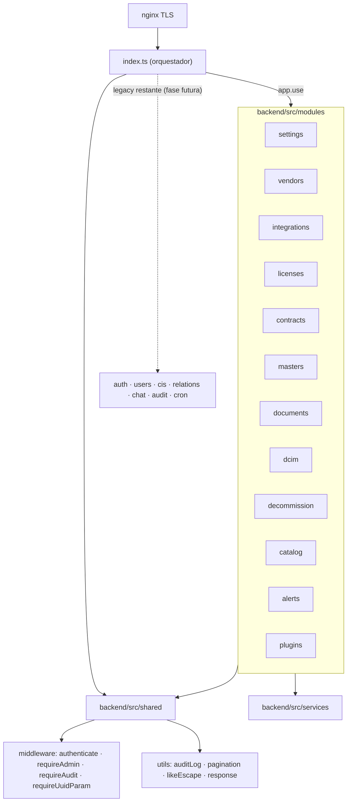

# REFACTOR ANALYSIS — v2.9.0 — Modularización del backend

> **Estado:** APROBADO (alcance cerrado 2026-06-19). Plan operativo en `docs/PLAN_v2.9.0.md`.
> **Autor del análisis:** Opus. **Ejecución:** Sonnet.

---

## 1. Resumen ejecutivo y decisión de alcance

`backend/src/index.ts` tiene **8.237 líneas / 168 rutas**. La convención v2.6.0 (CLAUDE.md) dice: *"index.ts remains the home for the existing legacy domains only — do not grow it further"*. Es decir: lo nuevo es modular, el legacy se queda. Una refactorización "todo a módulos incluido auth" **va más allá y en contra** de esa convención, sobre código crítico (auth/RBAC/audit/GDPR) y **sin red de tests del legacy** → riesgo de regresión de seguridad/compliance con beneficio funcional cero.

**Decisión adoptada — *Strangler* pragmático con tests-primero:**
- ✅ **Entran en v2.9.0** (perímetro CRUD, ~108 rutas): `settings`, `vendors`, `integrations`, `licenses`, `contracts`, `masters`, `documents`.
- ⏸️ **Fuera de v2.9.0, fase futura planificada:** `cis`+`relations` (central/acoplado) y el **núcleo crítico** (`auth`/SSO/MFA, `users`/RBAC, `audit-logs`, `chat`/RAG, `cron`, misc). Ver §7 (roadmap restante).
- 🔒 **otplib** (#152) y **exceljs→uuid** (#153): se quedan como están, registrados como issues. No se tocan en v2.9.0.

**Principio rector:** *cero cambio de comportamiento*. La API (paths, payloads, códigos, auditoría) debe ser **idéntica** antes y después. Mover/extraer, nunca reescribir lógica.

---

## 2. Datos verificados (2026-06-19)

| Hecho | Realidad |
|---|---|
| `index.ts` | 8.237 líneas, 168 rutas |
| Módulos existentes | 5: `alerts`, `catalog`, `dcim`, `decommission`, `plugins` |
| `shared/` | No existe (se crea en T0) |
| Tooling de test | jest 30 + supertest 7 instalados; `npm test` definido |
| Tests existentes | **Solo** `modules/plugins/__tests__/` (5 archivos). **Cero** del legacy |
| `exceljs` | Backend **y** frontend; backend **parsea XLSX de usuario** (`index.ts:2506`, `docParser.ts:221`) |

## 3. Inventario de dominios en `index.ts`

| Dominio | Rutas | Riesgo | Veredicto v2.9.0 |
|---|---:|---|---|
| `masters` | 43 | Bajo | ✅ Extraer (T6) |
| `documents` | 31 | Medio | ✅ Extraer (T7) |
| `cis` | 28 | Alto | ⏸️ Fase futura (acoplamiento `CI_INCLUDE`, bulk, relations) |
| `licenses` | 14 | Bajo-Medio | ✅ Extraer (T4) |
| `contracts` | 9 | Bajo-Medio | ✅ Extraer (T5) |
| `auth` | 8 | **Crítico** | ⏸️ Fase futura (JWT/MFA/SSO/LDAP) |
| `chat` (RAG) | 6 | Medio | ⏸️ Fase futura (acopla `ragService`) |
| `admin` | 6 | Medio-Alto | ⏸️ Fase futura (revisar contenido) |
| `settings` | 5 | Bajo | ✅ Extraer (T1) |
| `vendors` | 4 | Bajo | ✅ Extraer (T2) |
| `users` | 4 | **Crítico** | ⏸️ Fase futura (RBAC + borrado GDPR) |
| `relations` | 2 | Medio | ⏸️ Fase futura (con `cis`) |
| `integrations` | 2 | Medio | ✅ Extraer (T3, SSRF-sensible) |
| `vulnerabilities`/`system-info`/`profile`/`audit-logs`/`health` | 5 | Mixto | ⏸️ Fase futura / se quedan |

## 4. Criterios de evaluación

Cada dominio se evaluó por: **tamaño** (>200 líneas = candidato), **cohesión** (rutas comparten schemas/queries), **acoplamiento** (dependencia de estado global de `index.ts`), **complejidad** (raw SQL vs CRUD), **riesgo** (crítico=auth vs periférico=settings) y **red de tests** (inexistente en legacy → tests-primero obligatorio). El perímetro elegido maximiza cohesión y minimiza acoplamiento/riesgo.

## 5. Arquitectura objetivo



## 6. Diseño de `backend/src/shared/`

Creado en **T0** y consumido por los nuevos módulos (los 5 módulos existentes migran a `shared/` en una limpieza futura, no en v2.9.0):

```
backend/src/shared/
├── middleware/
│   ├── authenticate.ts     # authenticateToken (extraído de index.ts)
│   ├── requireAdmin.ts     # requireAdmin / requireAdminRole
│   ├── requireAudit.ts     # requireAudit
│   └── requireUuidParam.ts # validación de :id UUID
├── utils/
│   ├── audit.ts            # auditLog() — inserción insert-only en audit_logs
│   ├── pagination.ts       # parse de page/pageSize + meta
│   ├── likeEscape.ts       # escape %,_,\ para LIKE + ESCAPE '\'
│   └── response.ts         # helpers de respuesta/errores genéricos (sin stack)
└── schemas/
    └── common.ts           # Zod: UuidParam, Pagination, etc.
```

`index.ts` importará desde `shared/` (cambio de import, sin cambio de comportamiento — verificable con smoke test de auth).

## 7. Roadmap restante para modularidad total (post-v2.9.0)

Lo que faltaría tras v2.9.0 para dejar `index.ts` como **orquestador puro (<500 líneas)**:

| Fase futura | Dominios | Pre-requisito | Riesgo |
|---|---|---|---|
| **F-Hard-1** (v2.9.x/v2.10) | `cis` + `relations` | Mover `CI_INCLUDE` a `shared/` o al módulo `ci`; tests de bulk import, relaciones y mapa | Alto |
| **F-Hard-2** (v2.10.x) | `chat`/RAG, `users` (RBAC+GDPR), `audit-logs`, `auth`/SSO/MFA, `cron`, misc | **Red de tests de integración del núcleo construida primero** (login, MFA, SSO, RBAC 401/403, erase GDPR, audit insert-only). Aquí encaja resolver #152 (otplib) | **Muy alto** |
| **F-Cleanup** (final) | `index.ts` → solo imports, middleware global, montaje de routers, init de cron, health. Migrar copias locales de `requireAdmin` de los 5 módulos a `shared/` | Todo lo anterior verde | Bajo |

**Meta final:** `index.ts` < 500 líneas, todos los dominios en `backend/src/modules/`, código común en `backend/src/shared/`, servicios externos en `backend/src/services/`.

## 8. Riesgos y mitigaciones

| Riesgo | Mitigación |
|---|---|
| Regresión silenciosa al mover código | Tests-primero por módulo (supertest) que deben seguir verdes tras la extracción |
| Pérdida de auditoría en escrituras | Test que asevera inserción en `audit_logs` por cada endpoint de escritura |
| Cambio de RBAC | Test 401 (sin token) / 403 (rol incorrecto) por módulo |
| Acoplamiento oculto a estado global | Extraer a `shared/` primero (T0); desacoplar explícitamente |
| Verificación sin E2E completo | tsc + jest + rebuild contenedor + health + smoke como admin (acceso admin disponible, ver CLAUDE.md temp-admin) |
| Pérdida de contexto (`/clear`) | Plan vivo en `docs/PLAN_v2.9.0.md` + protocolo de reanudación + memoria actualizada por tarea |

## 9. Deuda técnica registrada (no en v2.9.0)

- **#152** — otplib v12→v13 (tech-debt, no vuln). Se abordará en F-Hard-2 (módulo Auth) con tests TOTP.
- **#153** — exceljs→uuid (7 advisories transitivas). Fix recomendado: `overrides` de uuid. Tarea aparte.
