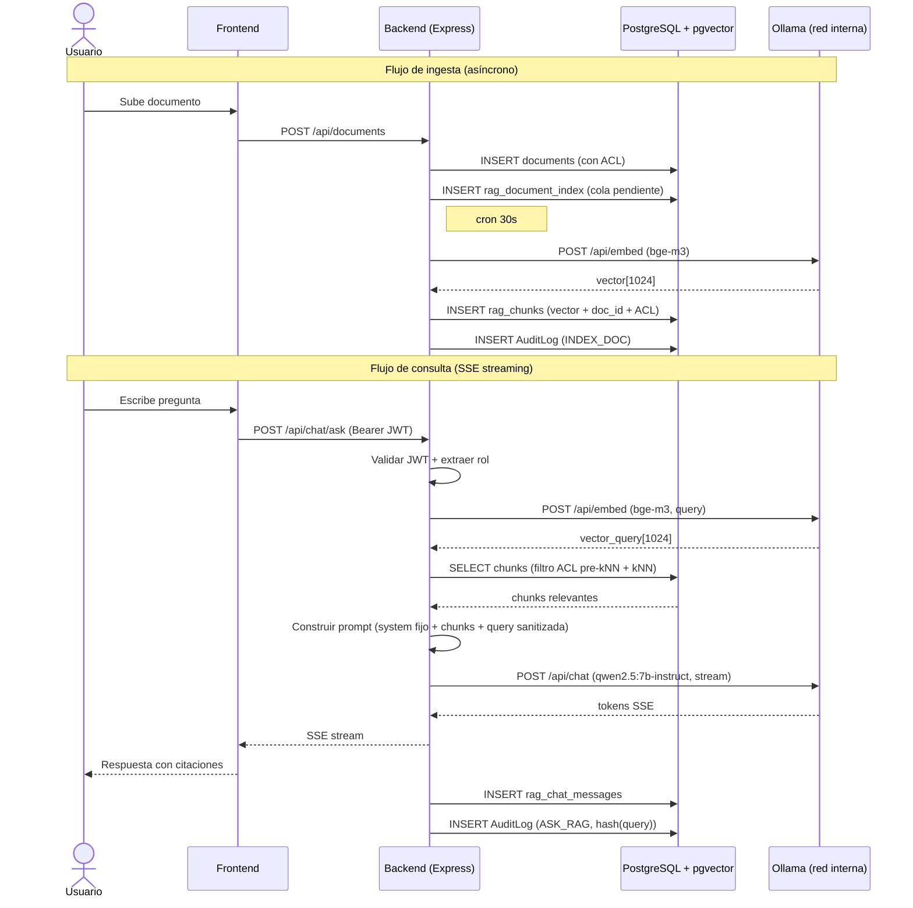

# DPIA y Threat Model — Subsistema RAG / Asistente IA

**Versión:** 1.0
**Fecha:** 2026-05-20
**Estado:** Aprobado pendiente implementación
**Documento ID:** ISMS-DPIA-002
**Owner:** [SUSTITUIR: nombre del DPO]
**Revisado por:** [SUSTITUIR: Asesor jurídico, CISO]
**Base legal:** GDPR Art. 35, EDPB Guidelines 09/2022, Directiva NIS2 Art. 21
**Próxima revisión:** 2027-05-20 o tras cambio significativo de arquitectura

---

## 1. Resumen ejecutivo

Este documento constituye la Evaluación de Impacto relativa a la Protección de Datos (DPIA) y el modelo de amenazas STRIDE para el subsistema de Asistente IA con Recuperación Aumentada de Generación (RAG) que se incorpora a CMDB Enterprise Platform v2.3.

El subsistema permite a los usuarios autenticados realizar consultas en lenguaje natural sobre el corpus de documentos corporativos almacenados en la plataforma. El procesamiento se realiza íntegramente en infraestructura interna mediante un modelo de embeddings (bge-m3, 1024 dimensiones) y un modelo de lenguaje (qwen2.5:7b-instruct) servidos por Ollama en la red Docker privada. No se produce ninguna transferencia de datos a proveedores externos de IA.

El análisis concluye que el riesgo residual del tratamiento es **BAJO** una vez implementados los controles descritos en este documento. La activación del subsistema en producción está condicionada a la finalización de los bloques de implementación B1, B2, B3, A0, A2 y A9 descritos en `docs/RAG_IMPLEMENTATION_PLAN.md`.

---

## 2. Descripción del tratamiento

El subsistema RAG introduce dos flujos de tratamiento nuevos:

1. **Ingesta de documentos:** cuando se sube o actualiza un documento en la plataforma, el contenido se fragmenta (chunking), se vectoriza mediante el modelo de embeddings y los vectores se almacenan en PostgreSQL con extensión pgvector. El proceso se desencadena mediante un hook en `POST /api/documents` y una cola procesada por un cron de 30 segundos.

2. **Consulta conversacional:** el usuario envía una pregunta a `POST /api/chat/ask`. El backend vectoriza la pregunta, recupera los chunks mas relevantes del corpus respetando la ACL del usuario (filtro pre-kNN), construye un prompt con contexto y obtiene una respuesta del LLM via Ollama. La respuesta se transmite al cliente mediante Server-Sent Events (SSE).

### 2.1 Flujo de datos

### 2.2 Datos almacenados

| Tabla BD | Campos principales | Categoría de dato | Retención |
|---|---|---|---|
| `rag_document_index` | `doc_id`, `status`, `indexed_at`, `error_msg` | Metadatos operativos (no PII) | Vida del documento (cascade delete) |
| `rag_chunks` | `chunk_id`, `doc_id`, `chunk_text`, `embedding` (vector 1024d), `chunk_index` | Fragmentos de texto corporativo (puede contener PII indirecta) | Vida del documento (cascade delete) |
| `rag_chat_sessions` | `session_id`, `user_id`, `created_at`, `updated_at` | PII — identificador de usuario | 90 dias (cron diario) |
| `rag_chat_messages` | `message_id`, `session_id`, `role`, `content`, `created_at` | Historial de consultas del usuario | 90 dias (cron diario, cascade) |
| `audit_logs` (filas ASK_RAG) | `action='ASK_RAG'`, `entity='chat'`, `entity_id=session_id`, `user_email`, `created_at`, `meta=hash(query)` | PII — email de usuario + hash de consulta | 1 año (cron existente) |

---

## 3. Base jurídica (GDPR Art. 6)

| Tratamiento | Base jurídica | Justificacion |
|---|---|---|
| Indexacion de documentos corporativos | Art. 6.1.b — ejecucion del contrato | Acceso a documentos necesario para las funciones del puesto |
| Historial de consultas (sesiones y mensajes) | Art. 6.1.f — interes legitimo | Mejora de la productividad interna; permite al usuario recuperar conversaciones previas |
| Registro de auditoria ASK_RAG | Art. 6.1.c — obligacion legal | ISO 27001 A.8.15, NIS2 Art. 21(2)(b) — trazabilidad de accesos |
| Embeddings derivados de documentos | Art. 6.1.b | Derivados del tratamiento licito de los documentos originales |

El interes legitimo del tratamiento de historial de consultas (Art. 6.1.f) queda justificado por: (a) finalidad limitada y no vinculada a la vigilancia del empleado, (b) periodo de retension corto (90 dias), (c) acceso restringido al propio usuario y al ADMIN, (d) mecanismo de borrado por solicitud mediante `DELETE /api/chat/sessions/:id`.

---

## 4. Categorias de datos personales

No se tratan categorias especiales del Art. 9 GDPR. Los datos personales tratados son:

| Dato | Tipo | Descripcion |
|---|---|---|
| Email del usuario | Dato identificativo | Almacenado en AuditLog (ASK_RAG) como atributo de trazabilidad |
| Identificador de sesion | Pseudonimo | UUID generado por el sistema, vinculado al `user_id` |
| Contenido de consultas | Dato de comportamiento | Texto libre introducido por el usuario; puede contener referencias a personas |
| Chunks de documentos | Dato indirecto | Fragmentos de documentos corporativos que pueden contener nombres u otros datos identificativos |

El contenido completo de las consultas no se almacena en el AuditLog; unicamente se registra el hash SHA-256 de la consulta. Esto minimiza el impacto en caso de acceso no autorizado al log.

---

## 5. Analisis de necesidad y proporcionalidad

### Por que Ollama local en lugar de un servicio cloud de IA

| Criterio | Servicio cloud de IA | Ollama local (decision adoptada) |
|---|---|---|
| Residencia del dato | Datos enviados a infraestructura del proveedor (posiblemente fuera de la UE) | Datos permanecen en el servidor de la organizacion |
| Transferencia internacional | Requiere SCCs o decision de adecuacion | Ninguna — Art. 44 GDPR no aplicable |
| Base juridica para transferencia | Requiere analisis adicional y DPA con proveedor | No requerida |
| Riesgo de filtracion de corpus | El proveedor tiene acceso tecnico al contenido | Sin acceso externo al corpus |
| Dependencia de disponibilidad | Sujeto a SLA del proveedor y conectividad | Disponibilidad local, sin dependencia de terceros |
| Coste de cumplimiento | Mayor (Art. 28 DPA, SCCs, Art. 44+) | Menor |

La eleccion de Ollama local cumple el principio de privacidad desde el diseno (Art. 25 GDPR) y el principio de minimizacion de transferencias.

---

## 6. Threat Model STRIDE

### 6.1 Amenazas generales

| Amenaza STRIDE | Vector | Control implementado | Referencia codigo |
|---|---|---|---|
| Spoofing (suplantacion) | Llamada a `/api/chat/ask` sin autenticacion valida | Middleware `authenticateToken` obligatorio; JWT HS256 con comprobacion de `active=true` en BD | `backend/src/index.ts` — `authenticateToken` |
| Tampering (manipulacion) | Modificacion de chunks en BD para alterar respuestas del LLM | Acceso a BD unicamente via Prisma con tagged templates; sin endpoint de modificacion de chunks expuesto | `backend/src/index.ts` — Prisma ORM |
| Repudiation (repudio) | Usuario niega haber realizado una consulta | AuditLog INSERT por cada ASK_RAG con `user_email`, `session_id` y `hash(query)`; logs inmutables (RLS) | `backend/src/index.ts` — AuditLog; `backend/prisma/schema.prisma` — RLS |
| Information Disclosure (divulgacion) | Acceso a chunks de documentos restringidos via kNN | Filtro ACL pre-kNN mediante `docVisibilitySqlCol(role)` aplicado en cláusula WHERE antes del operador `<->` | `backend/src/index.ts` — `docVisibilitySqlCol` |
| Denial of Service (denegacion) | Flood de consultas agotando recursos de Ollama o BD | Rate-limit 10 req/min/usuario en `/api/chat/ask`; timeout configurable en llamadas a Ollama | `backend/src/index.ts` — `express-rate-limit` |
| Elevation of Privilege (escalada) | Usuario VIEWER accede a documentos de ADMIN via RAG | Control ACL en columnas `read_admin`, `read_auditor`, `read_viewer`; filtro aplicado antes del kNN, no como post-filtrado | `backend/src/index.ts` — `docVisibilitySqlCol` |

### 6.2 Amenazas especificas de RAG

| Amenaza RAG | Vector | Control implementado | Referencia codigo |
|---|---|---|---|
| Prompt injection via contenido de documentos | Un documento malicioso contiene instrucciones para el LLM que intentan anular el system prompt | System prompt fijo no sobrescribible por el usuario; strip de caracteres de control (0x00–0x1F) en query y chunks antes de la construccion del prompt; denylist de patrones de inyeccion | `backend/src/index.ts` — construccion de prompt RAG |
| Membership inference / exfiltracion de chunks no autorizados | El LLM alude en su respuesta a contenido de documentos que el usuario no deberia ver | Filtro ACL pre-kNN garantiza que solo se incluyen chunks accesibles por el rol del usuario; los chunks no se devuelven al cliente, solo la respuesta sintetizada | `backend/src/index.ts` — `docVisibilitySqlCol` |
| Alucinaciones del LLM | El modelo genera informacion falsa presentada como real | Temperatura configurada a 0.1; prompt de sistema exige que cada afirmacion este respaldada por una citacion al chunk fuente; el cliente muestra las fuentes | `backend/src/index.ts` — parametros Ollama |
| SSRF outbound hacia Ollama | Un atacante manipula `OLLAMA_BASE_URL` para redirigir peticiones a servicios internos | `OLLAMA_BASE_URL` se lee exclusivamente de variable de entorno del servidor; nunca se acepta del cliente; la URL no puede ser modificada via API | `backend/src/index.ts` — config Ollama |
| Embeddings invertibles / extraccion del corpus | Acceso a los vectores almacenados en `rag_chunks.embedding` para reconstruir el texto original | bge-m3 produce embeddings de 1024d altamente comprimidos; la inversion exacta no es factible; ademas, el texto original (`chunk_text`) esta en la misma tabla — el riesgo real es el acceso al `chunk_text`, controlado por ACL y acceso a BD | `backend/prisma/schema.prisma` — `rag_chunks` |

---

## 7. Riesgos residuales y medidas de mitigacion

| Riesgo | Probabilidad | Impacto | Nivel bruto | Medida de mitigacion | Nivel residual |
|---|---|---|---|---|---|
| Acceso no autorizado a chunks via kNN sin filtro ACL | Baja (control implementado) | Alto | Medio | `docVisibilitySqlCol` pre-kNN; tests de regresion ACL | Bajo |
| Prompt injection exitosa via documento malicioso | Baja (multiples controles) | Medio | Medio | System prompt fijo; strip control chars; denylist; temperatura 0.1 | Bajo |
| Exfiltracion de historial de consultas via robo de BD | Muy baja (acceso BD restringido) | Medio | Bajo | TLS en transito; acceso BD solo desde contenedor backend; retension 90d | Bajo |
| Filtracion de datos personales en chunks al log | Baja (hash implementado) | Medio | Bajo | Solo hash(query) en AuditLog; sin chunk_text en logs | Bajo |
| Agotamiento de recursos por uso masivo del LLM | Media (sin rate-limit: alta) | Medio | Medio | Rate-limit 10/min/usuario; timeout Ollama; cola de ingesta asíncrona | Bajo |
| Indisponibilidad de Ollama afecta consultas RAG | Media | Bajo | Bajo | Circuit-breaker en cliente Ollama; fallback con mensaje de error informativo; Ollama no bloquea otras funciones | Bajo |
| Alucinacion del LLM causa decision erronea | Media | Medio | Medio | Temperatura 0.1; citaciones obligatorias; aviso en UI de que las respuestas deben verificarse | Bajo |

---

## 8. Controles implementados

| Control | Norma de referencia | Fichero de implementacion |
|---|---|---|
| Filtro ACL pre-kNN (`docVisibilitySqlCol`) — aplicado en WHERE antes del operador `<->` | GDPR Art. 25, ISO 27001 A.5.15 | `backend/src/index.ts` — funcion `docVisibilitySqlCol` |
| Rate-limit 10 req/min/usuario en `/api/chat/ask` | NIS2 Art. 21.2.i, ISO 27001 A.8.6 | `backend/src/index.ts` — instancia `express-rate-limit` para rutas chat |
| AuditLog INSERT por cada ASK_RAG e INDEX_DOC | ISO 27001 A.8.15, GDPR Art. 6.1.c, NIS2 Art. 21.2.b | `backend/src/index.ts` — bloques de audit tras cada operacion RAG |
| System prompt fijo anti-injection (no sobrescribible por el usuario) | OWASP LLM01, ISO 27001 A.8.28 | `backend/src/index.ts` — constante `RAG_SYSTEM_PROMPT` |
| Strip de caracteres de control en query y chunks | OWASP A03 Injection, ISO 27001 A.8.28 | `backend/src/index.ts` — funcion de sanitizado pre-prompt |
| Hash SHA-256 de la query en AuditLog (sin PII textual) | GDPR Art. 5.1.c minimizacion, ISO 27001 A.8.11 | `backend/src/index.ts` — `crypto.createHash('sha256')` |
| Retension 90 dias de sesiones y mensajes (cron diario) | GDPR Art. 5.1.e limitacion del plazo, ISO 27001 A.8.15 | `backend/src/index.ts` — cron purga RAG |
| `OLLAMA_BASE_URL` solo desde variable de entorno, no del cliente | OWASP A10 SSRF, ISO 27001 A.8.12 | `backend/src/index.ts` — lectura de `process.env.OLLAMA_BASE_URL` |
| Cascade delete de chunks al eliminar el documento | GDPR Art. 17, ISO 27001 A.8.10 | `backend/prisma/schema.prisma` — `onDelete: Cascade` en `rag_chunks` |
| TLS 1.2+ en todas las comunicaciones externas | NIS2 Art. 21.2.h, ISO 27001 A.8.24 | `nginx/conf.d/frontend.conf` |
| Denylist de patrones de inyeccion en query | OWASP LLM01 | `backend/src/index.ts` — funcion `sanitizeRagQuery` |

---

## 9. Derechos del interesado (GDPR Art. 15-22)

| Derecho | Mecanismo disponible | Observaciones |
|---|---|---|
| Art. 15 — Acceso | `GET /api/chat/sessions` — devuelve las sesiones propias del usuario autenticado | Implementado en bloque A8 |
| Art. 17 — Supresion | `DELETE /api/chat/sessions/:id` — elimina la sesion y sus mensajes en cascade | Implementado en bloque A8; solo el propio usuario o un ADMIN puede borrar |
| Art. 20 — Portabilidad | Exportacion JSON de sesiones propias | A implementar en bloque A8 (`GET /api/chat/sessions/:id/export`) |
| Art. 16 — Rectificacion | No aplicable — el historial de consultas no es rectificable (es un registro factual) | Documentar en aviso de privacidad |
| Art. 18 — Limitacion | Cuenta desactivada impide nuevas consultas; sesiones existentes accesibles hasta expiracion | Procedimiento administrativo via ADMIN |
| Art. 21 — Oposicion | El usuario puede deshabilitar el RAG a nivel de sesion no iniciando nuevas sesiones; el historial expira a los 90 dias | Documentar en aviso de privacidad |

El mecanismo de borrado de sesiones cubre el derecho de supresion (Art. 17) para los datos directamente identificables. Los chunks anonimizados (sin vinculo directo con el usuario) no estan sujetos a borrado individual, pero se eliminan en cascade con el documento fuente, que si puede ser eliminado por un ADMIN.

---

## 10. Retencion de datos

| Entidad | Retencion | Mecanismo de purga |
|---|---|---|
| `rag_document_index` | Vida del documento | `ON DELETE CASCADE` desde tabla `documents` |
| `rag_chunks` | Vida del documento | `ON DELETE CASCADE` desde tabla `documents` |
| `rag_chat_sessions` | 90 dias desde `updated_at` | Cron diario a las 03:30 AM: `DELETE FROM rag_chat_sessions WHERE updated_at < NOW() - INTERVAL '90 days'` |
| `rag_chat_messages` | 90 dias (cascade de sesion) | `ON DELETE CASCADE` desde `rag_chat_sessions`; eliminados con la sesion padre |
| `audit_logs` (accion ASK_RAG) | 1 año (365 dias por defecto, configurable via `AUDIT_RETENTION_DAYS`) | Cron existente en `backend/src/index.ts` — purga de audit_logs |

El periodo de 90 dias para sesiones y mensajes de chat ha sido determinado como el minimo necesario para que el usuario pueda recuperar conversaciones recientes, cumpliendo con el principio de limitacion del plazo de conservacion (Art. 5.1.e GDPR).

---

## 11. Incidentes y notificacion (NIS2 Art. 23)

### Clasificacion de incidentes relacionados con RAG

| Tipo de incidente | Clasificacion | Plazo de notificacion |
|---|---|---|
| Acceso no autorizado confirmado al corpus de documentos via RAG (bypass de ACL) | Significativo — Art. 23 NIS2 | 24h alerta temprana / 72h informe detallado |
| Filtracion de datos de sesiones de chat de multiples usuarios | Significativo | 24h / 72h |
| Prompt injection exitosa que genera respuestas daniñas o exfiltra informacion | Significativo si hay datos sensibles afectados | 24h / 72h |
| Indisponibilidad del subsistema RAG > 4h | Incidente operativo (no significativo si no hay brecha de datos) | Segun IRP operativo |
| Alucinacion del LLM sin impacto en datos personales | No significativo | Registro interno |

Para el procedimiento completo de notificacion, incluyendo plantillas y matriz de escalado, se remite al Plan de Respuesta a Incidentes en `docs/security/isms/04-incident-response-plan.md`.

Una filtracion del corpus de documentos indexados debe clasificarse como incidente significativo bajo NIS2 Art. 23 dado que los documentos pueden contener informacion estrategica o datos personales. El plazo de notificacion inicial a la autoridad competente es de 24 horas desde la deteccion.

---

## 12. Conclusion y prerrequisitos

### Conclusion

El tratamiento de datos personales introducido por el subsistema RAG es proporcional a su finalidad (mejora de la productividad mediante acceso semantico a documentos corporativos), se basa en fundamentos juridicos solidos del GDPR, y cuenta con controles tecnicos suficientes para reducir el riesgo residual a un nivel **BAJO**.

La decision de utilizar Ollama en infraestructura local elimina el riesgo de transferencia internacional de datos y reduce significativamente la superficie de ataque respecto a alternativas cloud.

### Prerrequisitos antes de activar RAG en produccion

| Bloque | Descripcion | Estado requerido |
|---|---|---|
| B1 | Columnas ACL (`read_admin`, `read_auditor`, `read_viewer`) en tabla `documents` | Completado |
| B2 | Migracion pgvector y tablas `rag_document_index`, `rag_chunks`, `rag_chat_sessions`, `rag_chat_messages` | Completado |
| B3 | Contenedor Ollama en red Docker interna con modelos bge-m3 y qwen2.5:7b-instruct | Completado |
| A0 | Variables de entorno RAG (`OLLAMA_BASE_URL`, `RAG_ENABLED`) sin valores por defecto inseguros | Completado |
| A2 | Schema pgvector y migracion Prisma aplicada | Completado |
| A9 | Middleware `enforceDocAccess` y funcion `docVisibilitySqlCol` implementados y con tests de regresion ACL | Requerido antes de activacion |

No activar `RAG_ENABLED=true` en produccion hasta que A9 este completado y verificado.

---

## 13. Tabla de mapeo normativo

| Control | GDPR | ISO 27001:2022 | NIS2 (Art. 21) | ISO 22301:2019 | Fichero de implementacion |
|---|---|---|---|---|---|
| Filtro ACL pre-kNN | Art. 25 (privacidad desde el diseno), Art. 5.1.f | A.5.15 (control de acceso), A.5.18 (derechos de acceso) | 21.2.i (control de acceso) | — | `backend/src/index.ts` |
| Rate-limit `/api/chat/ask` | Art. 32 (seguridad del tratamiento) | A.8.6 (gestion de capacidad) | 21.2.i, 21.2.a | 8.4 (disponibilidad de recursos) | `backend/src/index.ts` |
| AuditLog ASK_RAG e INDEX_DOC | Art. 6.1.c (obligacion legal), Art. 5.1.a (transparencia) | A.8.15 (registro de actividad) | 21.2.b (gestion de incidentes) | — | `backend/src/index.ts` |
| System prompt fijo anti-injection | Art. 32 (medidas tecnicas adecuadas) | A.8.28 (codificacion segura) | 21.2.e (seguridad en desarrollo) | — | `backend/src/index.ts` |
| Hash(query) en log — sin PII textual | Art. 5.1.c (minimizacion), Art. 5.1.f | A.8.11 (enmascaramiento de datos) | — | — | `backend/src/index.ts` |
| Retension 90d sesiones (cron) | Art. 5.1.e (limitacion del plazo) | A.8.15 (retencion de registros) | 21.2.b | — | `backend/src/index.ts` |
| Cascade delete chunks con documento | Art. 17 (supresion) | A.8.10 (borrado de informacion) | — | — | `backend/prisma/schema.prisma` |
| Ollama en red Docker interna | Art. 44+ (no transferencia internacional), Art. 25 | A.8.12 (prevencion de fugas de datos) | 21.2.e (cadena de suministro), 21.2.h (cifrado) | 8.3 (estrategia de continuidad) | `docker-compose.prod.yml` |
| TLS 1.2+ nginx | Art. 32.1.a (cifrado) | A.8.24 (uso de criptografia) | 21.2.h (politicas de cifrado) | — | `nginx/conf.d/frontend.conf` |
| DELETE /api/chat/sessions/:id | Art. 17 (supresion), Art. 20 (portabilidad) | A.5.15 | 21.2.i | — | `backend/src/index.ts` |
| Notificacion 72h fuga de corpus | Art. 33 (notificacion a autoridad) | A.6.8 (notificacion de eventos) | 21.2.b, Art. 23 | — | `docs/security/isms/04-incident-response-plan.md` |

---

*Este documento contiene hallazgos de cumplimiento legalmente sensibles. Su distribucion debe restringirse al Delegado de Proteccion de Datos, el equipo juridico y los responsables de ingenieria de la plataforma.*

*Proxima revision obligatoria: 2027-05-20 o antes si se introducen cambios significativos en la arquitectura RAG, en los modelos utilizados, o en las categorias de documentos indexados.*
